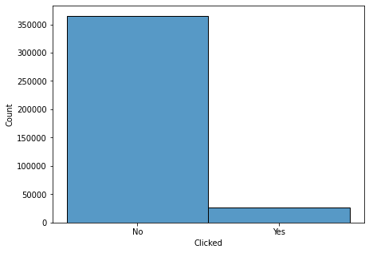
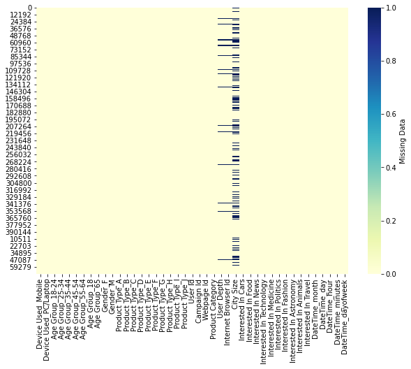
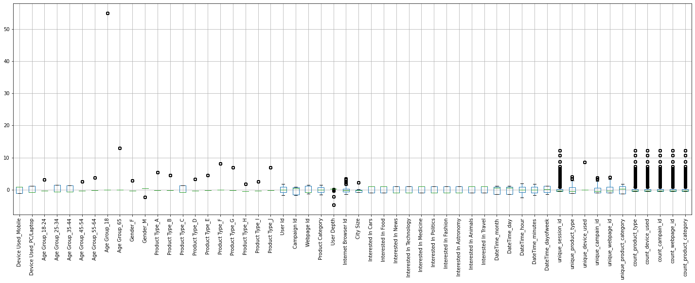
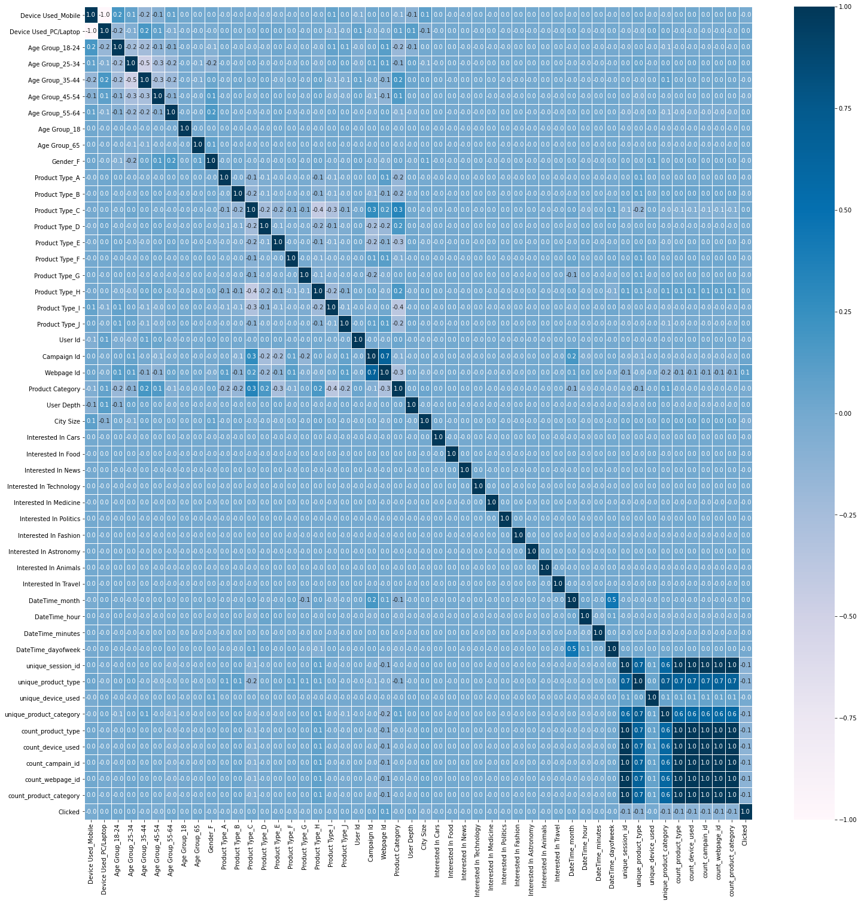
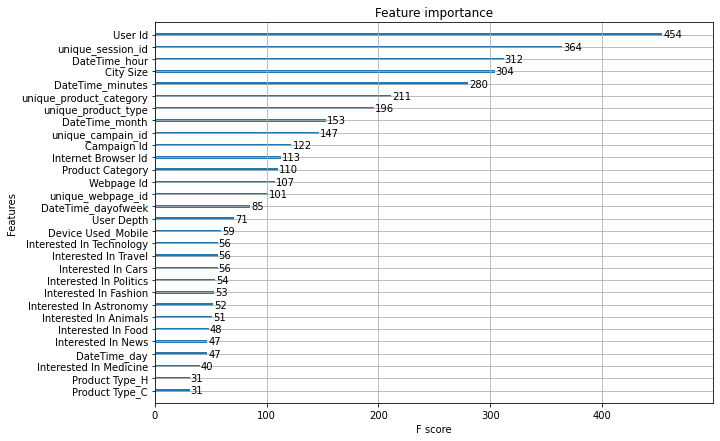

# IBM Nordcloud DS Challange
---
Date: 12.11.2021
<br>
Author: Sergej Schweizer
<br><br>
The dataset consists of 463.291 entries from a 2021 online advertising campaign.
The training set pertains to the time period of 9.04.2021 - 13.04.2021, while the test set only
contains the day of 14.04.2021.


# 1. Import packages
---


```python
#!pip install tensorflow tensorflow_data_validation fastcluster imbalanced-learn bayesian-optimization
```


```python
import pandas as pd
import numpy as np
from typing import Tuple
from pandarallel import pandarallel

import seaborn as sns 
import matplotlib.pyplot as plt

import tensorflow as tf
import tensorflow_data_validation as tfdv

from sklearn import linear_model
from sklearn.experimental import enable_iterative_imputer
from sklearn.impute import IterativeImputer
from sklearn.preprocessing import StandardScaler, OneHotEncoder
from sklearn.model_selection import train_test_split
from sklearn.metrics import accuracy_score, roc_auc_score, precision_score, recall_score, f1_score, classification_report, plot_confusion_matrix
from sklearn.feature_selection import RFE, SelectKBest, SelectFromModel, chi2, f_classif

import xgboost as xgb
from xgboost import XGBClassifier, plot_tree, cv, plot_importance

import itertools
import regex as re

from imblearn.over_sampling import SMOTE, ADASYN
from imblearn.combine import SMOTEENN

from bayes_opt import BayesianOptimization


import warnings
warnings.filterwarnings('ignore')
pandarallel.initialize()
```

    INFO: Pandarallel will run on 8 workers.
    INFO: Pandarallel will use Memory file system to transfer data between the main process and workers.


# 2. Load data
---


```python
# check the csv before load
!head -n 3 train_set.csv
```

    Session Id,DateTime,User Id,Product Type,Campaign Id,Webpage Id,Product Category,Advertisment Size,User Depth,Internet Browser Id,Gender,Age Group,City Size,Device Used,Interested In Cars,Interested In Food,Interested In News,Interested In Technology,Interested In Medicine,Interested In Politics,Interested In Fashion,Interested In Astronomy,Interested In Animals,Interested In Travel,Clicked
    229ac4c2-0ee9-4a3b-b52c-3b20c9d43039,09-04-2021 00:00,858557,C,359520,13787,4,,3.0,10.0,F,45-54,5900000.0,Mobile,1,0,1,0,1,0,0,0,1,0,No
    87c0f74a-fa7a-4b3f-bc48-ad1a5f80de2e,09-04-2021 00:00,243253,C,105960,11085,5,,2.0,8.0,F,25-34,,Mobile,1,0,1,1,1,0,0,0,1,1,No


### Notes
* separator is comma !
* existing column names
* one DateTime column


```python
# load
df_train =  pd.read_csv('train_set.csv', sep=',')
df_test =  pd.read_csv('test_set.csv', sep=',')
```


```python
# filter < in column names
df_train.columns = df_train.columns.str.replace(r'[<,>]', '')
df_test.columns = df_test.columns.str.replace(r'[<,>]', '')
```


```python
df_train.head(3)
```


<div>
<style scoped>
    .dataframe tbody tr th:only-of-type {
        vertical-align: middle;
    }

    .dataframe tbody tr th {
        vertical-align: top;
    }

    .dataframe thead th {
        text-align: right;
    }
</style>
<table border="1" class="dataframe">
  <thead>
    <tr style="text-align: right;">
      <th></th>
      <th>Session Id</th>
      <th>DateTime</th>
      <th>User Id</th>
      <th>Product Type</th>
      <th>Campaign Id</th>
      <th>Webpage Id</th>
      <th>Product Category</th>
      <th>Advertisment Size</th>
      <th>User Depth</th>
      <th>Internet Browser Id</th>
      <th>...</th>
      <th>Interested In Food</th>
      <th>Interested In News</th>
      <th>Interested In Technology</th>
      <th>Interested In Medicine</th>
      <th>Interested In Politics</th>
      <th>Interested In Fashion</th>
      <th>Interested In Astronomy</th>
      <th>Interested In Animals</th>
      <th>Interested In Travel</th>
      <th>Clicked</th>
    </tr>
  </thead>
  <tbody>
    <tr>
      <th>0</th>
      <td>229ac4c2-0ee9-4a3b-b52c-3b20c9d43039</td>
      <td>09-04-2021 00:00</td>
      <td>858557</td>
      <td>C</td>
      <td>359520</td>
      <td>13787</td>
      <td>4</td>
      <td>NaN</td>
      <td>3.0</td>
      <td>10.0</td>
      <td>...</td>
      <td>0</td>
      <td>1</td>
      <td>0</td>
      <td>1</td>
      <td>0</td>
      <td>0</td>
      <td>0</td>
      <td>1</td>
      <td>0</td>
      <td>No</td>
    </tr>
    <tr>
      <th>1</th>
      <td>87c0f74a-fa7a-4b3f-bc48-ad1a5f80de2e</td>
      <td>09-04-2021 00:00</td>
      <td>243253</td>
      <td>C</td>
      <td>105960</td>
      <td>11085</td>
      <td>5</td>
      <td>NaN</td>
      <td>2.0</td>
      <td>8.0</td>
      <td>...</td>
      <td>0</td>
      <td>1</td>
      <td>1</td>
      <td>1</td>
      <td>0</td>
      <td>0</td>
      <td>0</td>
      <td>1</td>
      <td>1</td>
      <td>No</td>
    </tr>
    <tr>
      <th>2</th>
      <td>b746f0ad-1aa3-492c-b7fa-5dd95643fb51</td>
      <td>09-04-2021 00:00</td>
      <td>243253</td>
      <td>C</td>
      <td>359520</td>
      <td>13787</td>
      <td>4</td>
      <td>NaN</td>
      <td>2.0</td>
      <td>8.0</td>
      <td>...</td>
      <td>0</td>
      <td>0</td>
      <td>1</td>
      <td>0</td>
      <td>0</td>
      <td>1</td>
      <td>0</td>
      <td>0</td>
      <td>0</td>
      <td>No</td>
    </tr>
  </tbody>
</table>
<p>3 rows × 25 columns</p>
</div>


```python
# we concat both datasets for preprocessing and scalling reasons
df = pd.concat([df_train, df_test], axis=0)
```


```python
# relative amount of test data
df_test.shape[0] / df.shape[0]
```


    0.15425725947622554


### Columns descriptions:
1. Session Id – refers to session identifier
2. DateTime – refers to date and time of the entry
3. User Id – refers to the user identifier
4. Product Type – refers to the product type for which the advertisement is
5. Campaign Id – refers to the campaign identifier of the advertisement
6. Webpage Id - refers to the webpage identifier
7. Product Category – refers to the category of the product
8. Advertisement Size – refers to the area of an advertisement posted on a website, measured in pixels.
9. User Depth - refers to user’s duration of exposure to the advertisement during the respective entry
(3 being the longest, 1 being the shortest and NA being the inability to measure the time spent)
10. Internet Browser Id – refers to the identifier of the Internet browser type which is used by the user
11. Gender – refers to the gender of the user
12. Age Group – refers to the age group of the user
13. City Size – refers to the size of the city where the user is located
14. Device Used – refers to the device used by the user (could be Mobile or PC/Laptop)
15. Clicked – refers to the fact that the user clicked on the advertisement16. Interested in Cars - refers to the fact that the user is interested in cars
17. Interested in Food - refers to the fact that the user is interested in food
18. Interested in News - refers to the fact that the user is interested in news
19. Interested in Technology - refers to the fact that the user is interested in technology
20. Interested in Medicine - refers to the fact that the user is interested in Medicine
21. Interested in Politics - refers to the fact that the user is interested in Politics
22. Interested in Fashion - refers to the fact that the user is interested in fashion
23. Interested in Astronomy - refers to the fact that the user is interested in Astronomy
24. Interested in Animals - refers to the fact that the user is interested in animals
25. Interested in Travel - refers to the fact that the user is interested in travelling

# 3. Explorative Data Analysis
---
The EDA can be devided in two different parts.

Feature engineering:
* Preprocess Categorical Columns
* Preprocess Numerical Columns
* Preprocess Date Columns
* Understand the Natare of NANs
* Generate Interactions of Predictors
* Generate aggregated Predictors
* Scale Predictors

Feature selection:
* Build baseline with all Predictors
* Use SMOTE to resolve the unbalanced classes issue
* Build model with uncorelated (intra) Predictors
* Build model with correlated (with Target) Predictors
* Build model with RFE selected Predictors
* Visualize Feature Importance
---


```python
# Generate dataset statistics
train_stats = tfdv.generate_statistics_from_dataframe(df)
# Visualize
tfdv.visualize_statistics(train_stats)
```


<iframe id='facets-iframe' width="100%" height="500px"></iframe>
        <script>
        facets_iframe = document.getElementById('facets-iframe');
        facets_html = '<script src="https://cdnjs.cloudflare.com/ajax/libs/webcomponentsjs/1.3.3/webcomponents-lite.js"><\/script><link rel="import" href="https://raw.githubusercontent.com/PAIR-code/facets/master/facets-dist/facets-jupyter.html"><facets-overview proto-input="CqnhBgoObGhzX3N0YXRpc3RpY3MQu6McGoS2AxACIvC1Awq4Agi7oxwYASABLQAAgD8ypAIaGwkAAAAAAADwPxEAAAAAAADwPyEzMzMzI5/mQBobCQAAAAAAAPA/EQAAAAAAAPA/ITMzMzMjn+ZAGhsJAAAAAAAA8D8RAAAAAAAA8D8hMzMzMyOf5kAaGwkAAAAAAADwPxEAAAAAAADwPyEzMzMzI5/mQBobCQAAAAAAAPA/EQAAAAAAAPA/ITMzMzMjn+ZAGhsJAAAAAAAA8D8RAAAAAAAA8D8hMzMzMyOf5kAaGwkAAAAAAADwPxEAAAAAAADwPyEzMzMzI5/mQBobCQAAAAAAAPA/EQAAAAAAAPA/ITMzMzMjn+ZAGhsJAAAAAAAA8D8RAAAAAAAA8D8hMzMzMyOf5kAaGwkAAAAAAADwPxEAAAAAAADwPyEzMzMzI5/mQCABQLujHBC7oxwaLxIkZmZmZjkzNTctOTc3Zi00OGYxLTgxODUtMTg2YWUyZDY2M2MxGQAAAAAAAPA/Gi8SJGZmZmY3ZmNhLTFiNmYtNDAwMy04YWQ3LTEwYzcxYTg5NDM4OBkAAAAAAADwPxovEiRmZmZmNGNkNi02MTQ2LTQ5MGMtYmIwYi0xNDYzZGViYTVkMjAZAAAAAAAA8D8aLxIkZmZmZjJkOWYtMWQyNS00ZTIyLWE4MmEtOTRkZWRiMWUwMWRmGQAAAAAAAPA/Gi8SJGZmZmVkMDUzLTRkMDQtNGM4Zi1iMDQ5LTk4N2ZmYmM4MGMwORkAAAAAAADwPxovEiRmZmZlY2I1Ni0wYmJkLTQxN2MtYTI1MS1kM2FiZDFlY2E1ZjIZAAAAAAAA8D8aLxIkZmZmZWI4ZjYtMmIwZi00MDA1LTk5OWItZjI4M2JjMDIxNDcyGQAAAAAAAPA/Gi8SJGZmZmViMjI1LWRiYmUtNDVmNy04Yzg0LTJmNWEyMDZkOWNmZhkAAAAAAADwPxovEiRmZmZlOWM1Ny03YTViLTQ3MjAtODllZC0xNGVkYWIxYWY1YWQZAAAAAAAA8D8aLxIkZmZmZTkxZTktZTBiZS00YjhhLWExNmEtNzhiNmU2M2Y3ZTdiGQAAAAAAAPA/Gi8SJGZmZmU1ZTM4LTIzNGItNDQyNC05ZDY2LWFjZTU2NTc1YWQwNBkAAAAAAADwPxovEiRmZmZlMWQ3MC1kZjQ1LTQxMzYtYWI5Zi00YTg0Yzk4YWFiYmMZAAAAAAAA8D8aLxIkZmZmZGRjYjctN2FkNi00MjY0LWEyMmQtNTIyZjllODhmZDkyGQAAAAAAAPA/Gi8SJGZmZmQ3MzQxLTBmOGItNGJjYi1iMmQ0LWVlYzk1MGI1NWQyMRkAAAAAAADwPxovEiRmZmZkNjkwZS1mZjk3LTQ1NDEtODQxNy1hMGFlYTdkNWVmYWIZAAAAAAAA8D8aLxIkZmZmZDIwODgtN2JlMy00YWExLWE2YWUtNjcyNzNhZjY5YjYyGQAAAAAAAPA/Gi8SJGZmZmM3NDdmLTU1Y2UtNDZlZi1hMmNkLTJmMDYxZGZjZWMxNxkAAAAAAADwPxovEiRmZmZjNWRkYy05ZTNmLTQwMjEtYTNjYy1mNDg1MzU3NjQ3N2EZAAAAAAAA8D8aLxIkZmZmYzJmNmMtM2Q4ZS00ODU1LTgxY2UtYTMzMzJkZTc1Mjc1GQAAAAAAAPA/Gi8SJGZmZmMxNWZiLWFkZTItNDY0NC04NGYyLTNjNjVjMmJjZWEwMhkAAAAAAADwPyUAABBCKtSrAwovIiRmZmZmOTM1Ny05NzdmLTQ4ZjEtODE4NS0xODZhZTJkNjYzYzEpAAAAAAAA8D8KMwgBEAEiJGZmZmY3ZmNhLTFiNmYtNDAwMy04YWQ3LTEwYzcxYTg5NDM4OCkAAAAAAADwPwozCAIQAiIkZmZmZjRjZDYtNjE0Ni00OTBjLWJiMGItMTQ2M2RlYmE1ZDIwKQAAAAAAAPA/CjMIAxADIiRmZmZmMmQ5Zi0xZDI1LTRlMjItYTgyYS05NGRlZGIxZTAxZGYpAAAAAAAA8D8KMwgEEAQiJGZmZmVkMDUzLTRkMDQtNGM4Zi1iMDQ5LTk4N2ZmYmM4MGMwOSkAAAAAAADwPwozCAUQBSIkZmZmZWNiNTYtMGJiZC00MTdjLWEyNTEtZDNhYmQxZWNhNWYyKQAAAAAAAPA/CjMIBhAGIiRmZmZlYjhmNi0yYjBmLTQwMDUtOTk5Yi1mMjgzYmMwMjE0NzIpAAAAAAAA8D8KMwgHEAciJGZmZmViMjI1LWRiYmUtNDVmNy04Yzg0LTJmNWEyMDZkOWNmZikAAAAAAADwPwozCAgQCCIkZmZmZTljNTctN2E1Yi00NzIwLTg5ZWQtMTRlZGFiMWFmNWFkKQAAAAAAAPA/CjMICRAJIiRmZmZlOTFlOS1lMGJlLTRiOGEtYTE2YS03OGI2ZTYzZjdlN2IpAAAAAAAA8D8KMwgKEAoiJGZmZmU1ZTM4LTIzNGItNDQyNC05ZDY2LWFjZTU2NTc1YWQwNCkAAAAAAADwPwozCAsQCyIkZmZmZTFkNzAtZGY0NS00MTM2LWFiOWYtNGE4NGM5OGFhYmJjKQAAAAAAAPA/CjMIDBAMIiRmZmZkZGNiNy03YWQ2LTQyNjQtYTIyZC01MjJmOWU4OGZkOTIpAAAAAAAA8D8KMwgNEA0iJGZmZmQ3MzQxLTBmOGItNGJjYi1iMmQ0LWVlYzk1MGI1NWQyMSkAAAAAAADwPwozCA4QDiIkZmZmZDY5MGUtZmY5Ny00NTQxLTg0MTctYTBhZWE3ZDVlZmFiKQAAAAAAAPA/CjMIDxAPIiRmZmZkMjA4OC03YmUzLTRhYTEtYTZhZS02NzI3M2FmNjliNjIpAAAAAAAA8D8KMwgQEBAiJGZmZmM3NDdmLTU1Y2UtNDZlZi1hMmNkLTJmMDYxZGZjZWMxNykAAAAAAADwPwozCBEQESIkZmZmYzVkZGMtOWUzZi00MDIxLWEzY2MtZjQ4NTM1NzY0NzdhKQAAAAAAAPA/CjMIEhASIiRmZmZjMmY2Yy0zZDhlLTQ4NTUtODFjZS1hMzMzMmRlNzUyNzUpAAAAAAAA8D8KMwgTEBMiJGZmZmMxNWZiLWFkZTItNDY0NC04NGYyLTNjNjVjMmJjZWEwMikAAAAAAADwPwozCBQQFCIkZmZmYzBkODctZGRkZS00ZDE5LWEwMzktMjYwMGZmM2I2ODUyKQAAAAAAAPA/CjMIFRAVIiRmZmZjMDFlYy1lMTJiLTQ1NWItYmFmYi0wNmNiODg4NDVkYzIpAAAAAAAA8D8KMwgWEBYiJGZmZmJmZjU2LTkxOGEtNGMxZS05NzEzLTg3YWU0MzAzMzEzYykAAAAAAADwPwozCBcQFyIkZmZmYmZiOTctY2YzYy00MTBhLTk2ZDctY2NhN2FjYmM1Y2NmKQAAAAAAAPA/CjMIGBAYIiRmZmZiZTI3OS05ZTdkLTQwZmMtOWVkMi03ZWI1MjEwODYxODEpAAAAAAAA8D8KMwgZEBkiJGZmZmJlMTZhLWZlYWEtNDdjNi05MzkyLTUyNjhlNjliZTAwMSkAAAAAAADwPwozCBoQGiIkZmZmYmRmMjktODAzMi00NDc4LTg0YjMtNTVkY2E1MTBkMTZmKQAAAAAAAPA/CjMIGxAbIiRmZmZiZDA2ZC0yYzBiLTQ5YjctOTg1My0xZGJkMzExMGJmZjApAAAAAAAA8D8KMwgcEBwiJGZmZmJjM2MwLTkxOGItNDAxYy05ZDdjLWI0ZjllM2E0NTA3NikAAAAAAADwPwozCB0QHSIkZmZmYjk0YzMtMzE2YS00M2RmLWIwZjktNjY1ZGEwZGE3OTY4KQAAAAAAAPA/CjMIHhAeIiRmZmZiODBiYy0zYTM2LTQyYWUtYWI4NC03MzFmMjExOWI2NzIpAAAAAAAA8D8KMwgfEB8iJGZmZmI2YWZmLTcwM2UtNDM3MS04ZDU2LTc4MmZkNjI4Y2E0YikAAAAAAADwPwozCCAQICIkZmZmYWRiZWUtOGMwOS00OTBjLThjYjMtZDNmMjVmZmMwMmI1KQAAAAAAAPA/CjMIIRAhIiRmZmZhN2NlMS0xNzY0LTRmYmYtYjE1Ni0zOWQyMzk5MDg3NmEpAAAAAAAA8D8KMwgiECIiJGZmZmE2NzBlLTk1Y2ItNDVkNS04YTc1LThlMTI4YmNhMDZkMCkAAAAAAADwPwozCCMQIyIkZmZmYTRmYjMtMTQ0ZS00ODA0LTg4OTYtNzAxZGE1MTVjZmY0KQAAAAAAAPA/CjMIJBAkIiRmZmZhMTUzNC0zYzM2LTQxNTctODc5OC03YjkzNGVhNWU2OTMpAAAAAAAA8D8KMwglECUiJGZmZmEwNTYyLTQ0YWQtNDIwZS05YzZhLTRiNjZkYzhjZjJhZSkAAAAAAADwPwozCCYQJiIkZmZmOWU4MzEtYzA5OC00ZWU0LThmMzQtMjYyZWM4NmMwMDE4KQAAAAAAAPA/CjMIJxAnIiRmZmY5ZTUwZC1iOTdjLTRmOTAtOGI5MC1iOTc1Njk5MjkwNmMpAAAAAAAA8D8KMwgoECgiJGZmZjliNjFmLTM3MTItNDNkMS04OTVmLTA5NmNhNWU5ZGFjOSkAAAAAAADwPwozCCkQKSIkZmZmOWFiYTQtMTgxZi00NDFkLTkwYWUtMmU4ZWUyZmJmZmY3KQAAAAAAAPA/CjMIKhAqIiRmZmY5N2E5ZC00ZjNjLTQwNzYtYWMzYi03NmNjNjJhMjg0OTEpAAAAAAAA8D8KMwgrECsiJGZmZjk3MTQyLWQ2MDctNDYyMS04ZGJiLTJhMTdmZDVhMDY5NykAAAAAAADwPwozCCwQLCIkZmZmOTZlMTktZjQ4ZS00ZGViLTk2MDYtMGRhYmM2YjAyODA2KQAAAAAAAPA/CjMILRAtIiRmZmY5NDU3ZC00NGNiLTRmN2QtYmIwMC0zMTNmZWEzOWVmMjQpAAAAAAAA8D8KMwguEC4iJGZmZjkzYjM2LTE2NjItNGRkNi05MDFlLTM0YTUwY2Y2M2YzZCkAAAAAAADwPwozCC8QLyIkZmZmOTBiMzgtNGU3Yi00MzNlLWIzMzQtYmUzNzdiZDM5YjFhKQAAAAAAAPA/CjMIMBAwIiRmZmY4ZmExNS1mOTYzLTQ5YjEtYThmYi0xOGIzYjY5Mzg2YzMpAAAAAAAA8D8KMwgxEDEiJGZmZjhlMDNmLWFiMjQtNDBlOC05Nzg4LTczYzE5MzlkY2RmZSkAAAAAAADwPwozCDIQMiIkZmZmOGNlMzAtYWUyNS00YmVjLWIxZWYtNWZlMzg2YzA4MTBlKQAAAAAAAPA/CjMIMxAzIiRmZmY4YWU4MS04OWY3LTQ5NTYtODE3MC1iMjc5NzA4NjM0NmIpAAAAAAAA8D8KMwg0EDQiJGZmZjg5ZTQwLTFmOTktNGRkNS1hMDY0LThkOWU3OWQzMWFkYSkAAAAAAADwPwozCDUQNSIkZmZmODliNGItNDQwZS00MTMwLTlhOWItMGJlOWE2NDQxYTM3KQAAAAAAAPA/CjMINhA2IiRmZmY4OTkwYy03Zjg1LTRlZDctOTk1NC1lMjRmZTI5ZWI1ZTIpAAAAAAAA8D8KMwg3EDciJGZmZjg5ODE0LWY2NjQtNGUyOS04N2Q5LWY1OWMzZDM3M2QyNCkAAAAAAADwPwozCDgQOCIkZmZmODU4M2UtYjgxOS00ZjczLWJiM2UtNDIwNGEyODI5Mjc5KQAAAAAAAPA/CjMIORA5IiRmZmY4MmQzMS03YTQwLTRjYjEtOTM2MC03ZTQ5ZjgyM2Q1NmYpAAAAAAAA8D8KMwg6EDoiJGZmZjgyNzllLWE5NWUtNDdkYS1iNmUyLWFkYWM0NDJiZDAyNSkAAAAAAADwPwozCDsQOyIkZmZmN2ZjODctMDhjZi00OWRkLThmOWYtMTYzY2Q0NWVhZTQ3KQAAAAAAAPA/CjMIPBA8IiRmZmY3ZGYxOS03ZDQzLTQ0ZmMtOTU4OC1lMDFkNmJjNDM4MTIpAAAAAAAA8D8KMwg9ED0iJGZmZjdkOWNiLWU3ODEtNGI0My05ZmIwLTI5MmQ0M2RkNWQ2OSkAAAAAAADwPwozCD4QPiIkZmZmN2M3M2EtYjdmYS00MTFkLTk3ZmQtYmE1ODkzOTUyMjdlKQAAAAAAAPA/CjMIPxA/IiRmZmY3NzBlOC0wZWNhLTQwMTUtOTQzYy0zNThmNWZjMmU5MzkpAAAAAAAA8D8KMwhAEEAiJGZmZjcyYmM3LWIzZDAtNDFhMC04MzEyLWFlMjlkMjU1Mjc3YikAAAAAAADwPwozCEEQQSIkZmZmNzJiMmMtMWQ2Yi00ZjdlLTg3YzMtMzIyNTc1YTEyNTc3KQAAAAAAAPA/CjMIQhBCIiRmZmY2ZmU5Ni02ODdiLTQ1MTktYTAxZi1iMDM5MGEwMDQ2MzgpAAAAAAAA8D8KMwhDEEMiJGZmZjZkMjQzLTRkNDUtNGI5OC04ZWNjLTRhMmFmMTViNTBiNSkAAAAAAADwPwozCEQQRCIkZmZmNmJmMWEtYzY0Mi00Y2E2LTk2N2ItZWUwZDhkOWZmNTliKQAAAAAAAPA/CjMIRRBFIiRmZmY1ZGZhNC0xZDQzLTQ5OWUtOTc0ZS02MDY5MjQyNWEwMjApAAAAAAAA8D8KMwhGEEYiJGZmZjVjZTBmLTEyNzQtNGZiMi04NTY2LTFiNmJkNGI4MWQ0OCkAAAAAAADwPwozCEcQRyIkZmZmNWMyYWMtNmIzNC00ODVkLTg3N2YtNmM5ZDk5ZTk1YTJjKQAAAAAAAPA/CjMISBBIIiRmZmY1ODBjMC1iMzk5LTQ1ZTMtODQ2MS0wMGE0NmUxNGUxOTApAAAAAAAA8D8KMwhJEEkiJGZmZjU3MmQ1LWQxMWMtNDM5My05NjgzLTgzNGQxYjJmN2Q1NCkAAAAAAADwPwozCEoQSiIkZmZmNTZhNWUtNjZiNy00MWM2LWJjNDEtNjlkMTBjNzA1NWM4KQAAAAAAAPA/CjMISxBLIiRmZmY1NTVmMi0zZTBjLTQ4YTEtYWNkZC1mNmRhYTk0NDM0NTcpAAAAAAAA8D8KMwhMEEwiJGZmZjU0NzIzLTA1OWMtNDgwYi04YWE3LTAyOGI1OTljNjY0MSkAAAAAAADwPwozCE0QTSIkZmZmNTMxMDItOWIxZS00YWQ5LWJlMDAtMDE4M2Q2ZTM3MDkzKQAAAAAAAPA/CjMIThBOIiRmZmY1MjMwMi0yNDRkLTQ1NzgtODNmYi05YWNhNzNkYjAyNTgpAAAAAAAA8D8KMwhPEE8iJGZmZjUxMWE3LTU2ZmYtNDFjOS1iMTVlLTA0ZTE0Mzg5MmU3MSkAAAAAAADwPwozCFAQUCIkZmZmNDllNmMtYjA5Zi00ZGNmLTg4ZWEtZGU0MDZiNzBiMTQzKQAAAAAAAPA/CjMIURBRIiRmZmY0N2I1ZC00ZjZjLTRjMzAtYWUyYS0wMWRiNTZiOTM1ZjkpAAAAAAAA8D8KMwhSEFIiJGZmZjQzYjgyLThkNWQtNGU1My1hODVmLWZlMWM5ZTc4NDhkNykAAAAAAADwPwozCFMQUyIkZmZmM2NjM2YtMTI4NC00OGFkLWJhM2QtYmFiNzk1ZWI5ZGQ5KQAAAAAAAPA/CjMIVBBUIiRmZmYzYjdiOC02NWQ0LTQwNTUtYTNlOS01N2FiZjE0NjAyZDQpAAAAAAAA8D8KMwhVEFUiJGZmZjNhYzZhLWQzNmQtNDZkYS04NTQ5LWYxZTFlYTA3MTUxZikAAAAAAADwPwozCFYQViIkZmZmMzk0YWYtMzZkYi00YzJlLWEyZTYtM2ZlODBlZmIwNTE3KQAAAAAAAPA/CjMIVxBXIiRmZmYzNWU0Zi0xNThlLTRmOWQtOWM4NS1hOGZhNGNiYTdlZDQpAAAAAAAA8D8KMwhYEFgiJGZmZjMzZjg5LTI2MzUtNDUwMC04NDlmLWU5NDM1ZTg3MzFhZSkAAAAAAADwPwozCFkQWSIkZmZmMzA0YzktYWFlMS00ZTU0LWJlOTktNmRlNWU5MGI1NjA2KQAAAAAAAPA/CjMIWhBaIiRmZmYyZjE0ZC0wNjRiLTQxZDYtOTMyNy1lOGJkZjliMWVjYTMpAAAAAAAA8D8KMwhbEFsiJGZmZjI2MmZhLWU2MjktNDYxOC1iNWM4LTcyODA1NzEzODVlZSkAAAAAAADwPwozCFwQXCIkZmZmMjAyYTctM2FiYy00OGVhLTgyMzMtZGEzOTU4MjcxNzQwKQAAAAAAAPA/CjMIXRBdIiRmZmYxZjlkMi0zZjcyLTRhNDktODk2MC1iYzY0ODA1ZWQ4YzMpAAAAAAAA8D8KMwheEF4iJGZmZjFlZWE1LTZkNjYtNDE5MC1iOTNlLWMxOGY5MjAzOWZhYikAAAAAAADwPwozCF8QXyIkZmZmMWRlYmYtYjRkNy00NDJkLThiZDktNDkxZDA3MGNkYmJiKQAAAAAAAPA/CjMIYBBgIiRmZmYxY2ZkYy03YTllLTQ4NjktOWU5NS1lM2VmODdhZWI4NmMpAAAAAAAA8D8KMwhhEGEiJGZmZjFjODdmLTAzZTUtNDVkMy04YWQwLWI1MmNkZTA2MjBkOSkAAAAAAADwPwozCGIQYiIkZmZmMWJiYWItNzIzOS00M2ZjLWFlYTgtMjIyNmI3MTIzOWQzKQAAAAAAAPA/CjMIYxBjIiRmZmYxYWQ3Ny04ZTk5LTRlNjUtOTQ0OS0wZWFmMzZhYjBjNTMpAAAAAAAA8D8KMwhkEGQiJGZmZjE5ZTRlLTYzOTctNDlhNy1hMTBiLTM2NDJmZTMzOTEzYSkAAAAAAADwPwozCGUQZSIkZmZmMTc1MTYtMWY4Ni00ODQ4LTkwZmQtNjhjZjkyZmM4NTI5KQAAAAAAAPA/CjMIZhBmIiRmZmYxMjA1Yy0wYzZhLTRjOWQtYWMyOC1iYWUyOTIxZDM5YzMpAAAAAAAA8D8KMwhnEGciJGZmZjExMTg5LWY4ODAtNGM3Ni05OTZhLTE0ZmY5M2Q2YThiNCkAAAAAAADwPwozCGgQaCIkZmZmMGRlMTctOWRlYy00Y2QzLWI0YzktMDMzNjVkMzdlYzY2KQAAAAAAAPA/CjMIaRBpIiRmZmYwOTQ3Yi1lNGM5LTQ4OTgtOWQ1Zi0yMmZkNGY3MDhjYTcpAAAAAAAA8D8KMwhqEGoiJGZmZjA2MjgzLWVhNDItNDMzYi1iOWZjLTQwY2MxZTc5OWJkMCkAAAAAAADwPwozCGsQayIkZmZmMDM3NzktYTc3My00NzYwLWI0OGItNTgwZGQzYjdkNTEzKQAAAAAAAPA/CjMIbBBsIiRmZmYwMjM4ZS1mZGYzLTRmNjgtOTIwZC03YjY0NGNiOGUyYWMpAAAAAAAA8D8KMwhtEG0iJGZmZWZmMmU4LTViZDktNDhkMy05NmU0LTM2MTdkYmRhYTcwNikAAAAAAADwPwozCG4QbiIkZmZlZmM3MDYtYjYwOC00MjBlLTllNTQtY2E2NmJjNzU1M2JiKQAAAAAAAPA/CjMIbxBvIiRmZmVmNzYwMi0wMjc1LTQ3NGQtOTNiOC1lOGZmZjFkOTFmM2MpAAAAAAAA8D8KMwhwEHAiJGZmZWYzNDhkLTg1Y2YtNDljYy1iNWJjLTJlNDk3NmEzNzE4NSkAAAAAAADwPwozCHEQcSIkZmZlZjMwMjMtN2Y4MC00OWFhLTg1OGEtNDA1YThjMWMyNDE1KQAAAAAAAPA/CjMIchByIiRmZmVlZjYyZC1lOGY2LTQ2OWUtYTQ2MS02YzdkZTk2ODcyMmUpAAAAAAAA8D8KMwhzEHMiJGZmZWVhMjZlLTYxYWItNGY4Zi1hNWEyLWNiOGY0ZDIxMmJhMSkAAAAAAADwPwozCHQQdCIkZmZlZTlkZWEtODhhOS00OGQ3LThjYTYtODczNjAxM2ExOTZlKQAAAAAAAPA/CjMIdRB1IiRmZmVlOTMxMy0wZmZkLTQ4ODgtOGNjYy1jNjk0YzVhNjdlMTYpAAAAAAAA8D8KMwh2EHYiJGZmZWU2ZTg4LWYwZTYtNDc3Yy1hMjEyLTFmZjBhMjFkYTEzNykAAAAAAADwPwozCHcQdyIkZmZlZTIxMzMtNjRjMC00ODNiLWFkYTItZjQyNWUxMDAxZmQyKQAAAAAAAPA/CjMIeBB4IiRmZmVlMTlmOS1mNDc0LTRjOTMtYjFiZC03OWU2YWI2NmFiY2IpAAAAAAAA8D8KMwh5EHkiJGZmZWRmMmVkLTIzOTctNDFjOC05MTU0LWY0MDQ1YzM5NzVmNCkAAAAAAADwPwozCHoQeiIkZmZlZGNjMjMtZjY0Ni00NWFmLThkMzQtZjExMDk0N2RiNzNiKQAAAAAAAPA/CjMIexB7IiRmZmVkODE4OS05ZGE2LTQyYTUtOWVkOS04MDFmMTAwOWM4ZjkpAAAAAAAA8D8KMwh8EHwiJGZmZWQwNzI1LWZiNDAtNDdmZi05ZjE3LWMxZmJmMjA5ZWY1OCkAAAAAAADwPwozCH0QfSIkZmZlY2FkNzMtNjgxMS00MDdmLTk3YzktYTVlNDM3ZGVlMjMxKQAAAAAAAPA/CjMIfhB+IiRmZmVjOWNkNy00Zjg4LTQ2ZjEtOTJjNC05NTEyOGU2MzE4OWQpAAAAAAAA8D8KMwh/EH8iJGZmZWM4NjZkLTljZjQtNDkyOS05YjA2LWZkNjUyZDRkZTcwYSkAAAAAAADwPwo1CIABEIABIiRmZmVjNjk4Ny1kZjkzLTRiYjYtYTdiNS03OWYzMDg5NDc3ZjgpAAAAAAAA8D8KNQiBARCBASIkZmZlYzYyN2MtOGQ0Ny00MjMwLTk0NGItYTllMDQ3NTJlOWUwKQAAAAAAAPA/CjUIggEQggEiJGZmZWM1ZWFmLTVjOGItNGI5ZS05YmJhLWNjZDU5MTYzMDcxOSkAAAAAAADwPwo1CIMBEIMBIiRmZmVjMzQ4Mi03NGI4LTRkZDUtOWRkZC02NjhhYmU3MGFjYTQpAAAAAAAA8D8KNQiEARCEASIkZmZlYzJhMDEtODQ5ZC00ZDY5LTkwM2UtNzk1ZGQ2NDU5NmMzKQAAAAAAAPA/CjUIhQEQhQEiJGZmZWMwMGU1LWRiODktNDBjZC1hNWUzLTY4Yjk5MjdmMmNiOSkAAAAAAADwPwo1CIYBEIYBIiRmZmViY2QyMi02MTE5LTRkMzItYWFlZC04YjhjNzYxY2U4NTgpAAAAAAAA8D8KNQiHARCHASIkZmZlYmJkZjktMWIxYi00ZjJkLTk0NzYtNjNhOGE2NGU4YzFkKQAAAAAAAPA/CjUIiAEQiAEiJGZmZWJhYmEzLWQyNzgtNGZhYy1hMTEwLTNiNmM3MmMxZmI3MikAAAAAAADwPwo1CIkBEIkBIiRmZmViOThhMi00MjExLTQ4MGQtYmE5Ny1kYTkzMzRiOGEwZTEpAAAAAAAA8D8KNQiKARCKASIkZmZlYjgwNDQtODMxNS00MTJmLWJhZWItYjQxNjI3NTYwMWY5KQAAAAAAAPA/CjUIiwEQiwEiJGZmZWI3YjcyLWI4Y2YtNDFkNS05MTM1LWE5MTBhZTc4MTEwZikAAAAAAADwPwo1CIwBEIwBIiRmZmViNWQ2NS1hNjhhLTQwOTAtYjVhMC00YjIyMmVjNzEzYWUpAAAAAAAA8D8KNQiNARCNASIkZmZlYjIyMWUtODE0OC00OTNmLTljY2QtOWI2Y2Q4ZDY5ZTE0KQAAAAAAAPA/CjUIjgEQjgEiJGZmZWFlMGRmLTFmNDItNDRkZS1iZjgzLTQxZGM4NTkyNWQ5ZSkAAAAAAADwPwo1CI8BEI8BIiRmZmVhYzhjYy04Zjg0LTQ2MjEtOTQ1MC0wMzJjZjhiMDZhMjIpAAAAAAAA8D8KNQiQARCQASIkZmZlYThkNGMtYTQ5NS00NTYwLTkwZWYtYjhhN2YxNTJhMzcwKQAAAAAAAPA/CjUIkQEQkQEiJGZmZWE3NmEwLTJiNTUtNGQ0OS04NGQwLTRmNmIwNWZhZmFmNCkAAAAAAADwPwo1CJIBEJIBIiRmZmVhNjk2Zi05MTY4LTQ0ZGMtYWMyNi0xMmVhZmRhMmI0NzYpAAAAAAAA8D8KNQiTARCTASIkZmZlYTYwYWMtOGU1Ny00NDY2LWI3MTctMzhkY2M2OGVhYjY1KQAAAAAAAPA/CjUIlAEQlAEiJGZmZWEyMjU5LTFiYmItNGM4Ny04NGIyLTlhZmEyZjhiNjk3YSkAAAAAAADwPwo1CJUBEJUBIiRmZmU5Zjc2NS1lNWM2LTRmOTYtODMzYS0zZGZmNGNlZWI4OTMpAAAAAAAA8D8KNQiWARCWASIkZmZlOWY1ODUtMjMzYS00YTIyLWFiYjEtODQxOTljOWE1MDY1KQAAAAAAAPA/CjUIlwEQlwEiJGZmZTk0OTA1LTA3ZmUtNDMzYy1hZTcxLWRjM2M0OThjNDBlNykAAAAAAADwPwo1CJgBEJgBIiRmZmU5MGE1Mi03MDRjLTRkOTctYWRlNS1mZmUwM2VlYjU1MDgpAAAAAAAA8D8KNQiZARCZASIkZmZlOGZhMGMtMjA4OC00NjgxLWJjYmYtZTVkMjU0ODI0ODFjKQAAAAAAAPA/CjUImgEQmgEiJGZmZThmNzBjLTJiNmQtNGFhOC04YWNjLWQ3NGQ0ZjVjYzU1NykAAAAAAADwPwo1CJsBEJsBIiRmZmU4ZTAyMC0xYmU2LTRhZDUtOWIyZC03MGVhODAxZGY0ODMpAAAAAAAA8D8KNQicARCcASIkZmZlOGQ4OTAtMDg0Zi00M2E4LWFhMWItMTM3NGMyM2U0NmRiKQAAAAAAAPA/CjUInQEQnQEiJGZmZThkNzdlLTZkZWEtNDYxOS05MzFlLTU0ZTYxN2VhY2JjYSkAAAAAAADwPwo1CJ4BEJ4BIiRmZmU4MzQ0Ni1lMmE5LTRhZjMtYWRiNi1kMjFkZTFkYjE0MTgpAAAAAAAA8D8KNQifARCfASIkZmZlODFhMzktYjBmNi00OWRkLWI2OTAtZjhhYTc3OWQ2ZDA0KQAAAAAAAPA/CjUIoAEQoAEiJGZmZTdkZGRmLWUyOWItNDdiMi05ZTc1LWFmZTA2ZmEwZjVlOCkAAAAAAADwPwo1CKEBEKEBIiRmZmU3YzYzYS1iYjg2LTQ0MTYtODIzOC00ZTQyODc5MmM1MjEpAAAAAAAA8D8KNQiiARCiASIkZmZlNzg2MzYtYTY5ZS00ZjRiLWE2ODEtN2YzZjFmZDIyZmQzKQAAAAAAAPA/CjUIowEQowEiJGZmZTc1MTlmLTVjYmUtNDUyMy04ZmQwLWI1NmI0ZWI0ZmMzZCkAAAAAAADwPwo1CKQBEKQBIiRmZmU3MTE0YS0wMjAyLTQ1MjEtYmNmZi0wZjBlNTE0MjY4NWEpAAAAAAAA8D8KNQilARClASIkZmZlNmYyMmQtYWRkMS00Yzk5LWIwYjAtNGI5Zjc4MGE2MDcxKQAAAAAAAPA/CjUIpgEQpgEiJGZmZTZkMzEyLTFhYjAtNDQ2Yy04ZjI1LWEzMTQxMTIyZDI5OSkAAAAAAADwPwo1CKcBEKcBIiRmZmU2YzI2Mi1kYmNmLTRjMzgtODY1MC04Nzc3ZGNiYTRjYjQpAAAAAAAA8D8KNQioARCoASIkZmZlNmJkNDMtZGZhOC00MjBiLTg3ZjktODI2ZGIzOGNjZmQ3KQAAAAAAAPA/CjUIqQEQqQEiJGZmZTZiYmFkLTAxZDYtNGIyMi1iMjFlLTNlNDg0Y2VkYTY3MCkAAAAAAADwPwo1CKoBEKoBIiRmZmU2MDliMy1kMmRlLTQ0NjktODRjMy1lNmQ2MDczZTI3ZjkpAAAAAAAA8D8KNQirARCrASIkZmZlNWZlNjgtZjEzNi00ZGZjLWE0NzEtM2UwYTU4NjNhMTdhKQAAAAAAAPA/CjUIrAEQrAEiJGZmZTU5MTAyLTJhOWMtNDZlMi1iNTY1LWZjZjNhMTlmN2E1MikAAAAAAADwPwo1CK0BEK0BIiRmZmU1NzA0ZC1kZTNmLTRlOTQtYjBkMC1hNGZjN2ZkZGQ5NDgpAAAAAAAA8D8KNQiuARCuASIkZmZlNTFkMmItYmQwYy00MTdmLWE5NDctMDFjNzcxMDQxOGJjKQAAAAAAAPA/CjUIrwEQrwEiJGZmZTUxYTJhLWZmN2ItNDVhMi05YWQyLWZkYWU3NjM2OTI5MikAAAAAAADwPwo1CLABELABIiRmZmU1MTUzMC1mOWZhLTQxYjYtOGE4My0yNGRiNTg2YjVjMDApAAAAAAAA8D8KNQixARCxASIkZmZlNGE2MTAtYzY3OS00NmNkLWI1NTYtMTkwYzAwNjkxYzBmKQAAAAAAAPA/CjUIsgEQsgEiJGZmZTQ0Mjc2LTI4MGItNDY0OS1iMDU4LTg0YjNiZjIwYzY2MykAAAAAAADwPwo1CLMBELMBIiRmZmUzZmUwZi05MGNmLTRjMjUtYTUwNS1iYTFlMmE2YTcxMzQpAAAAAAAA8D8KNQi0ARC0ASIkZmZlM2Y0YTAtNGJhYy00MTRlLWI3NTYtZTZjMDAyZjNhMDk0KQAAAAAAAPA/CjUItQEQtQEiJGZmZTNmNDExLTFlYTUtNDZiYi1hNTYzLTA2YmUzN2JkZGRkNSkAAAAAAADwPwo1CLYBELYBIiRmZmUzYTU4OC0yZGYyLTRiZmUtOGIxZi0wMWY5MjZiNDM4YzYpAAAAAAAA8D8KNQi3ARC3ASIkZmZlMzljYWEtYTQ5ZS00NjdiLWEwNjYtMDU4OTRiMDIxY2M0KQAAAAAAAPA/CjUIuAEQuAEiJGZmZTM4YzFhLTAxZWYtNGRiMC1hZGM2LTA4NDcyNTA5M2MzOSkAAAAAAADwPwo1CLkBELkBIiRmZmUzNWEyYi1kOWMzLTRkYTktOTc0OC1kZmEzMGMzZDZkZDApAAAAAAAA8D8KNQi6ARC6ASIkZmZlMzQwMGMtMDQwYy00ZjBiLThlYjAtNWRiYmU3Yjg4MjAxKQAAAAAAAPA/CjUIuwEQuwEiJGZmZTJlNDA4LWIxOWQtNDNhZS04MWM2LTJhNDhkY2MxODY0YikAAAAAAADwPwo1CLwBELwBIiRmZmUyYjg5Yy03ZjQzLTRhNjAtOWQyNi0zMWYxNGQyMjQ5NTcpAAAAAAAA8D8KNQi9ARC9ASIkZmZlMjgwMmUtYjg1Zi00ODExLWFhYWYtOTNlNDU2MjAyMWJlKQAAAAAAAPA/CjUIvgEQvgEiJGZmZTI3NGJhLWMxNmYtNDQ3My04ZDIxLTAwN2FhOGEwMWExZSkAAAAAAADwPwo1CL8BEL8BIiRmZmUyNzA2ZS1kMGQxLTRiNjMtYjVlYi0zNDE1N2RmMzE3ZTIpAAAAAAAA8D8KNQjAARDAASIkZmZlMjY5NDgtM2M4Yi00OTI5LTkyZTEtYTczOWQyYmRhZDY5KQAAAAAAAPA/CjUIwQEQwQEiJGZmZTI1NWE1LTE3YmQtNDQ3MC04ZTlkLTMzMzBjOTY5ZGE3YSkAAAAAAADwPwo1CMIBEMIBIiRmZmUyM2ZiMi1lMjViLTQ5YjQtOWIxYy0xMzM3NWIyYzk2N2IpAAAAAAAA8D8KNQjDARDDASIkZmZlMWY1MzgtMWUzOC00MTU0LTg2NzYtZGYwYjI5MzRiOGM0KQAAAAAAAPA/CjUIxAEQxAEiJGZmZTFlZDc4LTA2NWItNDk4NC1iMDg3LTZmMDQ2ZDYxNWZhZikAAAAAAADwPwo1CMUBEMUBIiRmZmUxZTRhYi1iNzg1LTQxYTMtOTQzOS1hYTQxY2RlZDliODUpAAAAAAAA8D8KNQjGARDGASIkZmZlMWRiZDMtYjI5OC00MzM0LWIyZjUtNGVhZjc0YjIxMjMzKQAAAAAAAPA/CjUIxwEQxwEiJGZmZTFiNGJhLWU2MDMtNGFkZS05ODk2LWFkYjMwOTk1N2M3ZikAAAAAAADwPwo1CMgBEMgBIiRmZmUxYTkxNS1jNmMzLTRkYTEtYjZkNi1jZmJlMmYxMTQzYWIpAAAAAAAA8D8KNQjJARDJASIkZmZlMTg4NzMtMjRiMy00MzllLWE1MDgtNjg3ZWZmOWM2MzZmKQAAAAAAAPA/CjUIygEQygEiJGZmZTE3MTViLTk2YjctNDViZC05NmNlLWMyNTgyNTNjMTg2ZSkAAAAAAADwPwo1CMsBEMsBIiRmZmUxNWU4ZS0xMTcwLTRlMTAtODkyMC1mNTNkNjg3NmViMmIpAAAAAAAA8D8KNQjMARDMASIkZmZlMTU3NmItMDYzYi00ZjExLTkyMDItYjZjMTNlNGE0YzRjKQAAAAAAAPA/CjUIzQEQzQEiJGZmZTEzMDg2LTJmNjUtNGNjZi1iNGQ2LTMyMTEzNGM4NGEzZikAAAAAAADwPwo1CM4BEM4BIiRmZmUxMmI3Ny1jMzdhLTQ3MGMtODBjOC0wZWMwYjg3ZDllZTMpAAAAAAAA8D8KNQjPARDPASIkZmZlMDhmMGItMmM5MC00MWU5LTgxNGUtMTg0YmZlYTdjMzBjKQAAAAAAAPA/CjUI0AEQ0AEiJGZmZTA1NDc2LWIzYTAtNGZiNy04OTAzLTY5NDAwMTA1NTM0NykAAAAAAADwPwo1CNEBENEBIiRmZmUwNDZiZS1mNDQ4LTQwNGUtYTFjNi1iMTE1Yjk4ZmIyMmIpAAAAAAAA8D8KNQjSARDSASIkZmZlMDFhMGYtYmE4OC00ZDlhLTkyMjYtMzIyZmQxMTAzNDAwKQAAAAAAAPA/CjUI0wEQ0wEiJGZmZTAwZjVjLTVlNDUtNGM3Mi04NDk2LWZjYTI5NDdlOGIwNCkAAAAAAADwPwo1CNQBENQBIiRmZmUwMDg0Ni01Mzk4LTRkYTktODkwZS04YWVhMzc5MWMyYzYpAAAAAAAA8D8KNQjVARDVASIkZmZkZmZlZTItY2VkNC00YmZjLThjOWItMWRiNzc5MDk5MjY1KQAAAAAAAPA/CjUI1gEQ1gEiJGZmZGZmNGE4LTMzMjktNDRkOC04ZWU5LWQ3M2QzMDM3Mzg2NSkAAAAAAADwPwo1CNcBENcBIiRmZmRmZTQ5MC1kNDk3LTQwZTEtYTc3YS0xMWViMDU4NTQ1MjMpAAAAAAAA8D8KNQjYARDYASIkZmZkZmQ4NTYtY2E0MS00NGUyLTk3ZTYtZTAzYjlhZTlhMTZlKQAAAAAAAPA/CjUI2QEQ2QEiJGZmZGY3MDk4LTM2NjUtNDg3Yi04NmVkLWM3NmZiOGFjZWEzMSkAAAAAAADwPwo1CNoBENoBIiRmZmRmNTkwYi1jMmRkLTRlY2UtYTI4OS1lYmIzMTMwNWNmMmIpAAAAAAAA8D8KNQjbARDbASIkZmZkZjRiM2QtNDVjNi00ZDFlLTkwNjUtN2Q0ZTczMjE3MTQ3KQAAAAAAAPA/CjUI3AEQ3AEiJGZmZGYzMGEyLTE5OWYtNGVmOS04YzFmLTkxOGJmYmFkNTFhMykAAAAAAADwPwo1CN0BEN0BIiRmZmRmMmY2NC0xM2YxLTQ2YTItOTBkYS1lYTQ5MDIwZjY0NTUpAAAAAAAA8D8KNQjeARDeASIkZmZkZjIyZjYtZDhiYi00MDk5LWJmNDAtNTA5N2Y1MmUxYWVjKQAAAAAAAPA/CjUI3wEQ3wEiJGZmZGVlYmI2LWFmN2UtNDUzMS04YmU3LTQ5YTVkOTRmMjAzOSkAAAAAAADwPwo1COABEOABIiRmZmRlZGM0Mi0yY2Q0LTRjYTMtOWRiNi1kZWE5OTAyYTVhY2UpAAAAAAAA8D8KNQjhARDhASIkZmZkZWM2YjItMGQ4Yy00M2YyLTk4NmItZjRlMzRmOGIxYzEyKQAAAAAAAPA/CjUI4gEQ4gEiJGZmZGU4NzAxLTE0MGEtNDUyOC05NjRjLTk5YTNkMDI0ZGY1NCkAAAAAAADwPwo1COMBEOMBIiRmZmRlMzc2YS00ZGMxLTQxOGMtOGVjYy1lMDM3YWI2NTc3MTIpAAAAAAAA8D8KNQjkARDkASIkZmZkZTEwN2MtZWUyZS00MWE2LTkxMWMtYmVhMzZlNWEyMzc4KQAAAAAAAPA/CjUI5QEQ5QEiJGZmZGRkZDRmLTM5MTgtNDk5Mi1iMTExLTVhNDlmMzU5YTE2MikAAAAAAADwPwo1COYBEOYBIiRmZmRkOTU4NC0wNGYxLTQ5M2QtODIyOC1lODg3YmVkYTI0ZGYpAAAAAAAA8D8KNQjnARDnASIkZmZkZDkxMDYtMDk3MS00OTJhLTlhYzctYzkyMjA2MDViYjI2KQAAAAAAAPA/CjUI6AEQ6AEiJGZmZGQ3NGU1LWUwNDEtNDQwOS1iZjc3LWU2ZWYyMGFlMDk5NykAAAAAAADwPwo1COkBEOkBIiRmZmRkNjc3OC1mOGQxLTRkZTUtOTk5Ny1mZjg3ZjFhNDVmNGEpAAAAAAAA8D8KNQjqARDqASIkZmZkZDRhMjYtNjNjNy00NGQzLWFkNjctNmY2YWVjYjhjNzI4KQAAAAAAAPA/CjUI6wEQ6wEiJGZmZGQxYzdjLTg0NjctNDgwMC1iMjk4LTAyYjhjNzg3ZDJiZCkAAAAAAADwPwo1COwBEOwBIiRmZmRjZjAxNS0xYmI0LTRkNTgtOGRiMy05NTU2NzdjZWU2YTcpAAAAAAAA8D8KNQjtARDtASIkZmZkYzUyMjQtOWE3NS00NmU1LTlmNjEtMTk3NTkwYmRhMjZlKQAAAAAAAPA/CjUI7gEQ7gEiJGZmZGMyM2IzLWNlMjctNGRlMC1iMjA0LThlNmU5NjAzZWExZSkAAAAAAADwPwo1CO8BEO8BIiRmZmRjMTMwNS04ODFjLTQzMGItYjQ0ZC0yNzYyODM5OGRkM2IpAAAAAAAA8D8KNQjwARDwASIkZmZkYzEwNjgtM2RkNC00OTFhLWE0MDctNzYzNWJlNTc1MzY4KQAAAAAAAPA/CjUI8QEQ8QEiJGZmZGJkYjQ0LWI4YmUtNGM4NS04ZmJhLWRlYTAxYTI5Mjc3ZSkAAAAAAADwPwo1CPIBEPIBIiRmZmRiNTU1YS03M2ZmLTQxOWQtYjE0MC02MjU0MDBlNzU0MjcpAAAAAAAA8D8KNQjzARDzASIkZmZkYjQ0ZjctZTNiMS00ZjA2LWFjZmItZjFhNGE1NDU1NjljKQAAAAAAAPA/CjUI9AEQ9AEiJGZmZGIzZDcwLTY4MDUtNDhiNC04MmExLTBkMDZjMDk2YzY5OSkAAAAAAADwPwo1CPUBEPUBIiRmZmRiMWNkNi1hN2FlLTQ3MzQtODIxYy0xZjY0Y2U4M2I3MjApAAAAAAAA8D8KNQj2ARD2ASIkZmZkYWZlYmQtMTU3OC00Yjc4LTgzZWUtYjc3ZTI3YTM1MjUwKQAAAAAAAPA/CjUI9wEQ9wEiJGZmZGFmYzgwLTRmZmYtNGZkNS1hMTJhLWYzOGQ3NDM1ZmM3OCkAAAAAAADwPwo1CPgBEPgBIiRmZmRhZDY4Yi00NTk3LTRjMjctODZlYy0zOThjMmUwODdjOTUpAAAAAAAA8D8KNQj5ARD5ASIkZmZkYWNkZmItMjViNC00OWJiLTkxNmMtNzUxYWU2YzUxYjg0KQAAAAAAAPA/CjUI+gEQ+gEiJGZmZGE4ODkzLWQ3MTItNDhjNS1iMGU3LTNlOGI3NjNmZWUxMSkAAAAAAADwPwo1CPsBEPsBIiRmZmRhMzA3OC05NDA2LTQ1NzgtYTY4My0wNzlmZDAzMGI4YTIpAAAAAAAA8D8KNQj8ARD8ASIkZmZkYTJhZTgtYWMyZS00MTY0LWFiNTgtZTRkNmI0NGJiZmI1KQAAAAAAAPA/CjUI/QEQ/QEiJGZmZGEyODQxLTFkMWMtNDFiNi1iNDhjLWU5MGI0YzRiOGJhNykAAAAAAADwPwo1CP4BEP4BIiRmZmRhMWJjYS03ZWMxLTQxMzgtYjVjZi0zMzM4NTZjNDc5OTgpAAAAAAAA8D8KNQj/ARD/ASIkZmZkOThmMGUtYWU1Ni00ZDM5LWIwOGYtOGVhMzdkZmZkMzMxKQAAAAAAAPA/CjUIgAIQgAIiJGZmZDk3YjllLWJkMjYtNDU4Zi05MmVmLTdkYmZlNTYzMWQxYSkAAAAAAADwPwo1CIECEIECIiRmZmQ5MDRhYS1kY2Y2LTRkYjQtOGYzZi0zYWE1YTgzMmM5MzkpAAAAAAAA8D8KNQiCAhCCAiIkZmZkOGE4YWYtNmJlYy00ZWQzLWIzZTUtMjBlYTZkMjZkZTY0KQAAAAAAAPA/CjUIgwIQgwIiJGZmZDg3ZTRhLTU5MDgtNDA1OC04YTYzLTAxOWVkNmNjZjFmYykAAAAAAADwPwo1CIQCEIQCIiRmZmQ4NmJlZS00ZTUxLTRhNGQtOTFmYi0wZmUyOGEyNTU1NDkpAAAAAAAA8D8KNQiFAhCFAiIkZmZkODQ3YWEtMjA2MS00NTY3LTk1OTYtMTc3NWM0Y2JjZTdlKQAAAAAAAPA/CjUIhgIQhgIiJGZmZDgyODVlLTkyNjctNDA0Ni05MjdiLTc2ZTI0YzgyOTViMikAAAAAAADwPwo1CIcCEIcCIiRmZmQ4MDVlMC1mMDY5LTQ5MTktYmVjZi0yYzA3YmNlMDFjOTkpAAAAAAAA8D8KNQiIAhCIAiIkZmZkN2ZmNzMtZTk2ZS00MjA0LWI5MGItMzc5MWU0MzBmN2MxKQAAAAAAAPA/CjUIiQIQiQIiJGZmZDdmMzdhLTA3MzYtNDE5My1hYzQ5LWI4OWM4NDExODdlNSkAAAAAAADwPwo1CIoCEIoCIiRmZmQ3ZGRjYS0xZDlhLTQ0NjUtYjY2Yi01Y2Q1MjIyMzEwYzkpAAAAAAAA8D8KNQiLAhCLAiIkZmZkN2RhYTItNjdkYS00MDM0LTg4Y2ItNmVjZmMyODVkM2UyKQAAAAAAAPA/CjUIjAIQjAIiJGZmZDdhNmVjLTVlOTItNGVlOS04M2ZjLWNkMjM4NTI1ZDllNykAAAAAAADwPwo1CI0CEI0CIiRmZmQ3OTljMC1lZjBmLTRjNTMtOWE5OS1jMzQ2NjExYTE0MDQpAAAAAAAA8D8KNQiOAhCOAiIkZmZkNzg4NzUtYTYxOC00MGYyLThhNGQtMzE2ZjFlM2RhYmFmKQAAAAAAAPA/CjUIjwIQjwIiJGZmZDc4Mjk0LTMxM2EtNGMwZi1iMmQ3LWRlMmM3MzViODlhNCkAAAAAAADwPwo1CJACEJACIiRmZmQ3NzE3My04MGIxLTQ3OGYtOTgzNS1jODcyM2UyMmUyNjgpAAAAAAAA8D8KNQiRAhCRAiIkZmZkNzcxNDQtMzU1ZC00NDBjLWI3NzYtMmM3N2QxOGVjNGUyKQAAAAAAAPA/CjUIkgIQkgIiJGZmZDc1NzJmLTY4ZTAtNDZlMy1hMzc2LTM1MTc5ZGQ3NjViOCkAAAAAAADwPwo1CJMCEJMCIiRmZmQ3NGQzNS04MzVkLTQ4MDItYjIyNi00NzhmMWU3NjRiNjIpAAAAAAAA8D8KNQiUAhCUAiIkZmZkNzMzNWEtNzg2Yy00ZTQwLWEzYzMtOTA5MzU3NWJhZDA3KQAAAAAAAPA/CjUIlQIQlQIiJGZmZDcyODFhLTY2OWUtNDQ1MS1hZmE5LTdmZmY4NDc2N2E0MCkAAAAAAADwPwo1CJYCEJYCIiRmZmQ3MTQ5Ni1kZDRhLTQyOTUtOTRhMC0wZDRlODFmZTFiYzQpAAAAAAAA8D8KNQiXAhCXAiIkZmZkNzA0NTgtNzZkMS00MzQ5LTk5NTAtMTBmMmQ2Y2I1NzdlKQAAAAAAAPA/CjUImAIQmAIiJGZmZDcwM2VlLWJkM2YtNDVlOS05NDAwLTg2NDhmNGRmYjAzNCkAAAAAAADwPwo1CJkCEJkCIiRmZmQ2YTNhZi1iYmY5LTQ1ZjctODFlYS1lMzVkZGU5M2RmYWYpAAAAAAAA8D8KNQiaAhCaAiIkZmZkNjY0ZDQtNTBkYi00MmY2LWIxMGMtZjQ1M2ZhMjczZjIwKQAAAAAAAPA/CjUImwIQmwIiJGZmZDY0YjM5LTVlMTMtNGQ2Ny1iYTMyLTk4N2I0NGIxMDJmZikAAAAAAADwPwo1CJwCEJwCIiRmZmQ1YTBkNi1jMzdjLTQ3ZGQtYWYzYy0xZmMxMTQzNzY5MTMpAAAAAAAA8D8KNQidAhCdAiIkZmZkNTMxNGEtODJiZS00MTEyLWE4YmUtZDdiZWZiM2Y4MjE5KQAAAAAAAPA/CjUIngIQngIiJGZmZDUwNDgyLTczMzktNGUxNy1hNDNmLTEwZDY4ZDY5NDRkNikAAAAAAADwPwo1CJ8CEJ8CIiRmZmQ0ZmY2YS0yMGE3LTQyMTItOTYwMy03OTNmYWIzYTM4NzEpAAAAAAAA8D8KNQigAhCgAiIkZmZkNGY4NmEtZTExNi00MTMwLWIxZDItMTIzZDc5MDc2YmY5KQAAAAAAAPA/CjUIoQIQoQIiJGZmZDRmNDNhLWE5MDAtNDI4OC1hZTgzLWMyMDA3MjUxMzM3MykAAAAAAADwPwo1CKICEKICIiRmZmQ0ZjM3Ny1jOTY2LTRiYmMtYWRkZC04Nzc1NDI1MzMxOTEpAAAAAAAA8D8KNQijAhCjAiIkZmZkNGEzNWQtZmQ4OC00MDMwLTk0MDItZmY0YzJjOTExYWM5KQAAAAAAAPA/CjUIpAIQpAIiJGZmZDQ5MTU1LWJkYzQtNGEwNC1hODUyLTBjODk2MzFiYzc3NikAAAAAAADwPwo1CKUCEKUCIiRmZmQ0N2E3NC1hZTBiLTQ0MmQtOGQ2ZC02OWFhNzIwOWZkZjMpAAAAAAAA8D8KNQimAhCmAiIkZmZkNDZjMDUtNzE5Mi00MDY0LWIwYWUtNDI0MGNjZTEzOGJhKQAAAAAAAPA/CjUIpwIQpwIiJGZmZDQ1NDhlLTE2NDktNGJjYS1iMDQzLTFhYWI2MDU5YzhlZikAAAAAAADwPwo1CKgCEKgCIiRmZmQzZjhlZC04NjFhLTRiYTMtYmQzOS0zNDMxN2Y5ZTVkYjcpAAAAAAAA8D8KNQipAhCpAiIkZmZkM2Y1N2MtYjUxYS00Y2JkLWI5OGUtYzYwNGY2ZDMyZWZhKQAAAAAAAPA/CjUIqgIQqgIiJGZmZDNjNDQyLTU3YWItNDQwZC04ZjQ3LTliZWEyNGJiYzc4OSkAAAAAAADwPwo1CKsCEKsCIiRmZmQzOTI5NC1kODEyLTQ3ZGQtOTVjYy1jMjQzNTE5ZTEwZjUpAAAAAAAA8D8KNQisAhCsAiIkZmZkMzgyNTUtMjE2MS00ZGE5LThlY2QtNzgzNTBkZjM3NjI3KQAAAAAAAPA/CjUIrQIQrQIiJGZmZDMxNmM5LWRjZTItNDFhMC1hNzMyLWJmYWRkYWY0MTA5YykAAAAAAADwPwo1CK4CEK4CIiRmZmQzMGRjNi0zZWQ5LTRmYjgtYTVjMS1iZjI1YmIzYjI5NWIpAAAAAAAA8D8KNQivAhCvAiIkZmZkMjhmMWEtYTYzYi00Y2YzLTg0YzQtOGE3MWQzYjU5M2NkKQAAAAAAAPA/CjUIsAIQsAIiJGZmZDIwNDk2LTE4YmYtNGY0Yy1iZDUwLTYzNDcwY2M1YThkNCkAAAAAAADwPwo1CLECELECIiRmZmQyMDI4ZS1jNDg2LTRlNjQtYWFhOS04M2QwZDA4YWU1YzUpAAAAAAAA8D8KNQiyAhCyAiIkZmZkMWVkYWYtOWE5OC00NDJjLThhYWUtNWY4MGYzNjhjYjExKQAAAAAAAPA/CjUIswIQswIiJGZmZDFlYzEzLTQ2MDYtNDY2ZS1iZTBkLTUxMGJkOWVkNTk1ZCkAAAAAAADwPwo1CLQCELQCIiRmZmQxY2ZiMC1mNTg1LTQ0M2UtYWEyYi1lNTM4YzRiOWRmNDkpAAAAAAAA8D8KNQi1AhC1AiIkZmZkMWIwYzktZGNkZC00MGIyLTk5ZTgtZDU3YjUwYTljMGMzKQAAAAAAAPA/CjUItgIQtgIiJGZmZDE5MDBkLTEzMmYtNDkzNi04MGYwLTQyYzdiMGFiMDc5OSkAAAAAAADwPwo1CLcCELcCIiRmZmQxODJhYi01ODMyLTQ3MmMtYjRkNi1jY2RjYTRmY2RkMGUpAAAAAAAA8D8KNQi4AhC4AiIkZmZkMTYwMTEtNThhNS00ZTAwLWEwYTMtZTg0ZTMzMDkwMmFiKQAAAAAAAPA/CjUIuQIQuQIiJGZmZDExNDlmLWIwZmUtNDlhZC05ZmMyLWNmZGY2ZTUyZGFjZCkAAAAAAADwPwo1CLoCELoCIiRmZmQwYzRlMy1lOWZlLTQ3MTgtYjkyMi1mNTVlZWRjNjEwYzgpAAAAAAAA8D8KNQi7AhC7AiIkZmZkMDllNTAtYmNmMi00YmZhLTljZDAtODgwOTc2MjQ2OThmKQAAAAAAAPA/CjUIvAIQvAIiJGZmZDA2NGUzLTFlMWUtNDc1Zi1hOTg5LWNmMWQwZWI5YTM4MSkAAAAAAADwPwo1CL0CEL0CIiRmZmQwNjFkMy0xMDg0LTRlNzktOTEyNi1hOTkyNjg3YTE1Y2YpAAAAAAAA8D8KNQi+AhC+AiIkZmZkMDQ4YTktMTMzMC00OGZlLWI0NTAtMjYxNTg2MGU5NzMyKQAAAAAAAPA/CjUIvwIQvwIiJGZmY2ZlMzlmLTk3NmYtNGI4NC05NTFhLWVkN2Y3NzM4NDJkNCkAAAAAAADwPwo1CMACEMACIiRmZmNmYTE0YS05YzQyLTQyMWUtYjE5NC1lM2ViMTJjODY4ZmMpAAAAAAAA8D8KNQjBAhDBAiIkZmZjZjQ3NjUtZjI4Mi00MWRhLThkMjAtY2YyNWRmMzRmZDkyKQAAAAAAAPA/CjUIwgIQwgIiJGZmY2YxY2QwLTk3ODctNGQwYi05ZjdiLTU2ZjBkN2FhNjZjOCkAAAAAAADwPwo1CMMCEMMCIiRmZmNmMTlmNy0zMTM4LTRkYWItOThhNi0zNDVlMmQ2YzRhYzkpAAAAAAAA8D8KNQjEAhDEAiIkZmZjZWFhMGQtYTZhMy00NDQzLWE0YjYtM2Y2MGE4YWNjNzNjKQAAAAAAAPA/CjUIxQIQxQIiJGZmY2RkNmU4LTBiZTQtNDkxNC1hMmJhLWJiZDM0ZGEyNzlkZikAAAAAAADwPwo1CMYCEMYCIiRmZmNkYmFjNS0xMTA0LTQ5MWEtYWIxZS1mOTEwZTVkM2YzOGUpAAAAAAAA8D8KNQjHAhDHAiIkZmZjZDdjMjgtMGFlMi00MmU3LThjYzAtNmE5MWM0YmIwYTcwKQAAAAAAAPA/CjUIyAIQyAIiJGZmY2Q1YjU1LWRhZDAtNDg1Ny1hMjBhLWEzMjNiYmYyMzBkYikAAAAAAADwPwo1CMkCEMkCIiRmZmNkNTM1MS1hMGY5LTRlOWYtYWUwNC0xMTcwN2ZkY2U3NzkpAAAAAAAA8D8KNQjKAhDKAiIkZmZjZDNlNzctNWRjNi00NjM3LWJkYWEtYjFiODc4MTFmYzliKQAAAAAAAPA/CjUIywIQywIiJGZmY2QzNjIyLWIwNTEtNDE3Yy1iZmNhLTcxMmYyZjNlYTJlYikAAAAAAADwPwo1CMwCEMwCIiRmZmNkMmQ1NS0zMjgxLTQxOWEtOGMzZC1iMDZiNjM0YzM3MzQpAAAAAAAA8D8KNQjNAhDNAiIkZmZjZDJiODAtM2ZmNi00OTVmLTllZjktOTJkYTBmNTgwMjc4KQAAAAAAAPA/CjUIzgIQzgIiJGZmY2NlMTJiLWU2NjMtNDA1NS05MjRkLWU4YTc4N2UxNGMwNikAAAAAAADwPwo1CM8CEM8CIiRmZmNjYjA5OC00M2M2LTQ4OWItODhiMy0wOGU2YWYwMDdjZmEpAAAAAAAA8D8KNQjQAhDQAiIkZmZjY2E1MjEtNzk0Zi00OWU0LWFiYTItOGM3OThjNzYyODk5KQAAAAAAAPA/CjUI0QIQ0QIiJGZmY2M4OGI0LTVlZDMtNDc3Yi1iOGVjLWI0OTM4MzRlODE3MikAAAAAAADwPwo1CNICENICIiRmZmNjODY1MC0xMTg5LTQ4NzgtYmYwMS0yYmRhY2VmM2QxNzApAAAAAAAA8D8KNQjTAhDTAiIkZmZjYzg1NGUtYjhiOC00MTYzLWI0N2QtMWMxMzc3MTQ1MzMxKQAAAAAAAPA/CjUI1AIQ1AIiJGZmY2M4MGQ5LTRmMDUtNDEwZC1hODc1LTZhMDBkMzg4M2U4MikAAAAAAADwPwo1CNUCENUCIiRmZmNjNWZlMC0zMzhhLTRmZWMtOThiNC01ZTYyNDkyNzY0ODgpAAAAAAAA8D8KNQjWAhDWAiIkZmZjYzNmODktNzI5My00NTViLTg4ODktZGNkNTc0NGQzYzg3KQAAAAAAAPA/CjUI1wIQ1wIiJGZmY2MxYjA4LTQ4ODAtNGU0OS05OGYxLTE4OGQ2Y2JkNWY2ZCkAAAAAAADwPwo1CNgCENgCIiRmZmNjMTE3Mi03MDZmLTQ4NmYtOGE1Mi01NWE4YmFkN2I2OWEpAAAAAAAA8D8KNQjZAhDZAiIkZmZjYzBlNTAtYTBjNi00ZDIwLTgyYTYtZmFlMGM2ODllZDdkKQAAAAAAAPA/CjUI2gIQ2gIiJGZmY2JhYjdhLTdlOWMtNDkxNy04MzBiLTdiNjQ5N2E3NWI0OCkAAAAAAADwPwo1CNsCENsCIiRmZmNiYTc3ZS0zOTI0LTRhODItODY2ZC01NDExMzAwYzQ3YjkpAAAAAAAA8D8KNQjcAhDcAiIkZmZjYmEwMjUtYjM2YS00YjdjLWI5NzUtMDM1MWRkMTlmM2JlKQAAAAAAAPA/CjUI3QIQ3QIiJGZmY2I5ZGI3LTA5MDgtNGE5Yi05ODZjLThjZDZlNTQwNDJmYykAAAAAAADwPwo1CN4CEN4CIiRmZmNiNjY4Yi03ZDJjLTQ4ODItOTJmMi1iNjMzNDMzZDZmOTYpAAAAAAAA8D8KNQjfAhDfAiIkZmZjYjU5OGMtOTgzOC00NGQ0LWI5NGMtMDQyOThiMTUxMTczKQAAAAAAAPA/CjUI4AIQ4AIiJGZmY2IwZDI2LTI4OTAtNDM0MS1iYmM2LTg4ODQwOTkwZDczNSkAAAAAAADwPwo1COECEOECIiRmZmNiMGNkZS1hMzZiLTQ3OTctOWJhMS0zNzFmZDg1NjY2ZWEpAAAAAAAA8D8KNQjiAhDiAiIkZmZjYTc4NDgtN2EyNC00Y2QwLThkYWEtNzE2MTYyNzk3OWVkKQAAAAAAAPA/CjUI4wIQ4wIiJGZmY2EzMjhjLTUwNTItNGUyMS1iMTNiLWU5NmJhMTg1YTM4NCkAAAAAAADwPwo1COQCEOQCIiRmZmNhMTRiOS1lOWRhLTRhMWUtODBmNy0yNmQ4ZDAyMTQyZjUpAAAAAAAA8D8KNQjlAhDlAiIkZmZjOTlkMzctOWNkNi00ZTUwLTk5MmYtYTk2NzFhNmJkNGY3KQAAAAAAAPA/CjUI5gIQ5gIiJGZmYzk4OWJlLTYwMTgtNGM5Yy05NGFhLTAxYzA1ZWM2ZDg4MSkAAAAAAADwPwo1COcCEOcCIiRmZmM5ODI2MC1lNTZmLTRhZjctOTdjZS1hNWZmZDllYmUwN2EpAAAAAAAA8D8KNQjoAhDoAiIkZmZjOTVmYzctMTAyZS00MjIwLTkyYTUtYTZjYjdlMGEwOWExKQAAAAAAAPA/CjUI6QIQ6QIiJGZmYzk0Zjc1LWQwYTgtNDhjMi1hNGJhLWVhMDIzOWY5MTg4MikAAAAAAADwPwo1COoCEOoCIiRmZmM5MzNjYy0wZWI0LTQwNTktOWU0ZC1iOGZhNWY4ZDgyNjkpAAAAAAAA8D8KNQjrAhDrAiIkZmZjOTMzMDYtOTIzMS00YTUzLThmNGItZDFmN2JjZTk5YjRhKQAAAAAAAPA/CjUI7AIQ7AIiJGZmYzkyYTMzLTZmZTYtNGI4ZC04NWIxLWQ3MmFlYzFmMTc5NykAAAAAAADwPwo1CO0CEO0CIiRmZmM5MDQ0MC00MzRmLTRlZmEtYjk5ZS0yNGVjZjQxZDc4MjgpAAAAAAAA8D8KNQjuAhDuAiIkZmZjOGY5YmYtNDZkMi00OTEwLWFlNDItOTg1N2Y2MTQwNzFiKQAAAAAAAPA/CjUI7wIQ7wIiJGZmYzhiZmNkLTg3Y2UtNDA3Ni1hMjQ5LTM1MTRjMjU2ZWU3ZCkAAAAAAADwPwo1CPACEPACIiRmZmM4YWU2MC0yNGM3LTQ1MjUtOGExYy1mNzRjOWM2M2FmM2UpAAAAAAAA8D8KNQjxAhDxAiIkZmZjODk1MzYtODRmMS00MWVhLWJjYjktYmNmOWQyYTc3MWRmKQAAAAAAAPA/CjUI8gIQ8gIiJGZmYzg4ZmQ3LWM0OTQtNGU2ZS1iNTc1LTliYzBlZDRhZWVjMikAAAAAAADwPwo1CPMCEPMCIiRmZmM4ODVmMC0xMDY0LTQzOTYtYjk2NC0yNzMyYmMwM2FhZTApAAAAAAAA8D8KNQj0AhD0AiIkZmZjODY0NmEtMmEyZi00NzE3LTllMmItZGFiMWI1M2Q0OTYzKQAAAAAAAPA/CjUI9QIQ9QIiJGZmYzgzMTgyLWQ5OGMtNGM2Mi05Y2MwLWUzYTFjYTk5ZWExOCkAAAAAAADwPwo1CPYCEPYCIiRmZmM4MjUyMS0wMDhhLTQyZDUtYjRkZC05MjJmNDZhNjQwNDQpAAAAAAAA8D8KNQj3AhD3AiIkZmZjN2QxNzQtNWE1ZS00MjRkLTllNGQtMDJlNGNhZTk5ZTlhKQAAAAAAAPA/CjUI+AIQ+AIiJGZmYzdjNzk2LWJhYmItNDY3ZS1hNzdjLWU2ZGM0NDFiMWExMCkAAAAAAADwPwo1CPkCEPkCIiRmZmM3NTRlYS01NGI1LTRjYzgtOTAxYy04NzFhNDY2ODg2ZWQpAAAAAAAA8D8KNQj6AhD6AiIkZmZjNzJmM2EtMmNhZC00N2FlLWJjNmEtODZlMTZiYmMyMTlmKQAAAAAAAPA/CjUI+wIQ+wIiJGZmYzcyOGU3LWQ5M2QtNDgzNS1hYzliLWVjNTkwOGQwMTFlZikAAAAAAADwPwo1CPwCEPwCIiRmZmM3MDJiNC1jMDYyLTQ2Y2YtYmU4NS0yMzM3ZWM0MTEwNWUpAAAAAAAA8D8KNQj9AhD9AiIkZmZjNjhmYzItMWZiZi00ODA5LWE0OTAtMTVhNWFmNzY4ZThhKQAAAAAAAPA/CjUI/gIQ/gIiJGZmYzY3MmM2LWFkODQtNGRkNS1iYzhjLTU1MjJhMWNiMmM2YSkAAAAAAADwPwo1CP8CEP8CIiRmZmM2NjhkYi1iZTEzLTQ2NTEtODA0NC03MzA1MTFhMzJmMmYpAAAAAAAA8D8KNQiAAxCAAyIkZmZjNjJmNWUtY2JmMC00NzYwLTk4NmUtYjQ1NDI2NzFkMTkzKQAAAAAAAPA/CjUIgQMQgQMiJGZmYzVlMGZjLTg2ODAtNDgzOC1hZjQ3LTgxYzQxNjJmNGY4OCkAAAAAAADwPwo1CIIDEIIDIiRmZmM1ZGFiZS1iNDIxLTRmNmUtOWYzNS1iODE0N2NiZmY4ZWMpAAAAAAAA8D8KNQiDAxCDAyIkZmZjNTE5OGEtOTExZi00NTU0LWJkMGUtZTk3ZGZkMzM0ZjA3KQAAAAAAAPA/CjUIhAMQhAMiJGZmYzRmZDgzLWM1MzgtNDVjNS04MjE1LTM3YzA5NzEwYTAyZSkAAAAAAADwPwo1CIUDEIUDIiRmZmM0Zjk0Yy1kMjNmLTQ3YjEtYmM4Ni04ZDI2M2JhN2IwMDQpAAAAAAAA8D8KNQiGAxCGAyIkZmZjNGY3OTYtMTY4ZS00ZTIxLTlmMjctODczZWI0M2NhOTM2KQAAAAAAAPA/CjUIhwMQhwMiJGZmYzRlMGQ3LTY1YzMtNGE1My1iNmQxLTNhOTZhN2E1NmUwNSkAAAAAAADwPwo1CIgDEIgDIiRmZmM0ZGEzNC0zMTc1LTQxNjMtYjRjZS1kMTcwNGIzMmI4ZWYpAAAAAAAA8D8KNQiJAxCJAyIkZmZjNDljNjQtZTdjMS00MGIxLTkwZGItNzAxNjNiZWNkOTFjKQAAAAAAAPA/CjUIigMQigMiJGZmYzQ5MmMyLWQ5NjktNDUzYi1iNjg5LTM0MzkxNzMxODZjNikAAAAAAADwPwo1CIsDEIsDIiRmZmM0NjllMS1lNzVmLTRlYjMtOTdkMi0xMjdlNTVmMjE0ODEpAAAAAAAA8D8KNQiMAxCMAyIkZmZjNDMyZDctZDY2Mi00MzM0LWE5NWYtYjBjMzMxOTA5YWU3KQAAAAAAAPA/CjUIjQMQjQMiJGZmYzQxMTAwLWU5MzItNDZmZS04NjE1LTMyNTI0ZWVhYzE3YikAAAAAAADwPwo1CI4DEI4DIiRmZmM0MDQzMi1lMDhmLTQwZDQtYmMxZC02ZmY2NDk3N2JkYmYpAAAAAAAA8D8KNQiPAxCPAyIkZmZjM2Y3ODYtNjRkZS00ZDg3LWEyMjQtZTc5ZjM0MDY1NmNmKQAAAAAAAPA/CjUIkAMQkAMiJGZmYzNmNDFhLTcxYzMtNDljZC05N2Y3LTI3MGJjMjZlM2NhMikAAAAAAADwPwo1CJEDEJEDIiRmZmMzODgxZS1mOWViLTRkY2MtOTM5NS05MDA4NzlhYmVlOTApAAAAAAAA8D8KNQiSAxCSAyIkZmZjMzg1MDctZTZkYi00NDU1LWIzNDgtYzE5ZDA3ZGJjNzFkKQAAAAAAAPA/CjUIkwMQkwMiJGZmYzM3YTQwLTkyNjktNDI4YS04Mjg0LWEyM2RjMTk2N2Q0ZSkAAAAAAADwPwo1CJQDEJQDIiRmZmMzMzYwNi1kODM5LTQwMGMtYmE3ZS05ZDAzZjE2YjFjNmIpAAAAAAAA8D8KNQiVAxCVAyIkZmZjMzJlMWMtMWZmNi00ZTU1LTk5Y2EtMDY3NzJiZTg0MmFiKQAAAAAAAPA/CjUIlgMQlgMiJGZmYzMyYTZiLTQwYjktNGJlYi04YTVkLTAzMDdjYmYxNDhiMikAAAAAAADwPwo1CJcDEJcDIiRmZmMyYmZkMC04MTNjLTQ4NzAtOTQ4MC1jOTBlMmZhZjcwMTIpAAAAAAAA8D8KNQiYAxCYAyIkZmZjMjkxZGItN2YzNS00N2ZlLThjODMtMjNiNzQyZmE0Mzc0KQAAAAAAAPA/CjUImQMQmQMiJGZmYzI3ZGQyLTY5YWUtNDkzMi1iMGFhLTllZGQxOTdlYjJiYSkAAAAAAADwPwo1CJoDEJoDIiRmZmMyN2MyZi00ZGRiLTQ2ZTctYmI4OC05YmMyY2FhOTA2NWEpAAAAAAAA8D8KNQibAxCbAyIkZmZjMjU2NTctNDc2ZS00MzdhLTlkYjItNWYxMjAwZjkxMzcxKQAAAAAAAPA/CjUInAMQnAMiJGZmYzIyYmQ4LTM0MzQtNGIxNS05NDUwLTI2ZjA1MDgyYTM5MSkAAAAAAADwPwo1CJ0DEJ0DIiRmZmMxYmU4Yy0wNjFlLTQyODEtOTgyNy1lNzFjNzM5YmM0NmYpAAAAAAAA8D8KNQieAxCeAyIkZmZjMWFiNjktMDM1Ni00MWZlLTg5ZjktZmY5YzU1MGYxMmViKQAAAAAAAPA/CjUInwMQnwMiJGZmYzFhNzM4LTQ0M2EtNDZiMS05Y2U0LTI2NmM4MzUxMjAwNSkAAAAAAADwPwo1CKADEKADIiRmZmMxOWQ3ZC1hNjdhLTQ0NjgtOWJlNy0xNjBlYWEyMDZkNjgpAAAAAAAA8D8KNQihAxChAyIkZmZjMThlZTctNjNhZS00M2RhLTg2Y2ItNTczNzEzMDU2N2ZmKQAAAAAAAPA/CjUIogMQogMiJGZmYzE3ODk4LWZkMDgtNGRlZC04MjZhLTNmYzYwODE0OWEwYSkAAAAAAADwPwo1CKMDEKMDIiRmZmMwZmZkOS1hMjMxLTRjNWQtYTQ0Ny04MjI3NjAyMmViNWUpAAAAAAAA8D8KNQikAxCkAyIkZmZjMGRiMzEtZWU3Yi00Mzg3LTg4MzktZDY2NDY5ZGY3OGQ0KQAAAAAAAPA/CjUIpQMQpQMiJGZmYzA0ODM1LTFhZjktNGM2MS1iY2Q4LTE4OGVlNjRjNzNhOSkAAAAAAADwPwo1CKYDEKYDIiRmZmMwNDI4My1iNjM4LTRkYjUtOTYwNC02NDNhZmNkMWZjZDYpAAAAAAAA8D8KNQinAxCnAyIkZmZiZmQwYmQtYmY3Yy00MGE3LWIyMGMtYTk5OTlhNjNjNWIwKQAAAAAAAPA/CjUIqAMQqAMiJGZmYmZhM2ZhLWU5YmMtNDViZC1iMWE5LWViZTBiNjg0OTA2MSkAAAAAAADwPwo1CKkDEKkDIiRmZmJmOTY4Mi01ZjI4LTQ1YTYtODIxMC02NzNlNDIyOWQ1MGUpAAAAAAAA8D8KNQiqAxCqAyIkZmZiZjcyYWUtOTA5OC00MmZhLTk0NTUtNmZkYjc2MWY3ZGRjKQAAAAAAAPA/CjUIqwMQqwMiJGZmYmYyZDVkLWEzOTItNDRlMC05NWI5LTFiNjI3MWFhMzFkZSkAAAAAAADwPwo1CKwDEKwDIiRmZmJmMGY5YS1mNjcwLTQxYjItOTU1NS04YmYzZWNjNzlkZWUpAAAAAAAA8D8KNQitAxCtAyIkZmZiZjBmMzQtYzhjOC00ZGJlLTk3NTctNzQwMjJjNTAyMjYwKQAAAAAAAPA/CjUIrgMQrgMiJGZmYmVkOGIyLTA0MjctNDAwZS05ZmQzLTdmOTg3MjE2NGRlNSkAAAAAAADwPwo1CK8DEK8DIiRmZmJlZDU5MC00ZWQxLTRmZGEtOWFlOS02M2I4NDg5Y2M3Y2MpAAAAAAAA8D8KNQiwAxCwAyIkZmZiZWJiOTktOTdjMy00MGY1LTkzMjAtMjk4YzMxMmEwODIzKQAAAAAAAPA/CjUIsQMQsQMiJGZmYmVhYzU3LTVlNjAtNGJmZS1hYjJhLTk3YjM4Y2NhZGUxMykAAAAAAADwPwo1CLIDELIDIiRmZmJlOGM4OS1lNDllLTRmYTgtYjM0ZS1jMzUyZGMxNjU0NTEpAAAAAAAA8D8KNQizAxCzAyIkZmZiZThiZjctZjllZi00MTE2LWE5YmMtMGRkMTE4MzdkYWY4KQAAAAAAAPA/CjUItAMQtAMiJGZmYmU3Njk4LWIyMmUtNGY5OC1iYjJiLWM0MTRkZjRmNzU4OCkAAAAAAADwPwo1CLUDELUDIiRmZmJkZWU0Yi0zYzExLTQzZDctOGE5MS01Yzk2ZDhmYWFhYmIpAAAAAAAA8D8KNQi2AxC2AyIkZmZiZGVkMjYtYzQ4MS00ZTRhLWE0YjctNGVlMjcwNGIyMWJlKQAAAAAAAPA/CjUItwMQtwMiJGZmYmRlMjY0LTY0ZTEtNGRiOS05ZjY3LWE4M2FhZTk1ODk3NykAAAAAAADwPwo1CLgDELgDIiRmZmJkYTIxYi1lMTVlLTQwNDYtYThhMS02YjBjZDc2ODdjYTIpAAAAAAAA8D8KNQi5AxC5AyIkZmZiZDk3YWQtZTM0Zi00YzU0LThiNjAtZjRmMGE2ZWU2YWQwKQAAAAAAAPA/CjUIugMQugMiJGZmYmQ4YmFlLTA4ZmItNDQ5Zi04N2IyLWM5YTc3ZGY0YjkwNCkAAAAAAADwPwo1CLsDELsDIiRmZmJkN2MxOC1mYWMyLTRhYTgtYmI4Zi1mYmUwZjMwYWNiMTcpAAAAAAAA8D8KNQi8AxC8AyIkZmZiZDRmZGItZDBkYy00NDlmLTkyY2EtMTcwZWU3MTlkYTg3KQAAAAAAAPA/CjUIvQMQvQMiJGZmYmQ0YWNkLTk5MGMtNDVmOC1hNjU0LTJlZWQ1N2M4NzBiYSkAAAAAAADwPwo1CL4DEL4DIiRmZmJkMGRiZi1kZTRlLTQ4ZTEtOTZkZS05NGI1OTdmYTdjMGQpAAAAAAAA8D8KNQi/AxC/AyIkZmZiZDA3OGMtMWE4Zi00NDg1LTgxOGQtYmExNGVmYmE5MDMwKQAAAAAAAPA/CjUIwAMQwAMiJGZmYmNlODdkLTRjM2QtNDVlNC05NjkxLTJkNWE4YzBkNzYyNSkAAAAAAADwPwo1CMEDEMEDIiRmZmJjZTQ0Mi0xMjI1LTRmMzUtYjc1ZS02YTI3MTM1ZjVkMDgpAAAAAAAA8D8KNQjCAxDCAyIkZmZiY2M2MTItOTUyNS00MDc5LWI4YjAtNjZhNTQ0MzdkZDAzKQAAAAAAAPA/CjUIwwMQwwMiJGZmYmM5MmM0LWFkYTktNDU3OS1hZDNiLTJiODMwMDY3OTAzZSkAAAAAAADwPwo1CMQDEMQDIiRmZmJjOTE3MC0xZmExLTRkMmQtOTUxZi1mNTE3YjE2NmM0MWMpAAAAAAAA8D8KNQjFAxDFAyIkZmZiYzhlNWItMTliYi00YTk5LWI0ZjEtNmJkYjJiNGI2NDMyKQAAAAAAAPA/CjUIxgMQxgMiJGZmYmMyZjM5LWZlNWUtNDY3My05MDcwLTA3YjM2YzdkMWY3MCkAAAAAAADwPwo1CMcDEMcDIiRmZmJjMjI1ZC1hNmIwLTQxOGUtODM5Yi0xNWQzODE3ZDczYjApAAAAAAAA8D8KNQjIAxDIAyIkZmZiYzEwMTYtNjJjMS00NzIzLWIzMGEtYTQ1NzI4ZTQ4YjlkKQAAAAAAAPA/CjUIyQMQyQMiJGZmYmJjNTQwLWVmNTAtNGRmOC04YTEwLWFkZjBmNGQ1NGM0NikAAAAAAADwPwo1CMoDEMoDIiRmZmJiOTI3MS04NjY5LTQ5MGItOWVjMi1iYTVmMTk3ZGY3YjMpAAAAAAAA8D8KNQjLAxDLAyIkZmZiYjhmMWQtNDM4Yi00OWM3LTk3YmItNmY1MmU4OTZkZTJiKQAAAAAAAPA/CjUIzAMQzAMiJGZmYmIzYjNjLWRmMjgtNGQ2Ny1iYjI5LTI0ZDVmYjc5YTAzMykAAAAAAADwPwo1CM0DEM0DIiRmZmJiMmJiYi02ZGJkLTQ0MmItYmI4MS0zY2FjNTQ1MmM3MDkpAAAAAAAA8D8KNQjOAxDOAyIkZmZiYjA4NmEtZjRlMC00NTU3LWE2MzYtZTllMWYwZWU1YTYxKQAAAAAAAPA/CjUIzwMQzwMiJGZmYmFmZDYwLWIzOTgtNGIyYi05ZmE2LTI5MmMyYzFlOGY3ZikAAAAAAADwPwo1CNADENADIiRmZmJhZjFmZC00NjY2LTRhZjAtYWNmZS0yMTQ2Njg5YmVjNDMpAAAAAAAA8D8KNQjRAxDRAyIkZmZiYWYwNGQtNTUyNS00YzAxLTlhN2MtYjBkZGMzMmJiNDc4KQAAAAAAAPA/CjUI0gMQ0gMiJGZmYmFiNWIxLTg3ZGYtNDRkZi05NTIxLTkyZDhhMTY1M2NhMSkAAAAAAADwPwo1CNMDENMDIiRmZmJhOWQ5ZS01MTBiLTQ5ZmUtYjY1Mi05MDNkODE5MGQ1ZWIpAAAAAAAA8D8KNQjUAxDUAyIkZmZiYTViMjUtYjE3Yi00YjE4LWE5MzAtZDhiZDkwZDBkMTNiKQAAAAAAAPA/CjUI1QMQ1QMiJGZmYmE0MmQ2LWMxMmItNDBmNC05MmIzLTZkMjFkYjkxZGM4NSkAAAAAAADwPwo1CNYDENYDIiRmZmJhMWIyZC0xZDdmLTRmZTUtYmNjNS1jOGRiMWEwYTM5YjQpAAAAAAAA8D8KNQjXAxDXAyIkZmZiYTAzOTEtZGUyOC00MjA3LThiYmYtNzM2NmJiZDE3YTg3KQAAAAAAAPA/CjUI2AMQ2AMiJGZmYjlmZmYwLWM3Y2YtNDhjOS05MzdhLWRjNmJkM2IzMTIyNSkAAAAAAADwPwo1CNkDENkDIiRmZmI5ZmQxMC01NDNhLTQ5ZjMtYmJlMS1kZGFiOTVmMWQwNDkpAAAAAAAA8D8KNQjaAxDaAyIkZmZiOWI3ZjgtZWYwMy00MTc1LWIwMjgtNDYwMzI1NjVmNTI3KQAAAAAAAPA/CjUI2wMQ2wMiJGZmYjliMTU3LWJkMGItNDI5Mi04MTAyLTA0MjkzNzU1MTZkNykAAAAAAADwPwo1CNwDENwDIiRmZmI5NDU2NS03Y2U4LTRjN2EtYTFhMy0wZTFmMGM5MThhZTQpAAAAAAAA8D8KNQjdAxDdAyIkZmZiOGJkYmEtNzA0YS00ZTZkLTkzMzMtOTcwODk1MmUzMmU2KQAAAAAAAPA/CjUI3gMQ3gMiJGZmYjg4MzM5LTNjMGMtNGExYy04ZjM2LTE1M2VmNzZiZTM0MSkAAAAAAADwPwo1CN8DEN8DIiRmZmI4N2EyNy0xYzhhLTQ0NGEtYjA1My03MDZkYzhjMjYyYjUpAAAAAAAA8D8KNQjgAxDgAyIkZmZiODY5NDctMDU1NS00Y2FjLWFiNzItMTcyMzI2Y2Y4NTQ5KQAAAAAAAPA/CjUI4QMQ4QMiJGZmYjg2NjdkLWEzNjEtNDdjZS05MjM0LWMwYzdjOTIyMDQ3YSkAAAAAAADwPwo1COIDEOIDIiRmZmI4MDhlZC02NGQxLTRhN2MtOGRkNS1mOTFjNzM3NDY0YjEpAAAAAAAA8D8KNQjjAxDjAyIkZmZiN2I0MzgtZGNjMS00ZDUwLWEwNzgtNGM5NmU4NjA1Y2Q1KQAAAAAAAPA/CjUI5AMQ5AMiJGZmYjdhMzZiLWE4MGYtNDdiZS1iOTVlLTJhNmJkMjJjYTNlZikAAAAAAADwPwo1COUDEOUDIiRmZmI3YTMwYi00MGFlLTRkM2ItYjgxNC00ZTZjMmMwYmYxYmQpAAAAAAAA8D8KNQjmAxDmAyIkZmZiNzk2OTMtZjQyNS00ZjMxLTk4YzAtY2IzYTY2ZTZlYzhiKQAAAAAAAPA/CjUI5wMQ5wMiJGZmYjc4Zjc5LWE2ODctNGY0My05ODI1LTVlNDcxMTljZDI3OCkAAAAAAADwPwo1COgDEOgDIiRmZmI3ODViYi00OGE1LTRiZGItOWM0OS04YzczYTRkMjkzMDkpAAAAAAAA8D8KNQjpAxDpAyIkZmZiNzNlNGItZjJhZC00NDQyLTg3MDctMTQxM2UxMTFiMjgxKQAAAAAAAPA/CjUI6gMQ6gMiJGZmYjczMmM4LTE5ZGQtNDU1OC1hYzEyLThlYmEyZjFmYTc2MikAAAAAAADwPwo1COsDEOsDIiRmZmI2ZTdkMy04ZjQwLTQ4YmEtODBhZC05M2JiNDNmOTNkOGYpAAAAAAAA8D8KNQjsAxDsAyIkZmZiNmRlNWQtNTFkYi00ZDNkLTg4MzYtMzczMTI2NTkyOTQ3KQAAAAAAAPA/CjUI7QMQ7QMiJGZmYjZiMzRkLWIyOGEtNDJiOC1hNGJmLWUwNTY0ZmM2ZTg4NSkAAAAAAADwPwo1CO4DEO4DIiRmZmI2YjIwOS04YmY4LTQyOTctYmM0Ni00MTQ4MmQ3MDJjNjQpAAAAAAAA8D8KNQjvAxDvAyIkZmZiNjk1ZTAtZWE0ZC00NGU4LTljZWItZWM0MjczMTYxMDBiKQAAAAAAAPA/CjUI8AMQ8AMiJGZmYjVkZmIxLTU4YzMtNDhkZS05YWYyLWVlMTYwYmUwNzJjNSkAAAAAAADwPwo1CPEDEPEDIiRmZmI1YzNjOS03ZmNjLTQyYjYtOTIwNy0zOGI3OGJlYmFjZWQpAAAAAAAA8D8KNQjyAxDyAyIkZmZiNTdjNDgtNDlmNi00Zjk0LWExZDgtY2IwZmJiZmRmNjUzKQAAAAAAAPA/CjUI8wMQ8wMiJGZmYjU0YmRjLWYxMDgtNGRmMC05Y2NkLTM3NDM4NjRhMzg0ZSkAAAAAAADwPwo1CPQDEPQDIiRmZmI1NDBjNS0wYjNkLTQyODUtODk1Mi1lYjNhZDAxOWYyOTMpAAAAAAAA8D8KNQj1AxD1AyIkZmZiNTA4YmEtMDNjMi00MjU4LWE3MjktMjFkNmI5YTc4M2VlKQAAAAAAAPA/CjUI9gMQ9gMiJGZmYjRmMWNhLWY1ZDItNGYyNi04NTRmLWE2MWEwZjIzYjM1NCkAAAAAAADwPwo1CPcDEPcDIiRmZmI0ZTVmZC0zMTU0LTQ4Y2UtODJkOS00MTBjMzg5YWUzMTEpAAAAAAAA8D8KNQj4AxD4AyIkZmZiNGE5MWMtYWE3OC00YTAwLWFiYjMtMDUxNDNiMDc3MTM0KQAAAAAAAPA/CjUI+QMQ+QMiJGZmYjQ2ODczLTZkZDMtNDQzYS05NGNhLTExZjlhM2JiOGIxZikAAAAAAADwPwo1CPoDEPoDIiRmZmI0M2Q3Ny05ZDM5LTRhNmUtYjg3Ny04MTI1ODcwNmJiODUpAAAAAAAA8D8KNQj7AxD7AyIkZmZiNDI5NmEtNTQ3ZC00OTQ2LTgyN2ItMjg2MDRkMzMzNjVlKQAAAAAAAPA/CjUI/AMQ/AMiJGZmYjNlOWVlLTdiNWMtNDQ5Ny05MWZhLTM3MzljYWQ2OTgyZikAAAAAAADwPwo1CP0DEP0DIiRmZmIzYWIwYS1iMTcyLTQ5ZWYtYWVjZi1lMTVlYzA1MDc2OGMpAAAAAAAA8D8KNQj+AxD+AyIkZmZiMzk1MWMtMDg1Yi00YzhiLWI3YzUtZDM1MTgxNmRjZWIyKQAAAAAAAPA/CjUI/wMQ/wMiJGZmYjJlOTRiLTkxZTQtNDg3MS1iZmMyLWE1MTVmNmNkODA3MSkAAAAAAADwPwo1CIAEEIAEIiRmZmIyYzc0OC03MGM3LTRiMzUtYmM3NC1lYTYxMjE2YzUxYzEpAAAAAAAA8D8KNQiBBBCBBCIkZmZiMjkwMGYtOTcwYy00MzE1LTgzMDAtNTU2Yzk2MGQ2ZTRjKQAAAAAAAPA/CjUIggQQggQiJGZmYjFmN2U0LTczOTctNGM1ZC1hYzU0LWIzZjU0NmE0NGNjNSkAAAAAAADwPwo1CIMEEIMEIiRmZmIxYzA0Ny01ZGE3LTQzOTEtYjAxYS0yMTJkNGE4NTNjNzkpAAAAAAAA8D8KNQiEBBCEBCIkZmZiMWJhYjctMjdkMC00YjIyLWJiMjItYjdhYWVhNjZlYmRmKQAAAAAAAPA/CjUIhQQQhQQiJGZmYjFhMjQ3LTQ0MjMtNDMwYy1iNWViLTIzMjFiYmNiM2RlNCkAAAAAAADwPwo1CIYEEIYEIiRmZmIxNmEwZC00YmI5LTRmNDEtYjhlNS1iZDRlMWQxNmM0YzApAAAAAAAA8D8KNQiHBBCHBCIkZmZiMTE3YjEtODYxYi00ZjNhLWFiMzYtNTM2YmZlYzJmYzczKQAAAAAAAPA/CjUIiAQQiAQiJGZmYjA5MDk0LTc1MmItNDBmYy1iZjhlLTlkYjQ1YzJhZmNlNikAAAAAAADwPwo1CIkEEIkEIiRmZmIwN2Y1NS04YTI2LTRmNmMtODIyYi00N2VjNDkwZTI4ZDApAAAAAAAA8D8KNQiKBBCKBCIkZmZiMDdiZjItODcyNy00OGMxLWI0NjMtNDM1ZmRhM2YzOGQ0KQAAAAAAAPA/CjUIiwQQiwQiJGZmYjA3YmJlLTQwMTItNDhmZS1hNzFhLTJhZTkzZjBiNzMxZCkAAAAAAADwPwo1CIwEEIwEIiRmZmIwMzIzNi1kOTExLTQ0OGQtOTY4Zi0xODlkOGZhODZmMWQpAAAAAAAA8D8KNQiNBBCNBCIkZmZiMDI3YzQtYzRhMS00NzJjLWI5ODktNmJjZmY0NWI2MDA1KQAAAAAAAPA/CjUIjgQQjgQiJGZmYjAxNmIxLTNiMmMtNDEyNS05ZDg4LWQ5MDU5YzAxMDk5NSkAAAAAAADwPwo1CI8EEI8EIiRmZmIwMGRjYS1lZGM4LTRiNzMtYmUxNy02OWY2NWU5MDU4NjcpAAAAAAAA8D8KNQiQBBCQBCIkZmZhZmZjY2MtMmE4MS00OTk1LTlmZWMtZGZiZTg5ZjcxNGQzKQAAAAAAAPA/CjUIkQQQkQQiJGZmYWY5ZjViLTIxN2QtNDY3MC05YjYwLWJkODQyYTNjZmQzNykAAAAAAADwPwo1CJIEEJIEIiRmZmFmOWFiZi0yNzU2LTRiYWItYjg0ZC1jZWYyZGZiNzA3NTUpAAAAAAAA8D8KNQiTBBCTBCIkZmZhZjhkZTAtZGI3Ni00YTc2LTljMDUtYTU1NjdhNWVmNzExKQAAAAAAAPA/CjUIlAQQlAQiJGZmYWY4NWY0LWQ4NTUtNDE0YS1iMWI3LTY2YWFkNjVhNjQ5YSkAAAAAAADwPwo1CJUEEJUEIiRmZmFmN2E0MS1lN2E3LTQyNGQtOWIyNy01N2M2YTI4ZjM4NjQpAAAAAAAA8D8KNQiWBBCWBCIkZmZhZjQ5ZTQtMjc1Mi00OTEyLWIyMGEtZTY0MDQxYTM5MDZjKQAAAAAAAPA/CjUIlwQQlwQiJGZmYWVkYTY2LWFjNzYtNDIxMy04ODE2LTk5OWJiN2NiZTFjMykAAAAAAADwPwo1CJgEEJgEIiRmZmFlYjJmZi02NTBjLTRlMGUtYTgzMS1lMWUzZTFiYmJjODEpAAAAAAAA8D8KNQiZBBCZBCIkZmZhZTg1Y2YtMTc2Mi00ZmM3LWIwZDUtY2RhYjc3YWQxYTc3KQAAAAAAAPA/CjUImgQQmgQiJGZmYWU3OGQ1LWI5ZDktNGY5YS1hMzIyLTQ3YWYyZmEwZDUzMikAAAAAAADwPwo1CJsEEJsEIiRmZmFlNmVmMi05OTViLTQ3OTEtYWU4Zi1iYzQyNzQ5M2RkMjMpAAAAAAAA8D8KNQicBBCcBCIkZmZhZTQ4MzktNzQ2ZS00ZThiLTkwOTItNmJjY2IyZjg2NjNjKQAAAAAAAPA/CjUInQQQnQQiJGZmYWU0NmI4LTMwZjEtNDJkNy1hNzhkLWJhMmI5NmEzNjhkNSkAAAAAAADwPwo1CJ4EEJ4EIiRmZmFlMjI2MC00MGFjLTRkM2ItOWU0Ny0wMDYyOWQ4NDBiZTIpAAAAAAAA8D8KNQifBBCfBCIkZmZhZTAwZTAtMWIzYS00NWRkLWE3ZDktYWQ2ZGJjMzkwNGU3KQAAAAAAAPA/CjUIoAQQoAQiJGZmYWRjYWQ3LTMzY2MtNDdmNy1iZDQ2LWQ3YjNlYzVkOTQ0MikAAAAAAADwPwo1CKEEEKEEIiRmZmFkYmIyMy05NTE3LTRhYjgtYjNjNy1mYWY0Y2IxMGEyMDcpAAAAAAAA8D8KNQiiBBCiBCIkZmZhZGIzN2YtNDUxNy00YTNlLWE5ODUtMjAwNDU5MjFhZWMyKQAAAAAAAPA/CjUIowQQowQiJGZmYWRhZDZhLWY1ZWQtNDQxYS04NjNjLWY2NDI4ZWM4NDE5ZCkAAAAAAADwPwo1CKQEEKQEIiRmZmFkOGQ5Yi1jZDY1LTQ2OWMtYTViNi1kN2FjZWZiMTIyODcpAAAAAAAA8D8KNQilBBClBCIkZmZhZDg4OGEtZGRjZC00NjUyLWFiNjgtMTkyMWVmNWFjYzY1KQAAAAAAAPA/CjUIpgQQpgQiJGZmYWQ4MmI0LTlhYzMtNDZiYi04ZjQ5LTRjZjdjMDcxNWExZSkAAAAAAADwPwo1CKcEEKcEIiRmZmFkNjk1MS1hMjQxLTQ4MzMtYjcxMy05YzQ2MzcwYjlhN2YpAAAAAAAA8D8KNQioBBCoBCIkZmZhZDU0ZGItMWUzZi00Nzk0LTg1M2EtNzkwNzU0NDBhMGYxKQAAAAAAAPA/CjUIqQQQqQQiJGZmYWQwOTk3LWM3YTktNDczNS1iOTdhLWMwZWI3MjVhZmE5OSkAAAAAAADwPwo1CKoEEKoEIiRmZmFjZmM0Zi03ZDg4LTRlMGMtOTQ5NC1hYzJmOTE5Nzg0MDMpAAAAAAAA8D8KNQirBBCrBCIkZmZhYzRkYzgtODA3Yy00MGJkLTk0ODctMzEwZjY1ZTljM2RmKQAAAAAAAPA/CjUIrAQQrAQiJGZmYWM0OWI5LTRlMWItNDQ1Zi04NjAwLTIxMjM5OTRiNzI0NCkAAAAAAADwPwo1CK0EEK0EIiRmZmFjMzQ4ZS0yZjdkLTQ0NGQtOWRjMy0xZDcyN2I5ZjQ1ZjMpAAAAAAAA8D8KNQiuBBCuBCIkZmZhYzI1MmUtZTA4Ni00YmQxLTkyMjQtNDc0YjE4YmFjOWY2KQAAAAAAAPA/CjUIrwQQrwQiJGZmYWMxNWNmLWY0ZWQtNDg3YS04MjA0LTY3MWZkYzYzMjFkZSkAAAAAAADwPwo1CLAEELAEIiRmZmFiZjk2ZC1kNmI3LTQwZDgtYTNjNC1mZWZjNWQ0MjZmN2MpAAAAAAAA8D8KNQixBBCxBCIkZmZhYmUzZDMtMzhhMy00NDg5LWFiMWUtZWE2YTQ5NTIwMzA2KQAAAAAAAPA/CjUIsgQQsgQiJGZmYWJkOGJiLWI0MDAtNGYwNC1hZDdiLWYxY2M4NTZiNmI3MykAAAAAAADwPwo1CLMEELMEIiRmZmFiYmMzMy04OGJjLTQ1MDctODVhNS1jYzI4ZDExZTU0YzIpAAAAAAAA8D8KNQi0BBC0BCIkZmZhYjdkYjUtM2I0Yi00Y2UwLWJlMjUtYzQ0MTdkNGU0NGMyKQAAAAAAAPA/CjUItQQQtQQiJGZmYWIzYzlmLWJlMGYtNDAwYS1hZWRlLTljNWRjOGU1NGFkMCkAAAAAAADwPwo1CLYEELYEIiRmZmFiMWRlMy03ZDM2LTQ3NzUtYmZjMS1hOTdiZjdmMzdkYmMpAAAAAAAA8D8KNQi3BBC3BCIkZmZhYjFhNjEtMzk2MS00NDkzLWIxM2YtZTE4NWU3YmVlZGJjKQAAAAAAAPA/CjUIuAQQuAQiJGZmYWIwZTRiLTVmZjYtNDNlMS1iNTViLTA5NDY3MWNiNjBhOCkAAAAAAADwPwo1CLkEELkEIiRmZmFiMGI3Ny02MWRmLTRmOTktYjNmNC1kZTA1MGQ4ZDdkZWEpAAAAAAAA8D8KNQi6BBC6BCIkZmZhYWI3ZGEtY2Y4Zi00NTNjLWEyMmMtYzMzYTE2NDVmZmU5KQAAAAAAAPA/CjUIuwQQuwQiJGZmYWFhOTUwLTU1NzUtNDIyZi04ZDMwLTYxOWNhZjRjNGMxOSkAAAAAAADwPwo1CLwEELwEIiRmZmFhOWE0OS1mYTRkLTRlYzAtOWMyZC01MzQwZDJiYzAyMmIpAAAAAAAA8D8KNQi9BBC9BCIkZmZhYTk2ZjItNzY4OC00MjZkLWI3YWQtOTFmOTk1ZDVjZmExKQAAAAAAAPA/CjUIvgQQvgQiJGZmYWE3NWEzLTE5YjgtNDJiMy1iZDdjLTBkODE2ODI0NmM3ZikAAAAAAADwPwo1CL8EEL8EIiRmZmFhNjYzYy00YzMwLTQ4ZTAtYjc5MC0xZjkwZDI0YjQyOTIpAAAAAAAA8D8KNQjABBDABCIkZmZhYTYzODktODIyMy00NjM5LTk1OWQtMDZkNjhlNmUzMmNlKQAAAAAAAPA/CjUIwQQQwQQiJGZmYWE2MTQ2LWY1YTUtNGQ4ZC1iYTQyLTA5YzZhNGVmNTUzOSkAAAAAAADwPwo1CMIEEMIEIiRmZmFhNTczNy1hMTczLTQ0YWQtYWY4Ny04YzczODA3NWY5MzEpAAAAAAAA8D8KNQjDBBDDBCIkZmZhYTMyMGQtN2VlOC00NDk5LThjYzItZjBlMmJhYWIwZDU3KQAAAAAAAPA/CjUIxAQQxAQiJGZmYWExOTFiLWM2ZWEtNGRkZS1iNmY1LWRjZTZkNWZlNGNjNSkAAAAAAADwPwo1CMUEEMUEIiRmZmE5YzU3My1iYmYzLTQ3M2UtYjBkMy1lYzI2MjcxYzcyYzkpAAAAAAAA8D8KNQjGBBDGBCIkZmZhOTlhYTgtYjFhMy00M2M1LThjYjYtMGFkNzNlNTkwZjA2KQAAAAAAAPA/CjUIxwQQxwQiJGZmYTk5N2YzLTVkY2EtNDZhYy1hYjBjLTU4MTE5OWE0NzU5MikAAAAAAADwPwo1CMgEEMgEIiRmZmE5NjE3Yy0zYzcyLTRiZWEtOGU4Ni1lZWVlZDM1ZmU2NzMpAAAAAAAA8D8KNQjJBBDJBCIkZmZhOTUzOTktZTdlOC00ODM0LWJmMjgtYWMzYmUwOGFjMmQxKQAAAAAAAPA/CjUIygQQygQiJGZmYTkzZWM2LWYyNGYtNDk3Zi05MDlmLTlkZGU0OGVlMDE3MSkAAAAAAADwPwo1CMsEEMsEIiRmZmE5MDgzOS0xMTk5LTQ4MjgtODViNi03ZmFmMjQ4NDgxOTYpAAAAAAAA8D8KNQjMBBDMBCIkZmZhOGY2OTEtMDg0ZC00OGRkLTkxMTUtYmI5OTQ5OTU5MGI0KQAAAAAAAPA/CjUIzQQQzQQiJGZmYThlMDgxLWE0YWMtNDA2Yi1iMWNiLWQ2ZGQ2YTgzYmJjNikAAAAAAADwPwo1CM4EEM4EIiRmZmE4YjkyZi1mZDNlLTQxYTgtYTVlZS0yZGI3YjhiZmZjMjQpAAAAAAAA8D8KNQjPBBDPBCIkZmZhODdjZWMtYWQ1Ny00ZTI2LThjZmUtMmRmZDgxOThkNTAwKQAAAAAAAPA/CjUI0AQQ0AQiJGZmYTg3Njk0LWUwMTEtNDc4Ni05NTVmLWY0YzhhZmM0MThkYykAAAAAAADwPwo1CNEEENEEIiRmZmE4NTNiMi1kMDA3LTRhNmEtOTMxYS02NjYwMDUzZTJiZDgpAAAAAAAA8D8KNQjSBBDSBCIkZmZhODQ5ZmUtYTAwNy00Nzc5LThkYjItZThkMDQ5Y2Y2OTE2KQAAAAAAAPA/CjUI0wQQ0wQiJGZmYTgwOGMxLTgxM2EtNDVlYi05N2QzLWQ3ZDRkOWQ2NzA5YikAAAAAAADwPwo1CNQEENQEIiRmZmE4MDRkOC0zZTY0LTQ1OGYtYTBjZC1mN2E5NTQ0NDczYmMpAAAAAAAA8D8KNQjVBBDVBCIkZmZhN2Y3ZGQtYWRmYi00NjFkLWIzN2ItMGViZWUxMDI0OGQ1KQAAAAAAAPA/CjUI1gQQ1gQiJGZmYTdmMDk5LTQwZmItNGVlMi1hMDkzLWZmMjllYThhYWNhYykAAAAAAADwPwo1CNcEENcEIiRmZmE3YWMyZS1mOGE5LTQ3YWYtYmM0MS1mZDMyNTAzNWUyNDUpAAAAAAAA8D8KNQjYBBDYBCIkZmZhN2E0ZDAtZTFjMS00MGE1LWI2MTItODFhNGJmZDMxYjFmKQAAAAAAAPA/CjUI2QQQ2QQiJGZmYTc3NTk2LWMwZmEtNDFiZi04ZTQyLWE4Yjg3NGRlYTZhNCkAAAAAAADwPwo1CNoEENoEIiRmZmE3NmI3NS1kMmIzLTQzYjAtYTFmOS03ZWNhM2IyY2UxNzgpAAAAAAAA8D8KNQjbBBDbBCIkZmZhNzYzNTktMzQzMC00NmIzLThhYzgtYzYyMmEzNjA4NGMzKQAAAAAAAPA/CjUI3AQQ3AQiJGZmYTc1NzViLWUxYWQtNDEwOS1hYzU4LTVlOThjNzZmYWM4MCkAAAAAAADwPwo1CN0EEN0EIiRmZmE3MmYzNy1lYmM5LTQzNDUtODkyZC1jN2UwOGI3OWE2YTEpAAAAAAAA8D8KNQjeBBDeBCIkZmZhNzIzZDctZjQwNC00Y2FiLTg1YWMtNzRmZmQyNTZhNTM1KQAAAAAAAPA/CjUI3wQQ3wQiJGZmYTcxZDEzLWZhYTAtNDBiMC1hZjU5LTM2OTlkYzgxNmNkZSkAAAAAAADwPwo1COAEEOAEIiRmZmE2ZjllYi03OWE4LTRiNzEtODU1My01YTZiNmU5YTU4YmUpAAAAAAAA8D8KNQjhBBDhBCIkZmZhNmNlMGQtMDU0Zi00OWM2LWJkMTUtZmRlYzgwYjg4OGQ2KQAAAAAAAPA/CjUI4gQQ4gQiJGZmYTY4N2ExLWI3MTEtNDVjZC1iMmE2LWQ3ZmE0MTdkYTVkNSkAAAAAAADwPwo1COMEEOMEIiRmZmE2N2UzYS1jYTExLTRmNWMtODU5ZS1lMjY0YzdkZjZjNzQpAAAAAAAA8D8KNQjkBBDkBCIkZmZhNjIyNDgtMzQ4NC00NzZmLTljNGQtN2IyOWZiZGQ1Y2NkKQAAAAAAAPA/CjUI5QQQ5QQiJGZmYTYxZTQ0LWEzZTMtNDk3Zi04ZThkLTdiODI4M2ZjNWY4MSkAAAAAAADwPwo1COYEEOYEIiRmZmE2MTE3YS0xZDZmLTRjMGMtOTJmMy02NjBhNWVkNzA0YjgpAAAAAAAA8D8KNQjnBBDnBCIkZmZhNWVjMWYtYTZhNC00NWNhLWE0ZGYtYjNlMDExYTIyZDFhKQAAAAAAAPA/CjUI6AQQ6AQiJGZmYTViODFmLTVlZjEtNDQwNi1iNzI4LWZlMzA4NzA5MjFjNSkAAAAAAADwPwo1COkEEOkEIiRmZmE1MjhjYi1iYTgyLTRjZjctYmEzNC1hNTU4OTBiMGI1MzIpAAAAAAAA8D8KNQjqBBDqBCIkZmZhNTIxZGYtYjA1Yi00ZTk0LTg0ZjctNzYxYTNmNjY0ZGM5KQAAAAAAAPA/CjUI6wQQ6wQiJGZmYTUxZDlkLTM3OTgtNDlhMy1iYWQ4LThkMzNjOGYzMjg0OCkAAAAAAADwPwo1COwEEOwEIiRmZmE0ZjNmZC1mZGZmLTRiMmQtOWJlOC0xOWYwMzQxYWExZDQpAAAAAAAA8D8KNQjtBBDtBCIkZmZhNGYyNGItODkxOS00ZjU1LTlkYjYtN2Q4OTdlN2VhOTYzKQAAAAAAAPA/CjUI7gQQ7gQiJGZmYTRlNjAxLWJkOWItNGJlYy1hNjhjLTdiYmE5Yjg1NGVjZSkAAAAAAADwPwo1CO8EEO8EIiRmZmE0ZGViNi01Y2E2LTRkYzktYTVhNC02ODM2NzEzMDM0N2QpAAAAAAAA8D8KNQjwBBDwBCIkZmZhNGI0MGItYzI5MS00NmFiLWE2YmMtYmQwMGIyODc3ZDc4KQAAAAAAAPA/CjUI8QQQ8QQiJGZmYTRhYjEyLWFhZDgtNDY1Yi1iOGJjLTRhNTg2ZTJjMGY0NykAAAAAAADwPwo1CPIEEPIEIiRmZmE0OTA4NC0wMzA2LTQzODUtYjc1Ny01NjY3YWI4ZWFhZTgpAAAAAAAA8D8KNQjzBBDzBCIkZmZhNDhiMzctOTFlYy00Nzg5LWEyMzAtYWRkN2E2MDJlODIwKQAAAAAAAPA/CjUI9AQQ9AQiJGZmYTQ1Y2RkLWIwZmEtNDRkZi1hMzdiLTQ4YjA3NGYzYWVhZikAAAAAAADwPwo1CPUEEPUEIiRmZmE0MmM0Zi0zY2ZkLTRiNWQtOTI2ZC0zZjZhOTkyYmYyYmYpAAAAAAAA8D8KNQj2BBD2BCIkZmZhNDBhYTItNmJjYy00YmQ1LWEyYTMtM2ZlNDc3NDY4YTlkKQAAAAAAAPA/CjUI9wQQ9wQiJGZmYTQwNmQ1LTdmMWEtNDQ0My05NmM4LWQxNzA0ZDlkZmYzMikAAAAAAADwPwo1CPgEEPgEIiRmZmEzZTIzOC01YWU5LTQ3ZTgtYWQ1NC05ZGE4NjNlNGI4YTMpAAAAAAAA8D8KNQj5BBD5BCIkZmZhM2M5YTctZDE5MC00MDcyLTgyZWUtN2Q3NmZjZWZjN2E5KQAAAAAAAPA/CjUI+gQQ+gQiJGZmYTNjMTU4LTk4NTYtNGVmYi05NmJlLWU2YmUwNDA2Yjg2OSkAAAAAAADwPwo1CPsEEPsEIiRmZmEzYjcxNS04OTNmLTRhMWMtYTRjYS0yMmYyMzEwMjlmZDQpAAAAAAAA8D8KNQj8BBD8BCIkZmZhM2I2ZTMtNjAyNS00YmI2LWI2MjQtOWNmODVlYTNhYzMwKQAAAAAAAPA/CjUI/QQQ/QQiJGZmYTNhZDc2LTY2YjctNDkzMy1hZWUyLTJhMTU1MmIwMjE4ZSkAAAAAAADwPwo1CP4EEP4EIiRmZmEzYTIyOC0wNjEwLTQwZjgtYTU1NC1lMTNlNjY1NTI3MzMpAAAAAAAA8D8KNQj/BBD/BCIkZmZhMzRmMDgtYTZhMC00NjNlLWE4ODItYjcwYjgzYWEwMWZiKQAAAAAAAPA/CjUIgAUQgAUiJGZmYTMyNmJkLWI0NTUtNGZjYS05OWY4LTZkNTU1YTlhZDkzYSkAAAAAAADwPwo1CIEFEIEFIiRmZmEzMTUwNi0xOTExLTRiN2YtYTVjYS1iN2EzZTY1Y2E4NWIpAAAAAAAA8D8KNQiCBRCCBSIkZmZhMmUzYmYtZThjMC00NGE3LWE4Y2EtMzQ0MWFlZTdiZjI3KQAAAAAAAPA/CjUIgwUQgwUiJGZmYTJhOTU1LTRkYzAtNGUzNy05YTZjLTIxOTQ3OWUxYzBjZCkAAAAAAADwPwo1CIQFEIQFIiRmZmEyNzQ4MC1mMmI2LTQ3NmEtODY2MS0xZmI1ZTQ4MTkwZDUpAAAAAAAA8D8KNQiFBRCFBSIkZmZhMjZkYzUtNTkzYy00ZTYzLWEwYmQtOTZkNGFhNmE2ZWUzKQAAAAAAAPA/CjUIhgUQhgUiJGZmYTI2MjU0LTU3YWItNDgwMy05OWU1LWJiZDY0ZWE0MjFjOSkAAAAAAADwPwo1CIcFEIcFIiRmZmEyMTg2Mi01MGFkLTQyMTUtYWQ2ZC0zNzhjOTVhNjliNzYpAAAAAAAA8D8KNQiIBRCIBSIkZmZhMjBmN2UtOTFlYS00MWFjLWE1ZWEtZTY4YzRmODI2NWI2KQAAAAAAAPA/CjUIiQUQiQUiJGZmYTFmYjA0LWJiMWUtNGJhYy1hMDhiLTkwNzM1M2FjNDg0YSkAAAAAAADwPwo1CIoFEIoFIiRmZmExZDhiYS0xZmM1LTQyNDAtYjU1YS05NjNlNDAxYTEwNzQpAAAAAAAA8D8KNQiLBRCLBSIkZmZhMWI3NjgtNmZmMi00MTMxLTljOTQtNTBhNWY1NDU3MGNkKQAAAAAAAPA/CjUIjAUQjAUiJGZmYTEzZjQ4LTRmODgtNDE5Mi05NTUxLWVhOTQ0M2M5ZGIwMykAAAAAAADwPwo1CI0FEI0FIiRmZmExMmVlZS03MjQ3LTQ5YTQtYWMxNS03YTU1NTM4ZjE1OWUpAAAAAAAA8D8KNQiOBRCOBSIkZmZhMTJlNzgtMWRkMy00ODg3LTljNjctOGVmNjI3YmM5NDNjKQAAAAAAAPA/CjUIjwUQjwUiJGZmYTBmNmVlLWMyZGQtNDA5OC1iZGI5LTZmY2I3NjBkZmJhMykAAAAAAADwPwo1CJAFEJAFIiRmZmEwZWM5ZS1hYTM4LTQ5OTUtOTg5Mi0xM2ZmYTU2NjQ3YTApAAAAAAAA8D8KNQiRBRCRBSIkZmZhMGUyMmItMzY5OS00NmUyLWI5NTAtNDY2ODlkMzMzNzg4KQAAAAAAAPA/CjUIkgUQkgUiJGZmYTBlMTQ0LWQ1YmYtNGNhYS1iZDhkLTI2NDE5MmJmYTEzMykAAAAAAADwPwo1CJMFEJMFIiRmZmEwZDMyYi00ZGE0LTQ0YzAtYmEwNC00Zjk0ZGFlZjAwMTQpAAAAAAAA8D8KNQiUBRCUBSIkZmZhMGQyYjctNjIyNC00MjFjLThiZTktZTA4NmYyMzFhNGVkKQAAAAAAAPA/CjUIlQUQlQUiJGZmYTBhM2EwLWRlMDQtNDlhNC04NjRmLWYxNmM0NTNkNzVlOCkAAAAAAADwPwo1CJYFEJYFIiRmZmEwN2UxNS05NDdjLTQ1ZWMtOWIyZS02MThhMzFkZDg4ODgpAAAAAAAA8D8KNQiXBRCXBSIkZmZhMDY5MDctN2QyYi00NjE1LWFkYjAtNTI2MmQ5NWJlNDRhKQAAAAAAAPA/CjUImAUQmAUiJGZmYTA2NGY0LTg1NzYtNDI0OS04ZmNkLTk2NzQ1NWRjNTlkYSkAAAAAAADwPwo1CJkFEJkFIiRmZmEwM2JjNC01MjBlLTQxNTktOWFjMC0xMTUzY2JkZjFiYTIpAAAAAAAA8D8KNQiaBRCaBSIkZmZhMDM5ZjgtNjllNi00NzlmLWI0MDEtNzNkODkzZmExMjZmKQAAAAAAAPA/CjUImwUQmwUiJGZmYTAwNDUwLTMyZmMtNGIxNS05M2I2LWUzMmQyYTE2OTE2MSkAAAAAAADwPwo1CJwFEJwFIiRmZjlmYmNmNy00NWM0LTQxYTItOTA4Ny00ZmQyNjJlNDIyOTYpAAAAAAAA8D8KNQidBRCdBSIkZmY5ZmI5ZGQtZjVjNi00ZTIxLWJjY2UtZjMwMGEzY2MwM2U3KQAAAAAAAPA/CjUIngUQngUiJGZmOWZhYzA3LWIxNDktNDRiZi1hNWQ0LTEyNTM0ZGM3NmQxYikAAAAAAADwPwo1CJ8FEJ8FIiRmZjlmNjMyYS0yZmI4LTQ0NGEtOGIxMy0wMTMwMDQ3NTUwNGEpAAAAAAAA8D8KNQigBRCgBSIkZmY5ZjU5M2ItMTgyMC00NzE4LTljYjgtNGE0MjRjZjczN2ZhKQAAAAAAAPA/CjUIoQUQoQUiJGZmOWYzOTdkLWViYjAtNDc0OS1iMmViLWZiMjRlYzhhMmZkYykAAAAAAADwPwo1CKIFEKIFIiRmZjlmMzNlMC01OTdjLTRmNTYtYWVlYi1kNmY0ZDgxZWM0Y2MpAAAAAAAA8D8KNQijBRCjBSIkZmY5ZjJkNTktOGY4OS00NDFkLWEzNjYtNjBlNmE2ZDdmZDI1KQAAAAAAAPA/CjUIpAUQpAUiJGZmOWVkZDY5LTQ1NGUtNDMwOS05ZDFiLTIxYmI2MjUwZWM0ZikAAAAAAADwPwo1CKUFEKUFIiRmZjllYzI5Ni0zMTc5LTQ3NDktYmU2Yi1lOGUwOTVjYTFjN2QpAAAAAAAA8D8KNQimBRCmBSIkZmY5ZWE5MDktNzFiNC00ZGJlLTlmOTQtNjI4NTJjNGY2OTkxKQAAAAAAAPA/CjUIpwUQpwUiJGZmOWU5MDZkLWYxMzUtNDA3Yy05YzMzLWM5NzkzMmY4MWRhZikAAAAAAADwPwo1CKgFEKgFIiRmZjllOGQ2OS0xNzYwLTQ3ODAtYjEzYi02OWI3Nzk5ZTUzYjgpAAAAAAAA8D8KNQipBRCpBSIkZmY5ZTZjZjItMTAxZC00MDlmLTgwZjEtZDQ0ZjFlZWFjY2JkKQAAAAAAAPA/CjUIqgUQqgUiJGZmOWUwZjJmLTE4YTYtNGJlOC1hNjljLTE4YTY1MDA0MDY1NikAAAAAAADwPwo1CKsFEKsFIiRmZjlkYjQ0ZS05ZWY1LTQzMDAtOWI0Ni0yMzUyN2JjNTQ3MDUpAAAAAAAA8D8KNQisBRCsBSIkZmY5ZGFkNGMtMWI0OC00YmQwLWI4YmQtODEwOWYxODcxMDg4KQAAAAAAAPA/CjUIrQUQrQUiJGZmOWQ4ZWIwLWYyMmQtNDcyYy05NDEyLTcyNzdhYWFhOTc3YikAAAAAAADwPwo1CK4FEK4FIiRmZjlkNmQ1Ni0wZmJkLTRmZDYtYTA1MS1jNTBiOTE1Y2U3ZWQpAAAAAAAA8D8KNQivBRCvBSIkZmY5ZDY3NzItMzczMS00OTUxLWI0ZjMtNTgwNmMzOTEwNjJjKQAAAAAAAPA/CjUIsAUQsAUiJGZmOWQ0MDYyLWQ3ZWItNGVmYi04YzExLTE1Nzk2Yzc5MGVmMSkAAAAAAADwPwo1CLEFELEFIiRmZjlkMzdiZi1jODRmLTQwZTEtYWM1Ny00ZmMxMjU4ZDM0MmMpAAAAAAAA8D8KNQiyBRCyBSIkZmY5Y2E3NDUtNjMxZS00YTI5LWJkNGItZGViZmRkZTU2ZDM0KQAAAAAAAPA/CjUIswUQswUiJGZmOWM4ZTI5LWQ0NjctNGQwMy1iMTk4LTYwNWRhYWFjNDY5OCkAAAAAAADwPwo1CLQFELQFIiRmZjljNzI2NS01MTk2LTQzYzUtYTM1Yi03NTZlYjY4NTE5ZWMpAAAAAAAA8D8KNQi1BRC1BSIkZmY5YzJiMzYtNWIwYi00NDc0LTgyMGEtM2M2ZjA1YjY3MGFjKQAAAAAAAPA/CjUItgUQtgUiJGZmOWMxMGMzLTMwMzMtNGNiNC1iZWFlLTgzOGJkZTUzODkxYikAAAAAAADwPwo1CLcFELcFIiRmZjliZDFkZi0xODcwLTQ0NzMtOTQ3Yy03ZjI0YWVlNmM5MGYpAAAAAAAA8D8KNQi4BRC4BSIkZmY5YmIzNzktM2E2NS00NmM3LWEyODktODE3NzJmZTk5MzMyKQAAAAAAAPA/CjUIuQUQuQUiJGZmOWI4Njg5LTg0ZWQtNGYxOC05NThmLTNlYTQwMTA2ZjA4ZCkAAAAAAADwPwo1CLoFELoFIiRmZjliNmQwZi01MGFhLTQyMzktOWE5ZC02MzkyMTJlYmY4YTgpAAAAAAAA8D8KNQi7BRC7BSIkZmY5YjQ5NGEtOGUxYi00MDQyLThjZjEtZTdkOGNlMDBkODVhKQAAAAAAAPA/CjUIvAUQvAUiJGZmOWI0MjQ4LTVmMzQtNDU5Ny05NGJiLWVmMDY4YjNmMGFlNikAAAAAAADwPwo1CL0FEL0FIiRmZjliMTExMS1lYTRkLTQ5MTQtYjUyMi05OTMyZDExNmJhZDApAAAAAAAA8D8KNQi+BRC+BSIkZmY5YWZlZWItOTE5ZS00OWM4LWFjMDktNzY2NmE5YTVjNjlhKQAAAAAAAPA/CjUIvwUQvwUiJGZmOWE5YmY4LTcwNmItNDg4ZS05M2M4LTdhZjQ4MTY3YzYwMykAAAAAAADwPwo1CMAFEMAFIiRmZjlhNTYyNC1mYjIxLTRiMDMtODQxNC02MjFhY2YxY2I4ZmUpAAAAAAAA8D8KNQjBBRDBBSIkZmY5YTM2YmQtMDkzMy00YTk4LThhOWYtYmRlMWI0OTdlMmMyKQAAAAAAAPA/CjUIwgUQwgUiJGZmOTllZTlhLWM5OTAtNGE0Ni05MGZkLTBjYTk0ZGIzZGFlMCkAAAAAAADwPwo1CMMFEMMFIiRmZjk5YTExYy05YjU2LTQzYzgtYjQ5Yi1mMDA2NmFjYWY1ODgpAAAAAAAA8D8KNQjEBRDEBSIkZmY5OTgyMTctNTA2YS00MDQ1LTllZjktZjc3NDY3NmRmZGVjKQAAAAAAAPA/CjUIxQUQxQUiJGZmOTkzOGMzLTIwMTYtNDk1NS04MTM0LWE0MGRiNDY4YTVlNikAAAAAAADwPwo1CMYFEMYFIiRmZjk5MzhhNS03NmI2LTQ2ZDgtYjc2OC1iZWViZjZjYjk4NTkpAAAAAAAA8D8KNQjHBRDHBSIkZmY5OTI3MGItZDU5Zi00NTkxLWEwOTktNzZmYmY5N2YyY2JjKQAAAAAAAPA/CjUIyAUQyAUiJGZmOThlODdkLWZmZjUtNDUxYS1hN2U0LWRlNzhjMmRkZTViZikAAAAAAADwPwo1CMkFEMkFIiRmZjk4ZDc4My1lMmNhLTQ0ZGMtYjliMS1mODIyNWM5NGJkNTUpAAAAAAAA8D8KNQjKBRDKBSIkZmY5OGMwMTUtMzM0YS00ZjA1LWI3ZGUtMzQxOTM3YmQ4OWM2KQAAAAAAAPA/CjUIywUQywUiJGZmOTg5ZjgwLTcwMGQtNGQ3MC1iODE0LWNkNDkzNTU5NjNiNCkAAAAAAADwPwo1CMwFEMwFIiRmZjk4OTdmZS00ZTI0LTQ2NWYtYWQ0Ny00OTg3ODAzZDU2NjMpAAAAAAAA8D8KNQjNBRDNBSIkZmY5ODkxNWUtZjc3YS00YTUwLTlkNDEtZDU0NGRkNzcwNWM5KQAAAAAAAPA/CjUIzgUQzgUiJGZmOTg4NmZjLTgxZjItNDRmYy05NGM3LTVmYjYyMjBjY2ZmOSkAAAAAAADwPwo1CM8FEM8FIiRmZjk4MTYyYS1iZjMwLTQ2M2QtYTE5MS1iNjMzNWVkZWJjM2YpAAAAAAAA8D8KNQjQBRDQBSIkZmY5ODBmMWEtMDFlNi00Nzg4LWFlZjYtY2E3MmM2Yjk0MTM3KQAAAAAAAPA/CjUI0QUQ0QUiJGZmOTdlOWNiLWFiMGItNGI4MS1hMzlmLTY4ZDNmNTFkY2FiYykAAAAAAADwPwo1CNIFENIFIiRmZjk3YzFjOS0zMWNlLTQ1OWUtOTExMi03NzZkNWM5ZWFhMzkpAAAAAAAA8D8KNQjTBRDTBSIkZmY5NzliMDEtMjAxNy00YzBlLTgzZTgtNjEwODViOWIxOTU3KQAAAAAAAPA/CjUI1AUQ1AUiJGZmOTc3NTgyLTcwMjYtNDgzYi05MmRiLTAyYWVmMDNhOTkzZCkAAAAAAADwPwo1CNUFENUFIiRmZjk3NDdmYy1hMmJjLTQxYTgtYjAwYS1kYjVmOGYzODM2NGEpAAAAAAAA8D8KNQjWBRDWBSIkZmY5NzQzYWItMGY2ZC00MjJhLWI3OWUtNDEzM2VlZDI3ZTI3KQAAAAAAAPA/CjUI1wUQ1wUiJGZmOTczNGQzLTYwYTktNGIzNy1iYzJmLTI3NTQ0NzQ4ZTUyZikAAAAAAADwPwo1CNgFENgFIiRmZjk3MjE4YS0wZTFhLTQyNmEtOGVlMC1jNTM3NjY4YzJlZTgpAAAAAAAA8D8KNQjZBRDZBSIkZmY5NmQ5ZjYtOWE1Zi00OTJjLWE2ZTktN2E4ZTk0MWQzNDU0KQAAAAAAAPA/CjUI2gUQ2gUiJGZmOTY2YTQ1LTNkZTgtNDkzMC1iZjZhLWE5YzM4NTRlOWZiOCkAAAAAAADwPwo1CNsFENsFIiRmZjk2MjcwNi02NTkzLTQ0YjktOWVhMy05ZTk2NzM1YWFlOGEpAAAAAAAA8D8KNQjcBRDcBSIkZmY5NjAxMzktODQ0MS00NmU0LThkMWMtOGIwZGU2ZTA1NGU5KQAAAAAAAPA/CjUI3QUQ3QUiJGZmOTYwMDliLWIzZjgtNDdkNi05OGU5LTkxNTI2YWIyMWQ3MSkAAAAAAADwPwo1CN4FEN4FIiRmZjk1ZTdhYy1hZTFiLTQzMDktYjc5Ny0wZjg4YzYwZDY1NTUpAAAAAAAA8D8KNQjfBRDfBSIkZmY5NWUyMjgtNzdhMC00NjE0LTk2YmEtYTg5YWYwMzllNDc0KQAAAAAAAPA/CjUI4AUQ4AUiJGZmOTVjYjgyLTQ5NWUtNGFkMS05MjQ5LWU3ZmFhNzQ5YTQzNCkAAAAAAADwPwo1COEFEOEFIiRmZjk1OTk4NS1mYjc1LTRkNDEtODVmNy1hMmNlNGFiY2RhZmUpAAAAAAAA8D8KNQjiBRDiBSIkZmY5NTdmNmItMjk4Mi00OWM4LWJiNDUtMDY5NTQ0Nzg5OWQ1KQAAAAAAAPA/CjUI4wUQ4wUiJGZmOTU3ZjRkLTA0MjMtNGE2ZC04OTJjLTliYWM5ZjE3ZTYwYykAAAAAAADwPwo1COQFEOQFIiRmZjk1NWZmNC0wNmJhLTQxYTQtYmM5MS03NWY1NDM1NTNiNzApAAAAAAAA8D8KNQjlBRDlBSIkZmY5NTMyNzEtZWIyYy00YzNkLWJhNjAtY2RhMjk2ZWRjMDU5KQAAAAAAAPA/CjUI5gUQ5gUiJGZmOTRiM2ZlLTI2ZjUtNGQ0Ny1hOTg3LWY5YzJmOTRmMjRjMSkAAAAAAADwPwo1COcFEOcFIiRmZjk0NWFkMS1hMThmLTRlMmEtODJkMy1hMThjNWQxMjY0MTgpAAAAAAAA8D8KNQjoBRDoBSIkZmY5NDRiNjEtNzZmYS00ZjMyLWE1YzgtZGVlOTQxMDg4ZGJhKQAAAAAAAPA/CjUI6QUQ6QUiJGZmOTQ0YWY3LWM0OTgtNDcyYi1hZTM0LWFhZjRiN2RiN2Y2MSkAAAAAAADwPwo1COoFEOoFIiRmZjk0NDg0Yi1mZjFlLTQzYmItOWYxOS0wZDRmNjA1MThhNzMpAAAAAAAA8D8KNQjrBRDrBSIkZmY5NDQzNTMtZDYwMi00YmE1LTgzOWYtMzIzOWQ3ZTdmNWYwKQAAAAAAAPA/CjUI7AUQ7AUiJGZmOTQwZDJlLTEwODEtNDdhMi1iNDc1LTQ0ODRkYTcxNWZhMykAAAAAAADwPwo1CO0FEO0FIiRmZjkzYzFhZC0yY2ZmLTRhOWEtYTliYS1kODA1OTJlZTE3MjcpAAAAAAAA8D8KNQjuBRDuBSIkZmY5Mzk5YmQtZTlmMS00MTg5LWIwMGItYTE3OTkwNWE2OGJhKQAAAAAAAPA/CjUI7wUQ7wUiJGZmOTMyYTA4LWJkMTEtNDc2Ny05ZTZjLWM2OTc1NDA4MDAyMykAAAAAAADwPwo1CPAFEPAFIiRmZjkzMjYwYy05MjczLTQ5YzEtYWFmMy03MTIyMjM1NzY5YjQpAAAAAAAA8D8KNQjxBRDxBSIkZmY5MmY0YjAtZjM2Ni00YjNmLWEyNDEtYmUzYjQxNWEzM2RlKQAAAAAAAPA/CjUI8gUQ8gUiJGZmOTJlZGRhLTliYjctNDhjYi05MjMzLTE4ZjI2YjUyOWQyYSkAAAAAAADwPwo1CPMFEPMFIiRmZjkyZDRjMS01NGQxLTQwMGYtYWFkOC0xZTBkZGJjNjU4ZWYpAAAAAAAA8D8KNQj0BRD0BSIkZmY5MmI3NTgtZDJhNS00YTA1LWIwOTEtY2Q0ZTU0Y2M3NWRiKQAAAAAAAPA/CjUI9QUQ9QUiJGZmOTI4YzE5LTE3MDctNDI3Mi1iNGMyLTU1NWQyYTBmMjBiOCkAAAAAAADwPwo1CPYFEPYFIiRmZjkyNWJjNy1kZGJhLTQzZjAtYTEwZi05N2QwZmI3NjM0ZWUpAAAAAAAA8D8KNQj3BRD3BSIkZmY5MjBlZTctNGQ4Mi00ZWY1LTk3ZGItOThhMzI0OTliZTJkKQAAAAAAAPA/CjUI+AUQ+AUiJGZmOTFkMjQ4LTdlN2ItNDI3Zi1iYjk5LTRiZGZjYTA4ZmJmZikAAAAAAADwPwo1CPkFEPkFIiRmZjkxYWUzNi01ZjI1LTQ1NTUtYTU4MS05YjA4NzJjY2Q2YjApAAAAAAAA8D8KNQj6BRD6BSIkZmY5MWFhYmMtMjYyNS00MjM2LWE5NzYtOTI4MjBkMzE4ZTNkKQAAAAAAAPA/CjUI+wUQ+wUiJGZmOTE4ZjQ2LWM4MDMtNDA1Ni05MTNhLWQyYTAxZGU5YTgwNykAAAAAAADwPwo1CPwFEPwFIiRmZjkxOGNjOC1kNDlmLTRmNmYtYTUzYy0wZDNjNzI2M2IzOTcpAAAAAAAA8D8KNQj9BRD9BSIkZmY5MTgwYmQtMWVkYS00MDAzLTkzZWItZDY4NTllMjZhMmY5KQAAAAAAAPA/CjUI/gUQ/gUiJGZmOTEwMjE2LTQxYWMtNDg4ZS1hMTNlLWJlMWNlYjA1YWU3MCkAAAAAAADwPwo1CP8FEP8FIiRmZjkwZTEwMy0zOWJjLTQ3NDktYjc1Yy03OTY4NjMyNDE0NTEpAAAAAAAA8D8KNQiABhCABiIkZmY5MGNkNDYtMWEzYS00NmIyLTgzNTQtNTc5OWNjZTA4NzQxKQAAAAAAAPA/CjUIgQYQgQYiJGZmOTBjNGRmLTE0NmUtNGEwNi05NmRjLTI5NWFkNDc5YzdhNCkAAAAAAADwPwo1CIIGEIIGIiRmZjkwODdlZi1lN2IyLTQwMTktYmQ1MC0xYmM1NzIzZGFhODYpAAAAAAAA8D8KNQiDBhCDBiIkZmY5MDE2YTYtZDIyNC00M2M2LWFkZWUtNGI4MWJiNTk4NWQ3KQAAAAAAAPA/CjUIhAYQhAYiJGZmOTAwOGNkLTFhZmEtNDM5OC04YjRkLWUwZDJkNjI0MTU4MykAAAAAAADwPwo1CIUGEIUGIiRmZjhmZWZkYy01Zjk0LTRlYjgtOTYzNC03MmQzYWY1ZTZlMDQpAAAAAAAA8D8KNQiGBhCGBiIkZmY4ZmRjM2MtZGY3YS00YjNiLWFhODMtNzlkMzdhZmZhYTBmKQAAAAAAAPA/CjUIhwYQhwYiJGZmOGY2ZTZlLTFkMGMtNDc4ZC1hOTJlLTQ0ZGI4MTZiNjA0NCkAAAAAAADwPwo1CIgGEIgGIiRmZjhmMzQ1Zi0wYjZlLTQ0YzYtYTM3ZS03MDI0ZGIxZDIyMDYpAAAAAAAA8D8KNQiJBhCJBiIkZmY4ZjBjODUtODAzNS00ODYxLWI1ZDctNWExYzQzODlhYWIxKQAAAAAAAPA/CjUIigYQigYiJGZmOGYwODQ1LWFlMzctNDZmNy1iNGUxLWQwYzY3MDRjNDk3ZSkAAAAAAADwPwo1CIsGEIsGIiRmZjhlZjMzOS0xODhmLTRmNmItYmJiMC0xY2U4OWU2NzdiMzEpAAAAAAAA8D8KNQiMBhCMBiIkZmY4ZWVkOGEtYjhiNy00ZTZhLWExMDAtYzU2YTJjM2RjYTA1KQAAAAAAAPA/CjUIjQYQjQYiJGZmOGU5ODRhLWQ0MzYtNDU1Yi04NzkwLWI3ZDVmNDQ4OWUxMCkAAAAAAADwPwo1CI4GEI4GIiRmZjhlNTA0MS0yYWRkLTQ5NjMtODgzNy0zN2MyNzE4ZDJhNDQpAAAAAAAA8D8KNQiPBhCPBiIkZmY4ZTNlYTktNmIxNC00YWY3LWFhZTAtZDY3NWI5ZTFmODZkKQAAAAAAAPA/CjUIkAYQkAYiJGZmOGUzYWJmLTg3Y2EtNDdlMC1hNTkxLTE2ZmYzNjUzMWQ5ZCkAAAAAAADwPwo1CJEGEJEGIiRmZjhlMGJiMy0wMjc2LTQ1NDUtOWM4Ny0zOWU1N2RhMTFjN2IpAAAAAAAA8D8KNQiSBhCSBiIkZmY4ZGYwZGMtZmMxOS00ODAwLWJmYTEtNTE1NmRmMmQ3MDE3KQAAAAAAAPA/CjUIkwYQkwYiJGZmOGRjMmM2LWUxYjUtNDhiMy05YzE5LWZkN2RmNDk0NzllNikAAAAAAADwPwo1CJQGEJQGIiRmZjhkM2Y2MC1lYTQ3LTQzNDAtODE1Mi1kMGFiYjc1NGEzMTMpAAAAAAAA8D8KNQiVBhCVBiIkZmY4ZDM0MzAtNjc3ZC00Y2VkLWIzNDQtNjM5MjQwMzVlOTMxKQAAAAAAAPA/CjUIlgYQlgYiJGZmOGQzMjBmLTU2YjQtNGU2YS1hMmM0LWIwZWM0NDQwY2VlMSkAAAAAAADwPwo1CJcGEJcGIiRmZjhkMTcxOS05M2I2LTQ0NjItYTg0Ny0wNjFkOTdlY2I4ZDYpAAAAAAAA8D8KNQiYBhCYBiIkZmY4Y2ZlODctOGMyNy00MWQwLTg3MjAtN2ZmOTlhOGQ0YzdmKQAAAAAAAPA/CjUImQYQmQYiJGZmOGM2ZDUzLWVkNDktNGI5Ni1hZDllLTFmZjg5ODRkZDdjZSkAAAAAAADwPwo1CJoGEJoGIiRmZjhjMmRjYi1iYzVmLTQwOGYtOTE2ZS1hZWVlYzdmODNkMDEpAAAAAAAA8D8KNQibBhCbBiIkZmY4YmY5MzctYjliMC00MGU2LTk3MmItMTI3ODllMWI4Njg1KQAAAAAAAPA/CjUInAYQnAYiJGZmOGI5ZjAwLWZlYWQtNDUwZC05MjI4LThlZjNkNDg5N2ExOCkAAAAAAADwPwo1CJ0GEJ0GIiRmZjhiOGEwNi05MmQ2LTQ2MTktOWUwMS04ZGQ0NWY0Nzk3ODIpAAAAAAAA8D8KNQieBhCeBiIkZmY4YjNkOGItNDRiMS00MmI4LTkyYWYtZGE0N2VjOGRkNTQ2KQAAAAAAAPA/CjUInwYQnwYiJGZmOGIyOGY1LWNmNTgtNDNiZS1hN2FhLTA5MTNhNzE1ZjM5MykAAAAAAADwPwo1CKAGEKAGIiRmZjhiMWVkMS04MjZiLTQxNjItYjRjNi1mMzE0NGZmZWQ1YTkpAAAAAAAA8D8KNQihBhChBiIkZmY4YjFjNzctMWEzNi00NTNiLWI5N2YtZTM0ZTNhMDk0ZDAzKQAAAAAAAPA/CjUIogYQogYiJGZmOGFlY2E4LWQ4YjMtNDhmNy1iYWNjLWI5NWVmOTcyYjhkNCkAAAAAAADwPwo1CKMGEKMGIiRmZjhhYWYwYi05MjhlLTRmY2UtYWViOS05YTJkZjY4NDI4ZWMpAAAAAAAA8D8KNQikBhCkBiIkZmY4YTRkMTItNmM3MC00MDlhLTkwMmItZTY2MWM2M2EzMzQ5KQAAAAAAAPA/CjUIpQYQpQYiJGZmOGEzZDA5LTE1ZDItNGU3OS1hNmUyLTUwZmI0MTk3YmFjMykAAAAAAADwPwo1CKYGEKYGIiRmZjhhMjcxOS04NDMyLTQzZmQtODRkNi05M2U1NDlkYTMxMmUpAAAAAAAA8D8KNQinBhCnBiIkZmY4YTEzMjItZmVjYy00Nzc0LThiNmEtMmNmNzliMDhlZDM2KQAAAAAAAPA/CjUIqAYQqAYiJGZmODk5ZTNkLWYwNTktNGIyZS05NGZiLWRhNzkwMzIyYzg1MykAAAAAAADwPwo1CKkGEKkGIiRmZjg5OWE5YS00MjljLTRhNTUtYTcxZC1lZmEyZWEyNzkzNmMpAAAAAAAA8D8KNQiqBhCqBiIkZmY4OTdkYmItOWNmNi00OWE3LWE0OTktNTY4YTdiM2U0ZDhjKQAAAAAAAPA/CjUIqwYQqwYiJGZmODk2YWRjLTgyZjAtNGE5Ny1iZTNlLTA0OWJmMjY4ZjExZSkAAAAAAADwPwo1CKwGEKwGIiRmZjg5NWQzOS1kODU4LTQ0YjgtYTFiMy0zMDQ0ZTA1NDJiMDQpAAAAAAAA8D8KNQitBhCtBiIkZmY4OTQ5NTgtMWQzNS00NmQ1LWFmNmItMmIzMTk3NGNkZjE0KQAAAAAAAPA/CjUIrgYQrgYiJGZmODkzY2JkLWQ4ZTMtNDUzZC1hYzZlLWYyNjVkNWYwNGFmMCkAAAAAAADwPwo1CK8GEK8GIiRmZjg5MTYzMC05YmQ4LTQyMzUtYjczYi0xYTk0ODA4NDEwMmEpAAAAAAAA8D8KNQiwBhCwBiIkZmY4OGY1NTUtOTcyNC00NzFhLTg5ZTItMDEzYWI5MWQ3MmM1KQAAAAAAAPA/CjUIsQYQsQYiJGZmODg3OTY3LTViNDAtNGQ5MS05YzNkLTIzOWY2MmYyYTRlZCkAAAAAAADwPwo1CLIGELIGIiRmZjg4NWY5Mi0yZTk2LTRhYWMtOGQyOS0wNGU0OWFlMmIxNTMpAAAAAAAA8D8KNQizBhCzBiIkZmY4ODUzYjAtNjhmOS00NDBkLTllOTEtODYxZWZmZmZlZjU4KQAAAAAAAPA/CjUItAYQtAYiJGZmODgxMDZiLWM5M2UtNGE0Ny1hODFlLWI0ODdkZjAzMTY2NCkAAAAAAADwPwo1CLUGELUGIiRmZjg3ZDU3Ny1mMDI1LTQ4NGQtYjA0MC1jNDI3OWZiNjg1ZTMpAAAAAAAA8D8KNQi2BhC2BiIkZmY4N2E3NGYtYWM3Ny00Y2RhLWE1YjgtOTI0MGY4ODNmYzMzKQAAAAAAAPA/CjUItwYQtwYiJGZmODc4ZGY3LTI3ODItNGMwMS1iOWYwLTkxNjlmMzJkZTkzMCkAAAAAAADwPwo1CLgGELgGIiRmZjg3N2M4OC0wZDIxLTQ4NDMtODMzMy03YjYwNmRjODY1OWUpAAAAAAAA8D8KNQi5BhC5BiIkZmY4NzY5NzYtZTVmMi00NDE0LTkxZWMtODczN2U1YmE0MmE4KQAAAAAAAPA/CjUIugYQugYiJGZmODc1NGMyLWM2MTMtNDE3OS1hMjljLWY3YjNiY2QxYjBlMSkAAAAAAADwPwo1CLsGELsGIiRmZjg2YjRiOS0wMDg0LTQ0YmItYjJjMi1mOWFjNmJkNTI2ZDQpAAAAAAAA8D8KNQi8BhC8BiIkZmY4Njk5MjYtOTAxNi00MjczLTg3MmItNWJjNzQ1N2ZiYjgzKQAAAAAAAPA/CjUIvQYQvQYiJGZmODY5NzkxLTY0NWYtNDllMy1iYjc1LWZjNjE2M2RmMjRjYSkAAAAAAADwPwo1CL4GEL4GIiRmZjg2ODA5My00NWYyLTQ3NjItOGQ3NS1jNWRkOTc2ZTA5NmIpAAAAAAAA8D8KNQi/BhC/BiIkZmY4NjMwZjYtYzVmYi00YWY5LTkxMmItMTFiMWYyY2YzMDdjKQAAAAAAAPA/CjUIwAYQwAYiJGZmODYwZjQ1LThiYjYtNGMxYy05ZDRkLTI3MzQ3NDljNjFiYykAAAAAAADwPwo1CMEGEMEGIiRmZjg1YjU5My0wNGE1LTQ1ZWMtYjg2OS0wMzM0ZTE5ODQwYTQpAAAAAAAA8D8KNQjCBhDCBiIkZmY4NTk0YWYtZDYwNy00ZGZhLWJmYWUtMmIzOTNkNzRmNjA4KQAAAAAAAPA/CjUIwwYQwwYiJGZmODU4YjdjLWIxOTItNGEyYS1iMGI3LTM0MTFhN2U0ZTI3MykAAAAAAADwPwo1CMQGEMQGIiRmZjg1NDc5ZS1lZmUzLTQ2NWYtYjYwMC1kY2Y2MzVhYjBiZGYpAAAAAAAA8D8KNQjFBhDFBiIkZmY4NGZmMzMtYWM1ZC00ZGM2LThiMTQtNmY2MTQ0OGE1ZjU1KQAAAAAAAPA/CjUIxgYQxgYiJGZmODRjODI0LTc2N2YtNGVhNS05ODhmLTE3YjBiNDIzNDVjYikAAAAAAADwPwo1CMcGEMcGIiRmZjg0YjkwZC02MzQwLTRmZTgtOGZkOS1lMWFhODg3OGFiNmIpAAAAAAAA8D8KNQjIBhDIBiIkZmY4NDQ2MWItZmQ5Mi00YjI4LTk5OTctNGU5NjkyNGE2NGM2KQAAAAAAAPA/CjUIyQYQyQYiJGZmODM3MTBkLWYxZjAtNGNjYi05MDgwLWE5N2RhOThlODJkMCkAAAAAAADwPwo1CMoGEMoGIiRmZjgzNDAwMi1hY2RiLTQ1OGEtYTY4ZS1hNGU2NzVmZDhlMWQpAAAAAAAA8D8KNQjLBhDLBiIkZmY4MzI0M2YtNWFhMy00NTY0LTkwYTctZTAwZjE3Y2I3MzY1KQAAAAAAAPA/CjUIzAYQzAYiJGZmODMxOGZjLWIwMzQtNDk1ZC1hNGIzLTRjNDZkZjJkOWQ4NikAAAAAAADwPwo1CM0GEM0GIiRmZjgzMGI3MS1mOWE5LTRjMTUtOWI5Mi02M2U2YTM0ZTUwNjQpAAAAAAAA8D8KNQjOBhDOBiIkZmY4MzA2MmItNzViYS00ZTFjLTg3MmQtMTIzYmNhZGUyMjE0KQAAAAAAAPA/CjUIzwYQzwYiJGZmODJhMWFhLTJhMzYtNDAxZS1iZjdmLThiZGZjMjkzZDNmOCkAAAAAAADwPwo1CNAGENAGIiRmZjgyOWRhMC1iYzliLTQzY2EtYjAxZS1iZjYzZWY3YTRmOTIpAAAAAAAA8D8KNQjRBhDRBiIkZmY4MjkzMGMtOTMyZC00MTRjLWFiMTItYmYxZTk1YzNlMzAzKQAAAAAAAPA/CjUI0gYQ0gYiJGZmODI4ZTBiLWJmZDAtNDM1Yy1hYzllLTMzNWNiMTliYzc1OSkAAAAAAADwPwo1CNMGENMGIiRmZjgyODk3Zi1iZGE2LTRmZTYtOGExZC0zNWI0OGM5NmI3ZTUpAAAAAAAA8D8KNQjUBhDUBiIkZmY4Mjc0OTAtMjY0ZC00MDMxLTk0NmYtMzQzNGQ0NDVhOTM3KQAAAAAAAPA/CjUI1QYQ1QYiJGZmODI3MDM1LWU0NDgtNGU0Ni1iNzU3LTM5ZWI3OTBkOWRiYikAAAAAAADwPwo1CNYGENYGIiRmZjgyMjRmZi0xYzkwLTQwYzUtYjRiMi1kOTkwYTcwYzgzYTkpAAAAAAAA8D8KNQjXBhDXBiIkZmY4MjAwMWQtZDYwYS00YjAwLWExM2MtOGM5ZjllNzNkZGY5KQAAAAAAAPA/CjUI2AYQ2AYiJGZmODFmMGIwLTVjYjgtNDYzMC1iOWVkLTg0N2E3NmU2MDhiZCkAAAAAAADwPwo1CNkGENkGIiRmZjgxZjA0ZS1hNjMxLTRmN2UtOWVlZS0zNDE1MWIwOGUwYWYpAAAAAAAA8D8KNQjaBhDaBiIkZmY4MWVlMjUtNWNjOC00MGMxLTk2MmUtY2IwY2EyMjhhNzY0KQAAAAAAAPA/CjUI2wYQ2wYiJGZmODFkZGI5LTQ5YzUtNGJjMS1iMWYxLTgyNjkzMTdjNjI0NikAAAAAAADwPwo1CNwGENwGIiRmZjgxZDcwMS01YzU0LTQyMmEtYWZhOC1mNDdlZWI0NmFkMTIpAAAAAAAA8D8KNQjdBhDdBiIkZmY4MWFkZmEtOGE3MS00ZjBkLTllYTUtMDIwOTFhMDk5NjViKQAAAAAAAPA/CjUI3gYQ3gYiJGZmODFhNDRjLTUzMDctNDU4MC1hNTAwLWJlNjMwMmUwYmU4NCkAAAAAAADwPwo1CN8GEN8GIiRmZjgxMzM2Yy1iOTc3LTQ1NWEtYmU3YS01YTc1MTY2YjNhYWEpAAAAAAAA8D8KNQjgBhDgBiIkZmY4MGRhM2UtODkyMC00OTI2LTg3OGYtYjc4MDU1NzRiMzIwKQAAAAAAAPA/CjUI4QYQ4QYiJGZmODBkMzc2LTIxZWQtNGE2YS04NjkyLThhZDdhNGQxYWUzNykAAAAAAADwPwo1COIGEOIGIiRmZjgwZDBmOC0yMzdmLTRkZGUtYjFhYy00YmIzOGI5ODM0MjcpAAAAAAAA8D8KNQjjBhDjBiIkZmY4MGNiZDgtNjc2Yy00NTEwLWIyOTktMGQwNjU4OTk3MDlhKQAAAAAAAPA/CjUI5AYQ5AYiJGZmODBjMmExLTAxN2UtNDY5OC05NjVkLTA4MWNhZTJkMjBlNSkAAAAAAADwPwo1COUGEOUGIiRmZjgwYWNlNy00ZTZiLTRhNjYtOTUwYS1hZWQzODI2M2IwNDUpAAAAAAAA8D8KNQjmBhDmBiIkZmY4MDJkNjctMTdkOC00M2YxLTk3NTMtYjZhYjQ4MzlmOWI1KQAAAAAAAPA/CjUI5wYQ5wYiJGZmODAwZjliLTUxZGYtNGRiOS1iOGM4LTc2ZTMwMjg2ZmZlNCkAAAAAAADwPwo1COgGEOgGIiRmZjdmYzBkNy01YmVmLTRhZmItYWYyOS03M2Q0ODliMjBiNmUpAAAAAAAA8D8KNQjpBhDpBiIkZmY3ZmFhNWEtODI3ZC00NDExLThmMzgtMjZkYzg3N2FiNmM1KQAAAAAAAPA/CjUI6gYQ6gYiJGZmN2Y3YTZjLTUzZGQtNDZkNS04MWY4LTM1ODAxYjgxMTcxZCkAAAAAAADwPwo1COsGEOsGIiRmZjdmNjcyYS1jNWQ1LTQ1NzYtYTY4Yy00YzUwODhkNjM4YjIpAAAAAAAA8D8KNQjsBhDsBiIkZmY3ZjJhZTctYzA2My00MzdmLTliNDMtYTA3NGE0ZjI2YWY3KQAAAAAAAPA/CjUI7QYQ7QYiJGZmN2VkMTgyLTJhZTYtNGY4NC1iZjI2LTU4OTRiOWRhYmY1ZSkAAAAAAADwPwo1CO4GEO4GIiRmZjdlYTQwZi0zNjVhLTRjYjItODkxZS05MGMzZTlkODM2YzcpAAAAAAAA8D8KNQjvBhDvBiIkZmY3ZTk1NTItMTRmOS00MTlhLWFhNjAtZjA1YWUwYWZhZTJlKQAAAAAAAPA/CjUI8AYQ8AYiJGZmN2RlOTM2LWQxZDUtNDhkMy1iM2UzLWY3ZGU1M2UxODAxYikAAAAAAADwPwo1CPEGEPEGIiRmZjdkZGViZS0wZWQzLTQyOTAtYjQ1NS1iYTRjN2E0Mzg4MDApAAAAAAAA8D8KNQjyBhDyBiIkZmY3ZGNkMGUtN2Y4ZS00MWQ3LTg2ZTYtYjc5ZWY5NDcyZTEzKQAAAAAAAPA/CjUI8wYQ8wYiJGZmN2RhYjY2LWY2MWUtNDZmNS1hMzA4LTQxOTI2OWVmOGQyMykAAAAAAADwPwo1CPQGEPQGIiRmZjdkOGQzMy02OWFhLTRhNGUtOTJmMS1kNTliYzE0YzE5MjcpAAAAAAAA8D8KNQj1BhD1BiIkZmY3ZDZmNDktZmEyNi00ZTVjLWIxOTYtZTk2MzA5NTg1OGRhKQAAAAAAAPA/CjUI9gYQ9gYiJGZmN2QzY2I0LTdkMzktNGM0MS05MDBkLThlOGY1NjUwNzU0MykAAAAAAADwPwo1CPcGEPcGIiRmZjdjZmMwNi1kNDU5LTQ0YzAtOWRjNS1mYzNlOWRiODhiMjApAAAAAAAA8D8KNQj4BhD4BiIkZmY3Y2Y0OGQtOGIwZi00NzA3LTg2M2UtMDcxMDE1Y2U1YzU4KQAAAAAAAPA/CjUI+QYQ+QYiJGZmN2NkZjhjLWMxZWUtNDJjZS04YWIyLWUzYzRlY2ZiNDc5ZikAAAAAAADwPwo1CPoGEPoGIiRmZjdjYjQ5Yi04NTYzLTQzMzktYTNiNC00MzZmMzJkYzIwYTEpAAAAAAAA8D8KNQj7BhD7BiIkZmY3Yzg3ZDUtYTVjZC00NDNjLWJkNzgtOWRiNTRlM2ZmOWVjKQAAAAAAAPA/CjUI/AYQ/AYiJGZmN2M0MTE5LTI2OTgtNGQzYy04MDg1LWIxNDlkMTkxOTE5MykAAAAAAADwPwo1CP0GEP0GIiRmZjdjMTVlZi0xNzg5LTRjMDUtYjE2MC1kYjRiYzQ0N2EzMGUpAAAAAAAA8D8KNQj+BhD+BiIkZmY3YmU4MzEtOGUxOS00MDY1LWFmZGMtYTE3NTMxM2ExNjZhKQAAAAAAAPA/CjUI/wYQ/wYiJGZmN2JjOTgwLWRlMWYtNDNjMS04M2NhLWI0ZmE2YzRhZWZmNikAAAAAAADwPwo1CIAHEIAHIiRmZjdiOWE2MS0wMTBkLTQ5MmEtOThjOS1hYzJhMzNhZWVkNTApAAAAAAAA8D8KNQiBBxCBByIkZmY3YjkyOWQtZTc0MC00MDBlLTkzYWEtNTVhYzEzZGMwMGQ5KQAAAAAAAPA/CjUIggcQggciJGZmN2I0Mjk1LTkzOWQtNDVhYi05NzExLWIzZDljMTY1ODI3OSkAAAAAAADwPwo1CIMHEIMHIiRmZjdhYjBiOC1iMWM3LTQwMDMtOWM2ZC05YmE0MTE2YzNmZTcpAAAAAAAA8D8KNQiEBxCEByIkZmY3YTkwYTEtMzFmYi00ODAyLWEzYjYtN2E2NmE2N2ZkYmY3KQAAAAAAAPA/CjUIhQcQhQciJGZmN2E2M2NmLWM1YzktNDQ2Ni05MzA1LThiMWZhOWE3MmU2ZSkAAAAAAADwPwo1CIYHEIYHIiRmZjdhNWY5MC0xZGNiLTRhYzYtODM4MS1iYWQ1ZTkxN2VhZDApAAAAAAAA8D8KNQiHBxCHByIkZmY3YTViYTAtZWRiNy00ZjcyLThlNmItMmE5NzU0YzA2ZjkyKQAAAAAAAPA/CjUIiAcQiAciJGZmN2E0ZTMzLWIxODYtNGM5My04NjFiLTJiMjcwY2RiMTBkYSkAAAAAAADwPwo1CIkHEIkHIiRmZjdhNGUwNC0zOWZkLTQxNWMtOGRkZS1jN2E5ZWU2NTY4NDkpAAAAAAAA8D8KNQiKBxCKByIkZmY3YTFiOGMtOGUwMi00M2RjLWE3MTUtMzA3ZjdiM2EyOGM2KQAAAAAAAPA/CjUIiwcQiwciJGZmNzkzYTQ0LTk5NDAtNDBmNy04MTNjLWY4NzA1YTAzNWQ0MCkAAAAAAADwPwo1CIwHEIwHIiRmZjc5MmE4My1kYzY4LTRiZWQtYTQ5ZS0yZmFjZGY5ZThiMWQpAAAAAAAA8D8KNQiNBxCNByIkZmY3OGYxYmEtOWE0ZC00MGUzLTg5ZGItNjRlMzYyZDIyOGQzKQAAAAAAAPA/CjUIjgcQjgciJGZmNzhiYzFjLWY5ZmItNDI0Yi1hMzQwLWRmNDIyNjc0YWNmMSkAAAAAAADwPwo1CI8HEI8HIiRmZjc4OWRhMC01MzUwLTQxYWEtYTllNy1jZWE4NWU3ODkwNTEpAAAAAAAA8D8KNQiQBxCQByIkZmY3ODhmNGQtNzE3NS00OGY2LWE1NzctYmNhNzBjNTExNDcxKQAAAAAAAPA/CjUIkQcQkQciJGZmNzg2ZjQ5LTUwZDUtNDM2MC1hYzdkLTczMTY2NDU1MzFkNikAAAAAAADwPwo1CJIHEJIHIiRmZjc4NWIxNS1iYjE1LTRiN2YtYjZkNC00MWE1MWY0ZDllOWMpAAAAAAAA8D8KNQiTBxCTByIkZmY3ODUyNzQtNDUxYi00MzM0LWFlYjktNThlNzc4MmM5MWZmKQAAAAAAAPA/CjUIlAcQlAciJGZmNzgxYzcwLWJlMTAtNGIwOC1hZWViLTk1ODljNTgxODU2YykAAAAAAADwPwo1CJUHEJUHIiRmZjc4MDc2ZC0xNzM4LTRlOTUtYTgzNC1mZTFhYzU5NTJjNWEpAAAAAAAA8D8KNQiWBxCWByIkZmY3NzlkMjctMTk2Yy00YTViLWIwOTMtN2Q4YzNhYjMxOTA3KQAAAAAAAPA/CjUIlwcQlwciJGZmNzc4Y2U0LTA2MzAtNDdjMC1iYmViLTM3MTczOWZiODM1MSkAAAAAAADwPwo1CJgHEJgHIiRmZjc3OGM1Zi1kNTE2LTQ1YmEtYjZmZC1hMTc4N2I5ZTE1NTMpAAAAAAAA8D8KNQiZBxCZByIkZmY3NzhiOTQtYTY0Ny00MGZmLWI2ODItMDA1NDEyMDY2YTQ2KQAAAAAAAPA/CjUImgcQmgciJGZmNzc3YWFkLWI1NzMtNDI1YS04YWY0LTdmYTQxYTAxYWMyYykAAAAAAADwPwo1CJsHEJsHIiRmZjc3NzkyYy02NmM0LTQ3YWUtOGQ4Yy03NmQ0MWQ5MmVhM2YpAAAAAAAA8D8KNQicBxCcByIkZmY3NzUzNDgtZTc3My00ZjY0LTk4NTYtNzFiZWZkNmZlOTBkKQAAAAAAAPA/CjUInQcQnQciJGZmNzcyZDc3LTEwZDItNDVmMC04OTI2LWJjODEwNzdkNTQyNikAAAAAAADwPwo1CJ4HEJ4HIiRmZjc3MTRlNS0yYjc0LTRlMmItODY0Yy01NDE0OGIxMDA3NjMpAAAAAAAA8D8KNQifBxCfByIkZmY3NzBmNGUtNjljMS00ODhmLWIxZWUtNWVmOTAwYjhhNmUwKQAAAAAAAPA/CjUIoAcQoAciJGZmNzZiZjEwLTUwYzUtNDM1MS1hZmVkLWNhOTU3N2RhZjE3NykAAAAAAADwPwo1CKEHEKEHIiRmZjc2ODA4NC0xNGE1LTQ5YWQtYWMxMC1lZGVkZmJmMjZlYjIpAAAAAAAA8D8KNQiiBxCiByIkZmY3NjdkOGItOTk5Ny00NTYwLWE5ZWQtZDgwMjhjMDAxYWE2KQAAAAAAAPA/CjUIowcQowciJGZmNzY2MGNlLTIyZGMtNDI0Ni1iMjExLTNiYzMwZTI0YTBmNykAAAAAAADwPwo1CKQHEKQHIiRmZjc2NjA4My1hZjBlLTQxOGUtYTBjNi0zMzAwZDJmZDBhMDApAAAAAAAA8D8KNQilBxClByIkZmY3NjFjNDEtNmFhNS00Yzc3LWE3MTItNjNmNzYwMWQ3ZTY0KQAAAAAAAPA/CjUIpgcQpgciJGZmNzYwNWMxLTcwMTgtNDg1OS04YzBiLTg5MmNlNTJlNzY3NykAAAAAAADwPwo1CKcHEKcHIiRmZjc1ZjBjZC0xMmFjLTQ2YTUtYTc2Ny0wOWQyMjllN2Q3ZmYpAAAAAAAA8D8KNQioBxCoByIkZmY3NWFkZTEtMzMwZC00MTUwLTg1OTctMjRkNzAwZTk4OWMwKQAAAAAAAPA/CjUIqQcQqQciJGZmNzVhOTkyLTMyNDAtNDBjOC04MDcwLWE0YjQ5NTExYzZlYykAAAAAAADwPwo1CKoHEKoHIiRmZjc1OTJlYS1hYjM3LTRmYTMtYTAzMy1mNmRlZmI3M2M2YWMpAAAAAAAA8D8KNQirBxCrByIkZmY3NTQ1MWMtZTYwMi00YjQ2LWE2YjYtYzRhMzlmYzc2MGRjKQAAAAAAAPA/CjUIrAcQrAciJGZmNzU0NGVmLTFhODQtNDI2My05NWFkLTRkZTRiYjE1ZjU5NCkAAAAAAADwPwo1CK0HEK0HIiRmZjc1MDBiZS0yYzMwLTQ2NmQtOTc3MC03MzI0OTQ4NDFlZDUpAAAAAAAA8D8KNQiuBxCuByIkZmY3NGM1ZTktYTU5YS00YjMzLWFkZGYtNTYyNDRlMmY1NWUwKQAAAAAAAPA/CjUIrwcQrwciJGZmNzRiOWJjLWI2NzYtNDcyOS04OGExLWMzMzcxMzE0MTYzNCkAAAAAAADwPwo1CLAHELAHIiRmZjc0YTkzYi04ZTcwLTQ5ZjYtOWMyYy1jODk0ZGU4YjBlY2QpAAAAAAAA8D8KNQixBxCxByIkZmY3NGE2YTktZDg3Yi00ZDgzLTk4YjYtNTI2ZmU5YjQzNWY5KQAAAAAAAPA/CjUIsgcQsgciJGZmNzRhMDMxLTRmMWYtNDc5My1hNWRlLTc0NTY5YjkyMjg1ZCkAAAAAAADwPwo1CLMHELMHIiRmZjc0OTU5NS0zNWQyLTQ3M2ItOWE0MC1jZWQ4MDY5OGFjMTApAAAAAAAA8D8KNQi0BxC0ByIkZmY3NDU1MzctMTY0YS00YTY1LWJmMGYtZmJiOGU0ZDYwZmJmKQAAAAAAAPA/CjUItQcQtQciJGZmNzQzYzBhLWMyYTItNDI0Yy1iYWY3LTlmNjY1ZTcyNTRjZCkAAAAAAADwPwo1CLYHELYHIiRmZjc0MWY2ZS01NWFmLTQyMmEtODc3YS00MDAxNTQ5MmJiYTIpAAAAAAAA8D8KNQi3BxC3ByIkZmY3M2M3ZGYtNDQwNC00YmIyLThmNDEtMzY3NDc3YmFmMTA5KQAAAAAAAPA/CjUIuAcQuAciJGZmNzNhZTU0LTgxMjMtNDVhNS1iZDJiLTIyY2Q5M2YyNzYwMSkAAAAAAADwPwo1CLkHELkHIiRmZjczYWE5NC00ODAyLTQ5MjMtOTNhMC1mNTU1MjA5OGVkZjkpAAAAAAAA8D8KNQi6BxC6ByIkZmY3MzhmNzYtMDM0OC00NDJlLWE2N2UtMjM4NjQwYWIwZGRhKQAAAAAAAPA/CjUIuwcQuwciJGZmNzM4NjFkLWMwMWQtNDg3Mi1iNTUzLTIzN2MyY2Q5N2MxZCkAAAAAAADwPwo1CLwHELwHIiRmZjczMzUyMi04ZjI2LTRhMjAtOTE3OS0wNDJkMmQyMWUzNDApAAAAAAAA8D8KNQi9BxC9ByIkZmY3MzE1MDUtNzljNi00MWE0LWE4NDUtNzRhNDcwOWRkZmFhKQAAAAAAAPA/CjUIvgcQvgciJGZmNzJmZDkzLThhMjktNGMyOS1hNGNkLTRmYTg5ZjVjNzJjZCkAAAAAAADwPwo1CL8HEL8HIiRmZjcyZjE0OS1mOTliLTRiYTktOTM0NC1iMzY0YjAwN2ViOWMpAAAAAAAA8D8KNQjABxDAByIkZmY3MmUwNDktM2E4MC00MmQwLTk1YjEtMzE0NmZlNWU1ODNiKQAAAAAAAPA/CjUIwQcQwQciJGZmNzJjNjFjLTExY2QtNDdkMC1hYjdmLWM5ZWM2MzY0MTg3ZSkAAAAAAADwPwo1CMIHEMIHIiRmZjcyNWQxOS01Zjg4LTRiODctOWUxOC0xNTNlNmZiNGI4ZWYpAAAAAAAA8D8KNQjDBxDDByIkZmY3MjMyNGUtNmQ0NC00MTRiLWJkZjYtMmIyZjIzZmQ0N2RmKQAAAAAAAPA/CjUIxAcQxAciJGZmNzFmMjNkLTU1YmItNDZhYS05ZDdiLTU2YjJhY2VjNzQ5YykAAAAAAADwPwo1CMUHEMUHIiRmZjcxYmQ0OS0zZDliLTQzNGYtYWFkNC03MThlM2U4MGVlMWQpAAAAAAAA8D8KNQjGBxDGByIkZmY3MTlmYzgtZWIzMy00NWU0LTllZjctNTc3MTA5MjIwMjA1KQAAAAAAAPA/CjUIxwcQxwciJGZmNzE4NzYxLTI5NjAtNGRjYy04NjRmLTljNDA2MDg1ODM5ZikAAAAAAADwPwo1CMgHEMgHIiRmZjcxNzU0Ni1hYmExLTRmNjAtOTU2MC02OGM2YjE0ZTZlZTkpAAAAAAAA8D8KNQjJBxDJByIkZmY3MTQ4YTctZTdlZC00OTNmLTlkNmUtZGFiNTQ2YmE1Y2U2KQAAAAAAAPA/CjUIygcQygciJGZmNzEzMTQwLTIzNmItNGE1YS05ZjNmLTczZmNhNGQ4MTg2ZCkAAAAAAADwPwo1CMsHEMsHIiRmZjcxMDNkNi05ZTFhLTQ5YzAtYTA2OC1iYzY2NzIyYjA2ZGYpAAAAAAAA8D8KNQjMBxDMByIkZmY3MGRmNmQtZTc5Yy00YjhhLTg4N2MtYmNiOTEyMGQwOTY1KQAAAAAAAPA/CjUIzQcQzQciJGZmNzBjNjA2LTc4ODEtNDFkZi04ZWY1LWM3YmIzNDI0ZTdkOSkAAAAAAADwPwo1CM4HEM4HIiRmZjcwYmMwYi1hMmRkLTRhZTUtOWY4MS1lMzNjYjk2M2M2ZGIpAAAAAAAA8D8KNQjPBxDPByIkZmY3MDYyYmEtNjg2Ny00YTVhLWEzOGEtMWVhNGRkODcxMDAwKQAAAAAAAPA/CjUI0AcQ0AciJGZmNzAyN2E3LWYzYTctNDczYy05OThmLTJmMDBiYmNmOTQ4ZSkAAAAAAADwPwo1CNEHENEHIiRmZjcwMTQyZC01MzcwLTRiNGEtYWIyOS1hN2ZlMTUxZmZmZDIpAAAAAAAA8D8KNQjSBxDSByIkZmY3MDA2YjgtNDRkZC00ODhkLThjM2MtZWJkNGM0OTA0OTE4KQAAAAAAAPA/CjUI0wcQ0wciJGZmNmZmMjQ2LTMwMTctNDk2OS04ZTEyLTY2Y2U4ZWJhMzYyOSkAAAAAAADwPwo1CNQHENQHIiRmZjZmZTI5Mi1lYjZlLTQ2ODAtYTFkMS05Mjk5MzEwMDZhZmQpAAAAAAAA8D8KNQjVBxDVByIkZmY2ZmM5MDItMTMzNy00ZGMzLTg2NWEtNTAzNGE1ODljY2Y2KQAAAAAAAPA/CjUI1gcQ1gciJGZmNmY5YWJiLTEzMjItNDhmZi05ZGE2LTI2OTBjNjYyNzIyZCkAAAAAAADwPwo1CNcHENcHIiRmZjZmOTA3Mi04MWNkLTQ0ZDUtYWUxYS1mZTZlMzUwNTA2ZDMpAAAAAAAA8D8KNQjYBxDYByIkZmY2ZjhhMWItMTgwMS00YThhLThkNDItNzIzNDkyYTM3YjNkKQAAAAAAAPA/CjUI2QcQ2QciJGZmNmY0MjZmLWYzNTYtNDBkZC1hYzk2LTJhMTFlMzRhYzY4YikAAAAAAADwPwo1CNoHENoHIiRmZjZmM2I0Yi1lZTE1LTQxNTMtOGFhYy0xMmI5YjY5MjRmZDgpAAAAAAAA8D8KNQjbBxDbByIkZmY2ZjIwM2MtNzYzOC00NDhjLWFlNDktYjY5ZWEwN2YwZGM5KQAAAAAAAPA/CjUI3AcQ3AciJGZmNmYwOTQ0LWQwOTItNGUxMy1iOTQ3LTA0MzUyYmQ2ZjQwZikAAAAAAADwPwo1CN0HEN0HIiRmZjZlZjFhZS1lY2ExLTQ2MDQtOTFmZS02YjRhYjZiNDc0YWUpAAAAAAAA8D8KNQjeBxDeByIkZmY2ZWYwYzQtZWFmZi00OTg4LTg1NjQtZjJlMDgwNDgwNWJiKQAAAAAAAPA/CjUI3wcQ3wciJGZmNmVkMTFjLWZjMDAtNGNhOC1iY2NiLTliMmQ2OTJlYTJiMCkAAAAAAADwPwo1COAHEOAHIiRmZjZlY2E5ZS1kZGFmLTRjYTYtYjBjYS0zMDRmZTZhNGI1ZGUpAAAAAAAA8D8KNQjhBxDhByIkZmY2ZTdhZDctNDVjNC00MzZiLWIwODgtMDc1NzM5Y2I5NjEyKQAAAAAAAPA/CjUI4gcQ4gciJGZmNmRmOTBjLWViMTgtNDVlZi05ODY0LTRhYzhiMzgxZDBiYSkAAAAAAADwPwo1COMHEOMHIiRmZjZkODA1OS1hNjU2LTQzOGUtYWVlYS01MDdkMzY5MmI1MDEpAAAAAAAA8D8KNQjkBxDkByIkZmY2ZDdkZWUtMmJhYS00MGY5LTljZGEtNWNiYjg3N2EyNGViKQAAAAAAAPA/CjUI5QcQ5QciJGZmNmQ2NWExLTljNmItNGMxYS1iMjI5LTAxYzczMDFmYWRkYikAAAAAAADwPwo1COYHEOYHIiRmZjZkM2ZiNi1jMzk5LTRmMjItYWZhNi1hNjAwMzg0NWIyYzUpAAAAAAAA8D8KNQjnBxDnByIkZmY2ZDJkMDQtZTFiOC00Njc1LWFmZTgtN2ZjMDgxYWQ2YzFhKQAAAAAAAPA/QgwKClNlc3Npb24gSWQa0ZYCEAIiv5YCCrgCCLujHBgBIAEtAACAPzKkAhobCQAAAAAAAPA/EQAAAAAAAPA/ITMzMzMjn+ZAGhsJAAAAAAAA8D8RAAAAAAAA8D8hMzMzMyOf5kAaGwkAAAAAAADwPxEAAAAAAADwPyEzMzMzI5/mQBobCQAAAAAAAPA/EQAAAAAAAPA/ITMzMzMjn+ZAGhsJAAAAAAAA8D8RAAAAAAAA8D8hMzMzMyOf5kAaGwkAAAAAAADwPxEAAAAAAADwPyEzMzMzI5/mQBobCQAAAAAAAPA/EQAAAAAAAPA/ITMzMzMjn+ZAGhsJAAAAAAAA8D8RAAAAAAAA8D8hMzMzMyOf5kAaGwkAAAAAAADwPxEAAAAAAADwPyEzMzMzI5/mQBobCQAAAAAAAPA/EQAAAAAAAPA/ITMzMzMjn+ZAIAFAu6McEKJDGhsSEDExLTA0LTIwMjEgMjA6MzkZAAAAAACgZUAaGxIQMTEtMDQtMjAyMSAyMDozMRkAAAAAAABlQBobEhAxMS0wNC0yMDIxIDIwOjMyGQAAAAAAYGRAGhsSEDExLTA0LTIwMjEgMjA6MjMZAAAAAADAY0AaGxIQMTItMDQtMjAyMSAxOTo0NxkAAAAAAKBjQBobEhAxMi0wNC0yMDIxIDIwOjI1GQAAAAAAgGNAGhsSEDExLTA0LTIwMjEgMjE6MDcZAAAAAABgY0AaGxIQMTEtMDQtMjAyMSAyMDoxNRkAAAAAACBjQBobEhAxMi0wNC0yMDIxIDIwOjIwGQAAAAAAAGNAGhsSEDExLTA0LTIwMjEgMjA6MjUZAAAAAADgYkAaGxIQMTItMDQtMjAyMSAxOTo0ORkAAAAAAMBiQBobEhAxMi0wNC0yMDIxIDE5OjUyGQAAAAAAgGJAGhsSEDEyLTA0LTIwMjEgMTk6MzMZAAAAAACAYkAaGxIQMTItMDQtMjAyMSAyMDo0MxkAAAAAAGBiQBobEhAxMi0wNC0yMDIxIDIwOjMzGQAAAAAAYGJAGhsSEDEyLTA0LTIwMjEgMjA6MjgZAAAAAABgYkAaGxIQMTItMDQtMjAyMSAyMDoyNhkAAAAAAGBiQBobEhAxMS0wNC0yMDIxIDIwOjMzGQAAAAAAYGJAGhsSEDExLTA0LTIwMjEgMjA6MzAZAAAAAAAgYkAaGxIQMTEtMDQtMjAyMSAyMDoyNxkAAAAAACBiQCUAAIBBKrSPAgobIhAxMS0wNC0yMDIxIDIwOjM5KQAAAAAAoGVACh8IARABIhAxMS0wNC0yMDIxIDIwOjMxKQAAAAAAAGVACh8IAhACIhAxMS0wNC0yMDIxIDIwOjMyKQAAAAAAYGRACh8IAxADIhAxMS0wNC0yMDIxIDIwOjIzKQAAAAAAwGNACh8IBBAEIhAxMi0wNC0yMDIxIDE5OjQ3KQAAAAAAoGNACh8IBRAFIhAxMi0wNC0yMDIxIDIwOjI1KQAAAAAAgGNACh8IBhAGIhAxMS0wNC0yMDIxIDIxOjA3KQAAAAAAYGNACh8IBxAHIhAxMS0wNC0yMDIxIDIwOjE1KQAAAAAAIGNACh8ICBAIIhAxMi0wNC0yMDIxIDIwOjIwKQAAAAAAAGNACh8ICRAJIhAxMS0wNC0yMDIxIDIwOjI1KQAAAAAA4GJACh8IChAKIhAxMi0wNC0yMDIxIDE5OjQ5KQAAAAAAwGJACh8ICxALIhAxMi0wNC0yMDIxIDE5OjUyKQAAAAAAgGJACh8IDBAMIhAxMi0wNC0yMDIxIDE5OjMzKQAAAAAAgGJACh8IDRANIhAxMi0wNC0yMDIxIDIwOjQzKQAAAAAAYGJACh8IDhAOIhAxMi0wNC0yMDIxIDIwOjMzKQAAAAAAYGJACh8IDxAPIhAxMi0wNC0yMDIxIDIwOjI4KQAAAAAAYGJACh8IEBAQIhAxMi0wNC0yMDIxIDIwOjI2KQAAAAAAYGJACh8IERARIhAxMS0wNC0yMDIxIDIwOjMzKQAAAAAAYGJACh8IEhASIhAxMS0wNC0yMDIxIDIwOjMwKQAAAAAAIGJACh8IExATIhAxMS0wNC0yMDIxIDIwOjI3KQAAAAAAIGJACh8IFBAUIhAxMC0wNC0yMDIxIDIwOjE1KQAAAAAAIGJACh8IFRAVIhAxMi0wNC0yMDIxIDIwOjM0KQAAAAAAAGJACh8IFhAWIhAxMi0wNC0yMDIxIDE5OjU1KQAAAAAAAGJACh8IFxAXIhAxMS0wNC0yMDIxIDIwOjA5KQAAAAAAAGJACh8IGBAYIhAxMi0wNC0yMDIxIDIwOjMyKQAAAAAA4GFACh8IGRAZIhAxMi0wNC0yMDIxIDIwOjA5KQAAAAAA4GFACh8IGhAaIhAxMi0wNC0yMDIxIDIwOjAwKQAAAAAA4GFACh8IGxAbIhAxMi0wNC0yMDIxIDE5OjU3KQAAAAAA4GFACh8IHBAcIhAxMi0wNC0yMDIxIDE5OjM2KQAAAAAA4GFACh8IHRAdIhAxMS0wNC0yMDIxIDE5OjUxKQAAAAAA4GFACh8IHhAeIhAxMi0wNC0yMDIxIDIwOjQxKQAAAAAAwGFACh8IHxAfIhAxMi0wNC0yMDIxIDIwOjMxKQAAAAAAwGFACh8IIBAgIhAxMi0wNC0yMDIxIDIwOjI3KQAAAAAAwGFACh8IIRAhIhAxMi0wNC0yMDIxIDIwOjE5KQAAAAAAwGFACh8IIhAiIhAxMi0wNC0yMDIxIDIwOjQyKQAAAAAAoGFACh8IIxAjIhAxMS0wNC0yMDIxIDIwOjUzKQAAAAAAoGFACh8IJBAkIhAxMi0wNC0yMDIxIDE5OjMwKQAAAAAAgGFACh8IJRAlIhAxMS0wNC0yMDIxIDIwOjM3KQAAAAAAgGFACh8IJhAmIhAxMS0wNC0yMDIxIDIwOjI5KQAAAAAAgGFACh8IJxAnIhAwOS0wNC0yMDIxIDIwOjU1KQAAAAAAgGFACh8IKBAoIhAxMS0wNC0yMDIxIDIwOjAzKQAAAAAAYGFACh8IKRApIhAxMi0wNC0yMDIxIDE5OjQ1KQAAAAAAQGFACh8IKhAqIhAxMS0wNC0yMDIxIDE5OjU4KQAAAAAAQGFACh8IKxArIhAxMS0wNC0yMDIxIDE5OjI2KQAAAAAAQGFACh8ILBAsIhAxMi0wNC0yMDIxIDIwOjM5KQAAAAAAIGFACh8ILRAtIhAxMi0wNC0yMDIxIDE5OjUxKQAAAAAAIGFACh8ILhAuIhAxMi0wNC0yMDIxIDIwOjM3KQAAAAAAAGFACh8ILxAvIhAxMi0wNC0yMDIxIDIwOjEyKQAAAAAAAGFACh8IMBAwIhAxMi0wNC0yMDIxIDE5OjUwKQAAAAAAAGFACh8IMRAxIhAxMi0wNC0yMDIxIDE5OjM5KQAAAAAAAGFACh8IMhAyIhAxMS0wNC0yMDIxIDIwOjI0KQAAAAAAAGFACh8IMxAzIhAxMS0wNC0yMDIxIDIwOjE5KQAAAAAAAGFACh8INBA0IhAwOS0wNC0yMDIxIDIwOjUzKQAAAAAAAGFACh8INRA1IhAxNC0wNC0yMDIxIDEwOjI1KQAAAAAA4GBACh8INhA2IhAxMi0wNC0yMDIxIDE5OjMxKQAAAAAA4GBACh8INxA3IhAxMS0wNC0yMDIxIDIxOjE2KQAAAAAA4GBACh8IOBA4IhAxMS0wNC0yMDIxIDIwOjI2KQAAAAAA4GBACh8IORA5IhAxMS0wNC0yMDIxIDIwOjIyKQAAAAAA4GBACh8IOhA6IhAxMS0wNC0yMDIxIDE5OjQwKQAAAAAA4GBACh8IOxA7IhAxNC0wNC0yMDIxIDEwOjIzKQAAAAAAwGBACh8IPBA8IhAxMi0wNC0yMDIxIDIwOjIxKQAAAAAAwGBACh8IPRA9IhAxMi0wNC0yMDIxIDIwOjExKQAAAAAAwGBACh8IPhA+IhAxMi0wNC0yMDIxIDIwOjA0KQAAAAAAwGBACh8IPxA/IhAxMS0wNC0yMDIxIDIwOjQ2KQAAAAAAwGBACh8IQBBAIhAxMS0wNC0yMDIxIDIwOjA0KQAAAAAAwGBACh8IQRBBIhAxMS0wNC0yMDIxIDE5OjQ4KQAAAAAAwGBACh8IQhBCIhAxMi0wNC0yMDIxIDE5OjU5KQAAAAAAoGBACh8IQxBDIhAxMi0wNC0yMDIxIDE5OjQzKQAAAAAAoGBACh8IRBBEIhAxMS0wNC0yMDIxIDIwOjQyKQAAAAAAoGBACh8IRRBFIhAxMS0wNC0yMDIxIDIwOjM0KQAAAAAAoGBACh8IRhBGIhAxMS0wNC0yMDIxIDE5OjU1KQAAAAAAoGBACh8IRxBHIhAxMS0wNC0yMDIxIDE5OjQ3KQAAAAAAoGBACh8ISBBIIhAwOS0wNC0yMDIxIDIwOjM0KQAAAAAAoGBACh8ISRBJIhAxMi0wNC0yMDIxIDIwOjE0KQAAAAAAgGBACh8IShBKIhAxMi0wNC0yMDIxIDIwOjA2KQAAAAAAgGBACh8ISxBLIhAxMi0wNC0yMDIxIDE5OjQ2KQAAAAAAgGBACh8ITBBMIhAxMi0wNC0yMDIxIDE5OjE3KQAAAAAAgGBACh8ITRBNIhAxMi0wNC0yMDIxIDE4OjQ2KQAAAAAAgGBACh8IThBOIhAxMS0wNC0yMDIxIDIwOjE2KQAAAAAAgGBACh8ITxBPIhAxNC0wNC0yMDIxIDEwOjMxKQAAAAAAYGBACh8IUBBQIhAxMi0wNC0yMDIxIDIwOjIzKQAAAAAAYGBACh8IURBRIhAxMi0wNC0yMDIxIDE5OjUzKQAAAAAAYGBACh8IUhBSIhAxMi0wNC0yMDIxIDE5OjQxKQAAAAAAYGBACh8IUxBTIhAxMS0wNC0yMDIxIDIxOjE0KQAAAAAAYGBACh8IVBBUIhAxMS0wNC0yMDIxIDIwOjU4KQAAAAAAYGBACh8IVRBVIhAxMS0wNC0yMDIxIDIwOjUyKQAAAAAAYGBACh8IVhBWIhAxMS0wNC0yMDIxIDIwOjUxKQAAAAAAYGBACh8IVxBXIhAxMS0wNC0yMDIxIDIwOjE3KQAAAAAAYGBACh8IWBBYIhAxMS0wNC0yMDIxIDIwOjEzKQAAAAAAYGBACh8IWRBZIhAxMS0wNC0yMDIxIDIwOjA4KQAAAAAAYGBACh8IWhBaIhAxMS0wNC0yMDIxIDIwOjA1KQAAAAAAYGBACh8IWxBbIhAwOS0wNC0yMDIxIDIwOjU0KQAAAAAAYGBACh8IXBBcIhAxMi0wNC0yMDIxIDIwOjE2KQAAAAAAQGBACh8IXRBdIhAxMi0wNC0yMDIxIDIwOjEwKQAAAAAAQGBACh8IXhBeIhAxMi0wNC0yMDIxIDIwOjAyKQAAAAAAQGBACh8IXxBfIhAxMi0wNC0yMDIxIDE5OjU4KQAAAAAAQGBACh8IYBBgIhAxMi0wNC0yMDIxIDE5OjM4KQAAAAAAQGBACh8IYRBhIhAxMi0wNC0yMDIxIDIwOjM2KQAAAAAAIGBACh8IYhBiIhAxMi0wNC0yMDIxIDIwOjIyKQAAAAAAIGBACh8IYxBjIhAxMi0wNC0yMDIxIDE5OjU2KQAAAAAAIGBACh8IZBBkIhAxMi0wNC0yMDIxIDE5OjQ0KQAAAAAAIGBACh8IZRBlIhAxMS0wNC0yMDIxIDE5OjM1KQAAAAAAIGBACh8IZhBmIhAxMC0wNC0yMDIxIDA3OjI0KQAAAAAAIGBACh8IZxBnIhAxNC0wNC0yMDIxIDEwOjUxKQAAAAAAAGBACh8IaBBoIhAxNC0wNC0yMDIxIDEwOjI3KQAAAAAAAGBACh8IaRBpIhAxNC0wNC0yMDIxIDEwOjE3KQAAAAAAAGBACh8IahBqIhAxMS0wNC0yMDIxIDIxOjAyKQAAAAAAAGBACh8IaxBrIhAxMi0wNC0yMDIxIDIwOjU0KQAAAAAAwF9ACh8IbBBsIhAxMS0wNC0yMDIxIDIwOjUwKQAAAAAAwF9ACh8IbRBtIhAxMi0wNC0yMDIxIDIwOjU2KQAAAAAAgF9ACh8IbhBuIhAxMi0wNC0yMDIxIDIwOjI0KQAAAAAAgF9ACh8IbxBvIhAxMi0wNC0yMDIxIDIwOjE3KQAAAAAAgF9ACh8IcBBwIhAxMi0wNC0yMDIxIDE5OjM3KQAAAAAAgF9ACh8IcRBxIhAxMS0wNC0yMDIxIDIwOjQ3KQAAAAAAgF9ACh8IchByIhAxMS0wNC0yMDIxIDIwOjQxKQAAAAAAgF9ACh8IcxBzIhAxMS0wNC0yMDIxIDIwOjA2KQAAAAAAgF9ACh8IdBB0IhAxMS0wNC0yMDIxIDIwOjAyKQAAAAAAgF9ACh8IdRB1IhAxMS0wNC0yMDIxIDE4OjUwKQAAAAAAgF9ACh8IdhB2IhAxMC0wNC0yMDIxIDA3OjI2KQAAAAAAgF9ACh8IdxB3IhAwOS0wNC0yMDIxIDIwOjU2KQAAAAAAgF9ACh8IeBB4IhAxMi0wNC0yMDIxIDIwOjU5KQAAAAAAQF9ACh8IeRB5IhAxMi0wNC0yMDIxIDIwOjU1KQAAAAAAQF9ACh8IehB6IhAxMi0wNC0yMDIxIDIwOjQwKQAAAAAAQF9ACh8IexB7IhAxMi0wNC0yMDIxIDIwOjM1KQAAAAAAQF9ACh8IfBB8IhAxMi0wNC0yMDIxIDE5OjE2KQAAAAAAQF9ACh8IfRB9IhAxMi0wNC0yMDIxIDE5OjEyKQAAAAAAQF9ACh8IfhB+IhAxMS0wNC0yMDIxIDIxOjAxKQAAAAAAQF9ACh8IfxB/IhAxMS0wNC0yMDIxIDIwOjM2KQAAAAAAQF9ACiEIgAEQgAEiEDE0LTA0LTIwMjEgMTA6MjkpAAAAAAAAX0AKIQiBARCBASIQMTItMDQtMjAyMSAyMDo1MCkAAAAAAABfQAohCIIBEIIBIhAxMi0wNC0yMDIxIDE5OjIyKQAAAAAAAF9ACiEIgwEQgwEiEDExLTA0LTIwMjEgMjA6MzgpAAAAAAAAX0AKIQiEARCEASIQMTEtMDQtMjAyMSAyMDoyOCkAAAAAAABfQAohCIUBEIUBIhAxMS0wNC0yMDIxIDIwOjEyKQAAAAAAAF9ACiEIhgEQhgEiEDExLTA0LTIwMjEgMjA6MTApAAAAAAAAX0AKIQiHARCHASIQMTEtMDQtMjAyMSAxOTo1OSkAAAAAAABfQAohCIgBEIgBIhAxMi0wNC0yMDIxIDIwOjA4KQAAAAAAwF5ACiEIiQEQiQEiEDEyLTA0LTIwMjEgMjA6MDcpAAAAAADAXkAKIQiKARCKASIQMTItMDQtMjAyMSAxOToyMSkAAAAAAMBeQAohCIsBEIsBIhAxMi0wNC0yMDIxIDE5OjE4KQAAAAAAwF5ACiEIjAEQjAEiEDExLTA0LTIwMjEgMTk6MjkpAAAAAADAXkAKIQiNARCNASIQMTEtMDQtMjAyMSAxOToxNykAAAAAAMBeQAohCI4BEI4BIhAxMC0wNC0yMDIxIDIwOjI4KQAAAAAAwF5ACiEIjwEQjwEiEDA5LTA0LTIwMjEgMjA6MzkpAAAAAADAXkAKIQiQARCQASIQMTItMDQtMjAyMSAyMDo0NSkAAAAAAIBeQAohCJEBEJEBIhAxMi0wNC0yMDIxIDE5OjA4KQAAAAAAgF5ACiEIkgEQkgEiEDExLTA0LTIwMjEgMjA6MTQpAAAAAACAXkAKIQiTARCTASIQMTAtMDQtMjAyMSAyMDoxMSkAAAAAAIBeQAohCJQBEJQBIhAxMC0wNC0yMDIxIDE5OjE3KQAAAAAAgF5ACiEIlQEQlQEiEDE0LTA0LTIwMjEgMTA6MTIpAAAAAABAXkAKIQiWARCWASIQMTItMDQtMjAyMSAyMDo0OCkAAAAAAEBeQAohCJcBEJcBIhAxMi0wNC0yMDIxIDIwOjI5KQAAAAAAQF5ACiEImAEQmAEiEDEyLTA0LTIwMjEgMjA6MTgpAAAAAABAXkAKIQiZARCZASIQMTItMDQtMjAyMSAxOTozMikAAAAAAEBeQAohCJoBEJoBIhAxMi0wNC0yMDIxIDE5OjI1KQAAAAAAQF5ACiEImwEQmwEiEDEyLTA0LTIwMjEgMTk6MjQpAAAAAABAXkAKIQicARCcASIQMTEtMDQtMjAyMSAxOTo1MikAAAAAAEBeQAohCJ0BEJ0BIhAxMS0wNC0yMDIxIDE5OjE4KQAAAAAAQF5ACiEIngEQngEiEDA5LTA0LTIwMjEgMjA6MDUpAAAAAABAXkAKIQifARCfASIQMDktMDQtMjAyMSAxMjozNSkAAAAAAEBeQAohCKABEKABIhAxNC0wNC0yMDIxIDEwOjU1KQAAAAAAAF5ACiEIoQEQoQEiEDE0LTA0LTIwMjEgMTA6MjApAAAAAAAAXkAKIQiiARCiASIQMTMtMDQtMjAyMSAxMDoyMCkAAAAAAABeQAohCKMBEKMBIhAxMi0wNC0yMDIxIDIwOjQ0KQAAAAAAAF5ACiEIpAEQpAEiEDEyLTA0LTIwMjEgMjA6MDUpAAAAAAAAXkAKIQilARClASIQMTItMDQtMjAyMSAxOToyMykAAAAAAABeQAohCKYBEKYBIhAxMS0wNC0yMDIxIDIxOjE1KQAAAAAAAF5ACiEIpwEQpwEiEDExLTA0LTIwMjEgMjA6NTYpAAAAAAAAXkAKIQioARCoASIQMTEtMDQtMjAyMSAxOToyMSkAAAAAAABeQAohCKkBEKkBIhAxMS0wNC0yMDIxIDE5OjA4KQAAAAAAAF5ACiEIqgEQqgEiEDA5LTA0LTIwMjEgMTk6NTgpAAAAAAAAXkAKIQirARCrASIQMTQtMDQtMjAyMSAxMDozNCkAAAAAAMBdQAohCKwBEKwBIhAxNC0wNC0yMDIxIDEwOjE1KQAAAAAAwF1ACiEIrQEQrQEiEDEyLTA0LTIwMjEgMTk6NDApAAAAAADAXUAKIQiuARCuASIQMTEtMDQtMjAyMSAyMTowNSkAAAAAAMBdQAohCK8BEK8BIhAxMS0wNC0yMDIxIDE5OjU3KQAAAAAAwF1ACiEIsAEQsAEiEDA5LTA0LTIwMjEgMjE6MDApAAAAAADAXUAKIQixARCxASIQMTQtMDQtMjAyMSAxMTo0OSkAAAAAAIBdQAohCLIBELIBIhAxNC0wNC0yMDIxIDEwOjQ5KQAAAAAAgF1ACiEIswEQswEiEDE0LTA0LTIwMjEgMTA6NDQpAAAAAACAXUAKIQi0ARC0ASIQMTQtMDQtMjAyMSAwODoyNikAAAAAAIBdQAohCLUBELUBIhAxMi0wNC0yMDIxIDIwOjM4KQAAAAAAgF1ACiEItgEQtgEiEDEyLTA0LTIwMjEgMjA6MTUpAAAAAACAXUAKIQi3ARC3ASIQMTItMDQtMjAyMSAxOToxMCkAAAAAAIBdQAohCLgBELgBIhAxMS0wNC0yMDIxIDIwOjM1KQAAAAAAgF1ACiEIuQEQuQEiEDExLTA0LTIwMjEgMjA6MTEpAAAAAACAXUAKIQi6ARC6ASIQMTEtMDQtMjAyMSAxOTo0MSkAAAAAAIBdQAohCLsBELsBIhAxMS0wNC0yMDIxIDE5OjM2KQAAAAAAgF1ACiEIvAEQvAEiEDEwLTA0LTIwMjEgMjA6NTEpAAAAAACAXUAKIQi9ARC9ASIQMTQtMDQtMjAyMSAxMDozMCkAAAAAAEBdQAohCL4BEL4BIhAxMy0wNC0yMDIxIDIwOjMxKQAAAAAAQF1ACiEIvwEQvwEiEDEzLTA0LTIwMjEgMTg6MzYpAAAAAABAXUAKIQjAARDAASIQMTMtMDQtMjAyMSAxMDozNikAAAAAAEBdQAohCMEBEMEBIhAxMi0wNC0yMDIxIDIwOjMwKQAAAAAAQF1ACiEIwgEQwgEiEDEyLTA0LTIwMjEgMTk6MjcpAAAAAABAXUAKIQjDARDDASIQMTItMDQtMjAyMSAxOToxNSkAAAAAAEBdQAohCMQBEMQBIhAxMi0wNC0yMDIxIDE4OjU3KQAAAAAAQF1ACiEIxQEQxQEiEDExLTA0LTIwMjEgMjA6NTcpAAAAAABAXUAKIQjGARDGASIQMTEtMDQtMjAyMSAxOTo1MykAAAAAAEBdQAohCMcBEMcBIhAxMS0wNC0yMDIxIDE5OjQ5KQAAAAAAQF1ACiEIyAEQyAEiEDExLTA0LTIwMjEgMTk6MTIpAAAAAABAXUAKIQjJARDJASIQMTAtMDQtMjAyMSAxOToxNikAAAAAAEBdQAohCMoBEMoBIhAwOS0wNC0yMDIxIDIwOjU5KQAAAAAAQF1ACiEIywEQywEiEDA5LTA0LTIwMjEgMjA6MTcpAAAAAABAXUAKIQjMARDMASIQMTMtMDQtMjAyMSAyMToxNCkAAAAAAABdQAohCM0BEM0BIhAxMi0wNC0yMDIxIDIwOjAzKQAAAAAAAF1ACiEIzgEQzgEiEDEyLTA0LTIwMjEgMTk6MTQpAAAAAAAAXUAKIQjPARDPASIQMTEtMDQtMjAyMSAxOToxMCkAAAAAAABdQAohCNABENABIhAxMC0wNC0yMDIxIDIwOjQ1KQAAAAAAAF1ACiEI0QEQ0QEiEDEwLTA0LTIwMjEgMjA6MjApAAAAAAAAXUAKIQjSARDSASIQMTItMDQtMjAyMSAyMDo0OSkAAAAAAMBcQAohCNMBENMBIhAxMi0wNC0yMDIxIDE5OjM0KQAAAAAAwFxACiEI1AEQ1AEiEDEyLTA0LTIwMjEgMTg6MzQpAAAAAADAXEAKIQjVARDVASIQMTEtMDQtMjAyMSAyMToxOSkAAAAAAMBcQAohCNYBENYBIhAxMS0wNC0yMDIxIDIwOjQ1KQAAAAAAwFxACiEI1wEQ1wEiEDExLTA0LTIwMjEgMTk6NDIpAAAAAADAXEAKIQjYARDYASIQMTAtMDQtMjAyMSAwODoyNykAAAAAAMBcQAohCNkBENkBIhAxMC0wNC0yMDIxIDA4OjIyKQAAAAAAwFxACiEI2gEQ2gEiEDA5LTA0LTIwMjEgMjA6MzMpAAAAAADAXEAKIQjbARDbASIQMTQtMDQtMjAyMSAxMDozMikAAAAAAIBcQAohCNwBENwBIhAxNC0wNC0yMDIxIDEwOjEzKQAAAAAAgFxACiEI3QEQ3QEiEDEzLTA0LTIwMjEgMjE6MDkpAAAAAACAXEAKIQjeARDeASIQMTItMDQtMjAyMSAyMTowMykAAAAAAIBcQAohCN8BEN8BIhAxMi0wNC0yMDIxIDE5OjI4KQAAAAAAgFxACiEI4AEQ4AEiEDEyLTA0LTIwMjEgMTk6MTEpAAAAAACAXEAKIQjhARDhASIQMTItMDQtMjAyMSAxOTowNikAAAAAAIBcQAohCOIBEOIBIhAxMi0wNC0yMDIxIDE5OjA0KQAAAAAAgFxACiEI4wEQ4wEiEDEyLTA0LTIwMjEgMTg6MjQpAAAAAACAXEAKIQjkARDkASIQMTEtMDQtMjAyMSAyMToxMCkAAAAAAIBcQAohCOUBEOUBIhAxMS0wNC0yMDIxIDE5OjQ1KQAAAAAAgFxACiEI5gEQ5gEiEDExLTA0LTIwMjEgMTk6MjIpAAAAAACAXEAKIQjnARDnASIQMTAtMDQtMjAyMSAyMDowMikAAAAAAIBcQAohCOgBEOgBIhAxMC0wNC0yMDIxIDEwOjI5KQAAAAAAgFxACiEI6QEQ6QEiEDEwLTA0LTIwMjEgMDg6NDIpAAAAAACAXEAKIQjqARDqASIQMDktMDQtMjAyMSAyMTowNCkAAAAAAIBcQAohCOsBEOsBIhAwOS0wNC0yMDIxIDIwOjI4KQAAAAAAgFxACiEI7AEQ7AEiEDA5LTA0LTIwMjEgMjA6MTgpAAAAAACAXEAKIQjtARDtASIQMTQtMDQtMjAyMSAxMDozMykAAAAAAEBcQAohCO4BEO4BIhAxNC0wNC0yMDIxIDEwOjI2KQAAAAAAQFxACiEI7wEQ7wEiEDEzLTA0LTIwMjEgMjE6MTUpAAAAAABAXEAKIQjwARDwASIQMTItMDQtMjAyMSAyMTowNykAAAAAAEBcQAohCPEBEPEBIhAxMi0wNC0yMDIxIDIwOjU3KQAAAAAAQFxACiEI8gEQ8gEiEDEyLTA0LTIwMjEgMTk6MzUpAAAAAABAXEAKIQjzARDzASIQMTItMDQtMjAyMSAxOToyNikAAAAAAEBcQAohCPQBEPQBIhAxMS0wNC0yMDIxIDIwOjIwKQAAAAAAQFxACiEI9QEQ9QEiEDExLTA0LTIwMjEgMjA6MDEpAAAAAABAXEAKIQj2ARD2ASIQMTEtMDQtMjAyMSAxOTozMSkAAAAAAEBcQAohCPcBEPcBIhAxMS0wNC0yMDIxIDE5OjI0KQAAAAAAQFxACiEI+AEQ+AEiEDExLTA0LTIwMjEgMTk6MDUpAAAAAABAXEAKIQj5ARD5ASIQMTEtMDQtMjAyMSAxODozNykAAAAAAEBcQAohCPoBEPoBIhAxMC0wNC0yMDIxIDIwOjU3KQAAAAAAQFxACiEI+wEQ+wEiEDEwLTA0LTIwMjEgMTk6NTYpAAAAAABAXEAKIQj8ARD8ASIQMTAtMDQtMjAyMSAxOTo0MSkAAAAAAEBcQAohCP0BEP0BIhAxMC0wNC0yMDIxIDA4OjEzKQAAAAAAQFxACiEI/gEQ/gEiEDA5LTA0LTIwMjEgMjA6NTcpAAAAAABAXEAKIQj/ARD/ASIQMDktMDQtMjAyMSAyMDo1MikAAAAAAEBcQAohCIACEIACIhAwOS0wNC0yMDIxIDIwOjEwKQAAAAAAQFxACiEIgQIQgQIiEDA5LTA0LTIwMjEgMTI6NTQpAAAAAABAXEAKIQiCAhCCAiIQMDktMDQtMjAyMSAxMjoxNikAAAAAAEBcQAohCIMCEIMCIhAwOS0wNC0yMDIxIDEwOjQzKQAAAAAAQFxACiEIhAIQhAIiEDEzLTA0LTIwMjEgMTg6NTIpAAAAAAAAXEAKIQiFAhCFAiIQMTItMDQtMjAyMSAyMDo0NikAAAAAAABcQAohCIYCEIYCIhAxMi0wNC0yMDIxIDIwOjEzKQAAAAAAAFxACiEIhwIQhwIiEDEyLTA0LTIwMjEgMjA6MDEpAAAAAAAAXEAKIQiIAhCIAiIQMTEtMDQtMjAyMSAyMTowMykAAAAAAABcQAohCIkCEIkCIhAxMS0wNC0yMDIxIDIwOjQ4KQAAAAAAAFxACiEIigIQigIiEDExLTA0LTIwMjEgMjA6NDQpAAAAAAAAXEAKIQiLAhCLAiIQMTEtMDQtMjAyMSAyMDo0MCkAAAAAAABcQAohCIwCEIwCIhAxMC0wNC0yMDIxIDIwOjI3KQAAAAAAAFxACiEIjQIQjQIiEDEwLTA0LTIwMjEgMTk6NTUpAAAAAAAAXEAKIQiOAhCOAiIQMTAtMDQtMjAyMSAxOTozNCkAAAAAAABcQAohCI8CEI8CIhAwOS0wNC0yMDIxIDIxOjAxKQAAAAAAAFxACiEIkAIQkAIiEDA5LTA0LTIwMjEgMjA6NDMpAAAAAAAAXEAKIQiRAhCRAiIQMDktMDQtMjAyMSAyMDozOCkAAAAAAABcQAohCJICEJICIhAxNC0wNC0yMDIxIDEwOjU5KQAAAAAAwFtACiEIkwIQkwIiEDE0LTA0LTIwMjEgMTA6MjIpAAAAAADAW0AKIQiUAhCUAiIQMTItMDQtMjAyMSAxOToyMCkAAAAAAMBbQAohCJUCEJUCIhAxMi0wNC0yMDIxIDE5OjEzKQAAAAAAwFtACiEIlgIQlgIiEDEyLTA0LTIwMjEgMTg6NDIpAAAAAADAW0AKIQiXAhCXAiIQMTEtMDQtMjAyMSAyMToxMikAAAAAAMBbQAohCJgCEJgCIhAxMS0wNC0yMDIxIDIwOjE4KQAAAAAAwFtACiEImQIQmQIiEDExLTA0LTIwMjEgMTk6MjMpAAAAAADAW0AKIQiaAhCaAiIQMTEtMDQtMjAyMSAxODo1MSkAAAAAAMBbQAohCJsCEJsCIhAxMS0wNC0yMDIxIDE4OjQ3KQAAAAAAwFtACiEInAIQnAIiEDEwLTA0LTIwMjEgMjA6MjkpAAAAAADAW0AKIQidAhCdAiIQMTAtMDQtMjAyMSAxOTo1OSkAAAAAAMBbQAohCJ4CEJ4CIhAxMC0wNC0yMDIxIDE5OjQ4KQAAAAAAwFtACiEInwIQnwIiEDEwLTA0LTIwMjEgMTk6MTMpAAAAAADAW0AKIQigAhCgAiIQMTAtMDQtMjAyMSAwOTozMikAAAAAAMBbQAohCKECEKECIhAxMC0wNC0yMDIxIDA3OjAzKQAAAAAAwFtACiEIogIQogIiEDA5LTA0LTIwMjEgMjA6MjQpAAAAAADAW0AKIQijAhCjAiIQMDktMDQtMjAyMSAyMDowOSkAAAAAAMBbQAohCKQCEKQCIhAwOS0wNC0yMDIxIDIwOjA0KQAAAAAAwFtACiEIpQIQpQIiEDA5LTA0LTIwMjEgMTQ6MTUpAAAAAADAW0AKIQimAhCmAiIQMTQtMDQtMjAyMSAxMDozOCkAAAAAAIBbQAohCKcCEKcCIhAxNC0wNC0yMDIxIDEwOjI0KQAAAAAAgFtACiEIqAIQqAIiEDE0LTA0LTIwMjEgMTA6MTkpAAAAAACAW0AKIQipAhCpAiIQMTQtMDQtMjAyMSAwOTo1NikAAAAAAIBbQAohCKoCEKoCIhAxMy0wNC0yMDIxIDIxOjA3KQAAAAAAgFtACiEIqwIQqwIiEDEzLTA0LTIwMjEgMTg6MzQpAAAAAACAW0AKIQisAhCsAiIQMTMtMDQtMjAyMSAxMDowOSkAAAAAAIBbQAohCK0CEK0CIhAxMi0wNC0yMDIxIDIxOjExKQAAAAAAgFtACiEIrgIQrgIiEDEyLTA0LTIwMjEgMjA6NDcpAAAAAACAW0AKIQivAhCvAiIQMTItMDQtMjAyMSAxOToyOSkAAAAAAIBbQAohCLACELACIhAxMi0wNC0yMDIxIDE5OjE5KQAAAAAAgFtACiEIsQIQsQIiEDExLTA0LTIwMjEgMjA6NTkpAAAAAACAW0AKIQiyAhCyAiIQMTEtMDQtMjAyMSAxOTozMykAAAAAAIBbQAohCLMCELMCIhAxMC0wNC0yMDIxIDIwOjI1KQAAAAAAgFtACiEItAIQtAIiEDEwLTA0LTIwMjEgMjA6MDgpAAAAAACAW0AKIQi1AhC1AiIQMTAtMDQtMjAyMSAyMDowNikAAAAAAIBbQAohCLYCELYCIhAxMC0wNC0yMDIxIDIwOjAzKQAAAAAAgFtACiEItwIQtwIiEDEwLTA0LTIwMjEgMDk6MzcpAAAAAACAW0AKIQi4AhC4AiIQMTAtMDQtMjAyMSAwODowNSkAAAAAAIBbQAohCLkCELkCIhAxMC0wNC0yMDIxIDA4OjAzKQAAAAAAgFtACiEIugIQugIiEDA5LTA0LTIwMjEgMjA6NDApAAAAAACAW0AKIQi7AhC7AiIQMDktMDQtMjAyMSAxMzoxNSkAAAAAAIBbQAohCLwCELwCIhAxNC0wNC0yMDIxIDExOjEwKQAAAAAAQFtACiEIvQIQvQIiEDE0LTA0LTIwMjEgMTA6MTgpAAAAAABAW0AKIQi+AhC+AiIQMTMtMDQtMjAyMSAyMToxMykAAAAAAEBbQAohCL8CEL8CIhAxMy0wNC0yMDIxIDE4OjQ3KQAAAAAAQFtACiEIwAIQwAIiEDEzLTA0LTIwMjEgMTM6MzcpAAAAAABAW0AKIQjBAhDBAiIQMTEtMDQtMjAyMSAyMDo1NCkAAAAAAEBbQAohCMICEMICIhAxMS0wNC0yMDIxIDE5OjQ0KQAAAAAAQFtACiEIwwIQwwIiEDExLTA0LTIwMjEgMTg6NTkpAAAAAABAW0AKIQjEAhDEAiIQMTAtMDQtMjAyMSAxOTo0MykAAAAAAEBbQAohCMUCEMUCIhAxMC0wNC0yMDIxIDE5OjQyKQAAAAAAQFtACiEIxgIQxgIiEDEwLTA0LTIwMjEgMDk6MTgpAAAAAABAW0AKIQjHAhDHAiIQMTAtMDQtMjAyMSAwNjo1OCkAAAAAAEBbQAohCMgCEMgCIhAwOS0wNC0yMDIxIDIwOjQ0KQAAAAAAQFtACiEIyQIQyQIiEDA5LTA0LTIwMjEgMjA6MjcpAAAAAABAW0AKIQjKAhDKAiIQMDktMDQtMjAyMSAyMDoyNSkAAAAAAEBbQAohCMsCEMsCIhAwOS0wNC0yMDIxIDE5OjM0KQAAAAAAQFtACiEIzAIQzAIiEDA5LTA0LTIwMjEgMTA6NTMpAAAAAABAW0AKIQjNAhDNAiIQMTQtMDQtMjAyMSAxMTo0MSkAAAAAAABbQAohCM4CEM4CIhAxNC0wNC0yMDIxIDA5OjUxKQAAAAAAAFtACiEIzwIQzwIiEDE0LTA0LTIwMjEgMDg6NDApAAAAAAAAW0AKIQjQAhDQAiIQMTItMDQtMjAyMSAxOTo0OCkAAAAAAABbQAohCNECENECIhAxMi0wNC0yMDIxIDE4OjQ4KQAAAAAAAFtACiEI0gIQ0gIiEDEyLTA0LTIwMjEgMTE6MzIpAAAAAAAAW0AKIQjTAhDTAiIQMTEtMDQtMjAyMSAyMToxMykAAAAAAABbQAohCNQCENQCIhAxMS0wNC0yMDIxIDE5OjQzKQAAAAAAAFtACiEI1QIQ1QIiEDEwLTA0LTIwMjEgMjA6NTUpAAAAAAAAW0AKIQjWAhDWAiIQMTAtMDQtMjAyMSAyMDoxNCkAAAAAAABbQAohCNcCENcCIhAxMC0wNC0yMDIxIDIwOjA1KQAAAAAAAFtACiEI2AIQ2AIiEDEwLTA0LTIwMjEgMTk6NTgpAAAAAAAAW0AKIQjZAhDZAiIQMDktMDQtMjAyMSAxOTo1NikAAAAAAABbQAohCNoCENoCIhAxNC0wNC0yMDIxIDExOjU2KQAAAAAAwFpACiEI2wIQ2wIiEDE0LTA0LTIwMjEgMTE6MzgpAAAAAADAWkAKIQjcAhDcAiIQMTQtMDQtMjAyMSAxMTowMSkAAAAAAMBaQAohCN0CEN0CIhAxNC0wNC0yMDIxIDEwOjQxKQAAAAAAwFpACiEI3gIQ3gIiEDE0LTA0LTIwMjEgMDc6MTkpAAAAAADAWkAKIQjfAhDfAiIQMTMtMDQtMjAyMSAxODozOCkAAAAAAMBaQAohCOACEOACIhAxMy0wNC0yMDIxIDE1OjE2KQAAAAAAwFpACiEI4QIQ4QIiEDEzLTA0LTIwMjEgMTA6NDEpAAAAAADAWkAKIQjiAhDiAiIQMTItMDQtMjAyMSAyMTowNikAAAAAAMBaQAohCOMCEOMCIhAxMi0wNC0yMDIxIDIxOjAyKQAAAAAAwFpACiEI5AIQ5AIiEDEyLTA0LTIwMjEgMTk6MDUpAAAAAADAWkAKIQjlAhDlAiIQMTItMDQtMjAyMSAxODo0MCkAAAAAAMBaQAohCOYCEOYCIhAxMS0wNC0yMDIxIDIxOjA2KQAAAAAAwFpACiEI5wIQ5wIiEDExLTA0LTIwMjEgMTk6NTYpAAAAAADAWkAKIQjoAhDoAiIQMTEtMDQtMjAyMSAxOTo1NCkAAAAAAMBaQAohCOkCEOkCIhAxMS0wNC0yMDIxIDE5OjUwKQAAAAAAwFpACiEI6gIQ6gIiEDExLTA0LTIwMjEgMTk6MzkpAAAAAADAWkAKIQjrAhDrAiIQMTEtMDQtMjAyMSAxOTozMikAAAAAAMBaQAohCOwCEOwCIhAxMS0wNC0yMDIxIDE5OjI3KQAAAAAAwFpACiEI7QIQ7QIiEDExLTA0LTIwMjEgMTk6MjUpAAAAAADAWkAKIQjuAhDuAiIQMTEtMDQtMjAyMSAxOToyMCkAAAAAAMBaQAohCO8CEO8CIhAxMC0wNC0yMDIxIDIwOjU2KQAAAAAAwFpACiEI8AIQ8AIiEDEwLTA0LTIwMjEgMjA6NDIpAAAAAADAWkAKIQjxAhDxAiIQMTAtMDQtMjAyMSAyMDoxNykAAAAAAMBaQAohCPICEPICIhAxMC0wNC0yMDIxIDIwOjE2KQAAAAAAwFpACiEI8wIQ8wIiEDEwLTA0LTIwMjEgMjA6MDApAAAAAADAWkAKIQj0AhD0AiIQMTAtMDQtMjAyMSAxOTo0NikAAAAAAMBaQAohCPUCEPUCIhAxMC0wNC0yMDIxIDEwOjIzKQAAAAAAwFpACiEI9gIQ9gIiEDEwLTA0LTIwMjEgMTA6MTYpAAAAAADAWkAKIQj3AhD3AiIQMDktMDQtMjAyMSAyMDo1MSkAAAAAAMBaQAohCPgCEPgCIhAwOS0wNC0yMDIxIDEzOjUyKQAAAAAAwFpACiEI+QIQ+QIiEDE0LTA0LTIwMjEgMTE6MjApAAAAAACAWkAKIQj6AhD6AiIQMTQtMDQtMjAyMSAxMDo0MikAAAAAAIBaQAohCPsCEPsCIhAxNC0wNC0yMDIxIDEwOjM5KQAAAAAAgFpACiEI/AIQ/AIiEDE0LTA0LTIwMjEgMDk6NTIpAAAAAACAWkAKIQj9AhD9AiIQMTMtMDQtMjAyMSAxNToxOCkAAAAAAIBaQAohCP4CEP4CIhAxMi0wNC0yMDIxIDIxOjA0KQAAAAAAgFpACiEI/wIQ/wIiEDEyLTA0LTIwMjEgMjE6MDApAAAAAACAWkAKIQiAAxCAAyIQMTItMDQtMjAyMSAxOTo1NCkAAAAAAIBaQAohCIEDEIEDIhAxMi0wNC0yMDIxIDE5OjQyKQAAAAAAgFpACiEIggMQggMiEDEyLTA0LTIwMjEgMTk6MDApAAAAAACAWkAKIQiDAxCDAyIQMTItMDQtMjAyMSAxODoyOCkAAAAAAIBaQAohCIQDEIQDIhAxMS0wNC0yMDIxIDIwOjAwKQAAAAAAgFpACiEIhQMQhQMiEDExLTA0LTIwMjEgMTk6MjgpAAAAAACAWkAKIQiGAxCGAyIQMTEtMDQtMjAyMSAxOToxOSkAAAAAAIBaQAohCIcDEIcDIhAxMS0wNC0yMDIxIDE4OjU1KQAAAAAAgFpACiEIiAMQiAMiEDEwLTA0LTIwMjEgMjA6NDYpAAAAAACAWkAKIQiJAxCJAyIQMTAtMDQtMjAyMSAyMDozNCkAAAAAAIBaQAohCIoDEIoDIhAxMC0wNC0yMDIxIDIwOjMzKQAAAAAAgFpACiEIiwMQiwMiEDEwLTA0LTIwMjEgMTk6NDcpAAAAAACAWkAKIQiMAxCMAyIQMTAtMDQtMjAyMSAwODo1MCkAAAAAAIBaQAohCI0DEI0DIhAxMC0wNC0yMDIxIDA4OjExKQAAAAAAgFpACiEIjgMQjgMiEDEwLTA0LTIwMjEgMDc6MTApAAAAAACAWkAKIQiPAxCPAyIQMDktMDQtMjAyMSAyMDo0NikAAAAAAIBaQAohCJADEJADIhAwOS0wNC0yMDIxIDIwOjQyKQAAAAAAgFpACiEIkQMQkQMiEDA5LTA0LTIwMjEgMjA6MTMpAAAAAACAWkAKIQiSAxCSAyIQMDktMDQtMjAyMSAxOTo0OCkAAAAAAIBaQAohCJMDEJMDIhAwOS0wNC0yMDIxIDE5OjQxKQAAAAAAgFpACiEIlAMQlAMiEDA5LTA0LTIwMjEgMTQ6MTEpAAAAAACAWkAKIQiVAxCVAyIQMDktMDQtMjAyMSAxMzozOCkAAAAAAIBaQAohCJYDEJYDIhAwOS0wNC0yMDIxIDEyOjEzKQAAAAAAgFpACiEIlwMQlwMiEDE0LTA0LTIwMjEgMTE6NDgpAAAAAABAWkAKIQiYAxCYAyIQMTQtMDQtMjAyMSAxMTo0NykAAAAAAEBaQAohCJkDEJkDIhAxNC0wNC0yMDIxIDExOjE5KQAAAAAAQFpACiEImgMQmgMiEDE0LTA0LTIwMjEgMTA6NTIpAAAAAABAWkAKIQibAxCbAyIQMTMtMDQtMjAyMSAxMDo1MSkAAAAAAEBaQAohCJwDEJwDIhAxMy0wNC0yMDIxIDEwOjIyKQAAAAAAQFpACiEInQMQnQMiEDEyLTA0LTIwMjEgMTk6MDkpAAAAAABAWkAKIQieAxCeAyIQMTItMDQtMjAyMSAxOTowNykAAAAAAEBaQAohCJ8DEJ8DIhAxMi0wNC0yMDIxIDE4OjI2KQAAAAAAQFpACiEIoAMQoAMiEDExLTA0LTIwMjEgMjE6MDkpAAAAAABAWkAKIQihAxChAyIQMTEtMDQtMjAyMSAyMTowNCkAAAAAAEBaQAohCKIDEKIDIhAxMC0wNC0yMDIxIDA4OjQzKQAAAAAAQFpACiEIowMQowMiEDEwLTA0LTIwMjEgMDY6NTkpAAAAAABAWkAKIQikAxCkAyIQMTAtMDQtMjAyMSAwNjo1MykAAAAAAEBaQAohCKUDEKUDIhAwOS0wNC0yMDIxIDIxOjAzKQAAAAAAQFpACiEIpgMQpgMiEDA5LTA0LTIwMjEgMjA6NDcpAAAAAABAWkAKIQinAxCnAyIQMDktMDQtMjAyMSAyMDoyMSkAAAAAAEBaQAohCKgDEKgDIhAwOS0wNC0yMDIxIDIwOjEyKQAAAAAAQFpACiEIqQMQqQMiEDA5LTA0LTIwMjEgMTg6NTkpAAAAAABAWkAKIQiqAxCqAyIQMDktMDQtMjAyMSAxMzozNCkAAAAAAEBaQAohCKsDEKsDIhAxNC0wNC0yMDIxIDEwOjU4KQAAAAAAAFpACiEIrAMQrAMiEDE0LTA0LTIwMjEgMDk6NDkpAAAAAAAAWkAKIQitAxCtAyIQMTMtMDQtMjAyMSAxNjo1MykAAAAAAABaQAohCK4DEK4DIhAxMy0wNC0yMDIxIDE0OjI4KQAAAAAAAFpACiEIrwMQrwMiEDEzLTA0LTIwMjEgMTM6NTEpAAAAAAAAWkAKIQiwAxCwAyIQMTMtMDQtMjAyMSAxMDoxOCkAAAAAAABaQAohCLEDELEDIhAxMi0wNC0yMDIxIDIxOjEyKQAAAAAAAFpACiEIsgMQsgMiEDEyLTA0LTIwMjEgMTg6MzUpAAAAAAAAWkAKIQizAxCzAyIQMTItMDQtMjAyMSAxODozMCkAAAAAAABaQAohCLQDELQDIhAxMS0wNC0yMDIxIDE5OjQ2KQAAAAAAAFpACiEItQMQtQMiEDEwLTA0LTIwMjEgMjA6MzApAAAAAAAAWkAKIQi2AxC2AyIQMTAtMDQtMjAyMSAyMDoyMykAAAAAAABaQAohCLcDELcDIhAxMC0wNC0yMDIxIDIwOjIyKQAAAAAAAFpACiEIuAMQuAMiEDEwLTA0LTIwMjEgMTk6MDMpAAAAAAAAWkAKIQi5AxC5AyIQMTAtMDQtMjAyMSAxMDoyMikAAAAAAABaQAohCLoDELoDIhAxMC0wNC0yMDIxIDA5OjEwKQAAAAAAAFpACiEIuwMQuwMiEDEwLTA0LTIwMjEgMDg6NTUpAAAAAAAAWkAKIQi8AxC8AyIQMTAtMDQtMjAyMSAwODozMikAAAAAAABaQAohCL0DEL0DIhAxMC0wNC0yMDIxIDA4OjI4KQAAAAAAAFpACiEIvgMQvgMiEDEwLTA0LTIwMjEgMDc6MTQpAAAAAAAAWkAKIQi/AxC/AyIQMDktMDQtMjAyMSAyMDozNSkAAAAAAABaQAohCMADEMADIhAwOS0wNC0yMDIxIDIwOjI2KQAAAAAAAFpACiEIwQMQwQMiEDA5LTA0LTIwMjEgMjA6MDIpAAAAAAAAWkAKIQjCAxDCAyIQMDktMDQtMjAyMSAxMjoyOCkAAAAAAABaQAohCMMDEMMDIhAxNC0wNC0yMDIxIDExOjU0KQAAAAAAwFlACiEIxAMQxAMiEDE0LTA0LTIwMjEgMTA6NDApAAAAAADAWUAKIQjFAxDFAyIQMTQtMDQtMjAyMSAwODoxNykAAAAAAMBZQAohCMYDEMYDIhAxMy0wNC0yMDIxIDE4OjQwKQAAAAAAwFlACiEIxwMQxwMiEDEzLTA0LTIwMjEgMTM6NTMpAAAAAADAWUAKIQjIAxDIAyIQMTMtMDQtMjAyMSAxMTo0OCkAAAAAAMBZQAohCMkDEMkDIhAxMy0wNC0yMDIxIDEwOjUwKQAAAAAAwFlACiEIygMQygMiEDEyLTA0LTIwMjEgMTg6NTgpAAAAAADAWUAKIQjLAxDLAyIQMTEtMDQtMjAyMSAyMToxNykAAAAAAMBZQAohCMwDEMwDIhAxMS0wNC0yMDIxIDIxOjAwKQAAAAAAwFlACiEIzQMQzQMiEDExLTA0LTIwMjEgMjA6NDkpAAAAAADAWUAKIQjOAxDOAyIQMTEtMDQtMjAyMSAxODo1NikAAAAAAMBZQAohCM8DEM8DIhAxMS0wNC0yMDIxIDE4OjM0KQAAAAAAwFlACiEI0AMQ0AMiEDEwLTA0LTIwMjEgMjE6MTUpAAAAAADAWUAKIQjRAxDRAyIQMTAtMDQtMjAyMSAyMDowMSkAAAAAAMBZQAohCNIDENIDIhAxMC0wNC0yMDIxIDE5OjUwKQAAAAAAwFlACiEI0wMQ0wMiEDEwLTA0LTIwMjEgMTk6MzYpAAAAAADAWUAKIQjUAxDUAyIQMTAtMDQtMjAyMSAwOTo1MikAAAAAAMBZQAohCNUDENUDIhAxMC0wNC0yMDIxIDA5OjA2KQAAAAAAwFlACiEI1gMQ1gMiEDEwLTA0LTIwMjEgMDg6MzUpAAAAAADAWUAKIQjXAxDXAyIQMTAtMDQtMjAyMSAwODozNCkAAAAAAMBZQAohCNgDENgDIhAxMC0wNC0yMDIxIDA4OjMwKQAAAAAAwFlACiEI2QMQ2QMiEDA5LTA0LTIwMjEgMjA6MjMpAAAAAADAWUAKIQjaAxDaAyIQMDktMDQtMjAyMSAyMDoyMCkAAAAAAMBZQAohCNsDENsDIhAwOS0wNC0yMDIxIDE5OjUzKQAAAAAAwFlACiEI3AMQ3AMiEDA5LTA0LTIwMjEgMTA6NTgpAAAAAADAWUAKIQjdAxDdAyIQMDktMDQtMjAyMSAwOTo1OSkAAAAAAMBZQAohCN4DEN4DIhAxNC0wNC0yMDIxIDExOjM5KQAAAAAAgFlACiEI3wMQ3wMiEDE0LTA0LTIwMjEgMTE6MjkpAAAAAACAWUAKIQjgAxDgAyIQMTQtMDQtMjAyMSAxMDo1NykAAAAAAIBZQAohCOEDEOEDIhAxNC0wNC0yMDIxIDEwOjI4KQAAAAAAgFlACiEI4gMQ4gMiEDEzLTA0LTIwMjEgMTg6NDkpAAAAAACAWUAKIQjjAxDjAyIQMTMtMDQtMjAyMSAxODozNykAAAAAAIBZQAohCOQDEOQDIhAxMy0wNC0yMDIxIDE4OjMyKQAAAAAAgFlACiEI5QMQ5QMiEDEzLTA0LTIwMjEgMTU6MzUpAAAAAACAWUAKIQjmAxDmAyIQMTItMDQtMjAyMSAyMToxNCkAAAAAAIBZQAohCOcDEOcDIhAxMi0wNC0yMDIxIDE5OjAzKQAAAAAAgFlACiEI6AMQ6AMiEDEyLTA0LTIwMjEgMTg6MjIpAAAAAACAWUAKIQjpAxDpAyIQMTItMDQtMjAyMSAxODoxOSkAAAAAAIBZQAohCOoDEOoDIhAxMi0wNC0yMDIxIDE4OjE3KQAAAAAAgFlACiEI6wMQ6wMiEDEyLTA0LTIwMjEgMDk6NTcpAAAAAACAWUAKIQjsAxDsAyIQMTEtMDQtMjAyMSAxOTowOSkAAAAAAIBZQAohCO0DEO0DIhAxMS0wNC0yMDIxIDE5OjAyKQAAAAAAgFlACiEI7gMQ7gMiEDExLTA0LTIwMjEgMTA6MTkpAAAAAACAWUAKIQjvAxDvAyIQMTAtMDQtMjAyMSAyMDoyNikAAAAAAIBZQAohCPADEPADIhAxMC0wNC0yMDIxIDE5OjIxKQAAAAAAgFlACiEI8QMQ8QMiEDEwLTA0LTIwMjEgMTk6MTQpAAAAAACAWUAKIQjyAxDyAyIQMTAtMDQtMjAyMSAxOTowNykAAAAAAIBZQAohCPMDEPMDIhAxMC0wNC0yMDIxIDA5OjE5KQAAAAAAgFlACiEI9AMQ9AMiEDEwLTA0LTIwMjEgMDg6NDQpAAAAAACAWUAKIQj1AxD1AyIQMTAtMDQtMjAyMSAwODoxOSkAAAAAAIBZQAohCPYDEPYDIhAxMC0wNC0yMDIxIDA4OjEyKQAAAAAAgFlACiEI9wMQ9wMiEDA5LTA0LTIwMjEgMjE6MDkpAAAAAACAWUAKIQj4AxD4AyIQMDktMDQtMjAyMSAyMDoxOSkAAAAAAIBZQAohCPkDEPkDIhAwOS0wNC0yMDIxIDE5OjQyKQAAAAAAgFlACiEI+gMQ+gMiEDA5LTA0LTIwMjEgMTI6MDkpAAAAAACAWUAKIQj7AxD7AyIQMDktMDQtMjAyMSAxMjowNCkAAAAAAIBZQAohCPwDEPwDIhAwOS0wNC0yMDIxIDExOjA5KQAAAAAAgFlACiEI/QMQ/QMiEDA5LTA0LTIwMjEgMTA6NTcpAAAAAACAWUAKIQj+AxD+AyIQMDktMDQtMjAyMSAxMDozMikAAAAAAIBZQAohCP8DEP8DIhAxNC0wNC0yMDIxIDA5OjAxKQAAAAAAQFlACiEIgAQQgAQiEDE0LTA0LTIwMjEgMDg6MTQpAAAAAABAWUAKIQiBBBCBBCIQMTQtMDQtMjAyMSAwNzoyMikAAAAAAEBZQAohCIIEEIIEIhAxMy0wNC0yMDIxIDIxOjExKQAAAAAAQFlACiEIgwQQgwQiEDEzLTA0LTIwMjEgMjA6MzIpAAAAAABAWUAKIQiEBBCEBCIQMTMtMDQtMjAyMSAxODo0MikAAAAAAEBZQAohCIUEEIUEIhAxMy0wNC0yMDIxIDEyOjU0KQAAAAAAQFlACiEIhgQQhgQiEDEzLTA0LTIwMjEgMTA6MjEpAAAAAABAWUAKIQiHBBCHBCIQMTItMDQtMjAyMSAyMToyMSkAAAAAAEBZQAohCIgEEIgEIhAxMi0wNC0yMDIxIDE5OjAyKQAAAAAAQFlACiEIiQQQiQQiEDEyLTA0LTIwMjEgMTc6NTYpAAAAAABAWUAKIQiKBBCKBCIQMTItMDQtMjAyMSAxNToxMCkAAAAAAEBZQAohCIsEEIsEIhAxMi0wNC0yMDIxIDExOjQ3KQAAAAAAQFlACiEIjAQQjAQiEDExLTA0LTIwMjEgMTg6NTcpAAAAAABAWUAKIQiNBBCNBCIQMTAtMDQtMjAyMSAyMTowNikAAAAAAEBZQAohCI4EEI4EIhAxMC0wNC0yMDIxIDIwOjM5KQAAAAAAQFlACiEIjwQQjwQiEDEwLTA0LTIwMjEgMjA6MzYpAAAAAABAWUAKIQiQBBCQBCIQMTAtMDQtMjAyMSAyMDozMikAAAAAAEBZQAohCJEEEJEEIhAxMC0wNC0yMDIxIDIwOjI0KQAAAAAAQFlACiEIkgQQkgQiEDEwLTA0LTIwMjEgMjA6MTgpAAAAAABAWUAKIQiTBBCTBCIQMTAtMDQtMjAyMSAxMTowMCkAAAAAAEBZQAohCJQEEJQEIhAxMC0wNC0yMDIxIDEwOjU3KQAAAAAAQFlACiEIlQQQlQQiEDEwLTA0LTIwMjEgMTA6MTkpAAAAAABAWUAKIQiWBBCWBCIQMTAtMDQtMjAyMSAwOTozMSkAAAAAAEBZQAohCJcEEJcEIhAxMC0wNC0yMDIxIDA4OjE2KQAAAAAAQFlACiEImAQQmAQiEDEwLTA0LTIwMjEgMDc6NTYpAAAAAABAWUAKIQiZBBCZBCIQMTAtMDQtMjAyMSAwNzoxNSkAAAAAAEBZQAohCJoEEJoEIhAxMC0wNC0yMDIxIDA2OjU0KQAAAAAAQFlACiEImwQQmwQiEDA5LTA0LTIwMjEgMjA6NDgpAAAAAABAWUAKIQicBBCcBCIQMDktMDQtMjAyMSAxMDo0NSkAAAAAAEBZQAohCJ0EEJ0EIhAwOS0wNC0yMDIxIDEwOjI5KQAAAAAAQFlACiEIngQQngQiEDE0LTA0LTIwMjEgMTE6NTUpAAAAAAAAWUAKIQifBBCfBCIQMTQtMDQtMjAyMSAxMToyOCkAAAAAAABZQAohCKAEEKAEIhAxNC0wNC0yMDIxIDA1OjU3KQAAAAAAAFlACiEIoQQQoQQiEDEzLTA0LTIwMjEgMTA6NDMpAAAAAAAAWUAKIQiiBBCiBCIQMTMtMDQtMjAyMSAxMDoyNikAAAAAAABZQAohCKMEEKMEIhAxMy0wNC0yMDIxIDEwOjE2KQAAAAAAAFlACiEIpAQQpAQiEDEyLTA0LTIwMjEgMTg6MzIpAAAAAAAAWUAKIQilBBClBCIQMTItMDQtMjAyMSAxNzo1OCkAAAAAAABZQAohCKYEEKYEIhAxMi0wNC0yMDIxIDEyOjU4KQAAAAAAAFlACiEIpwQQpwQiEDEyLTA0LTIwMjEgMTE6NDkpAAAAAAAAWUAKIQioBBCoBCIQMTEtMDQtMjAyMSAyMDoyMSkAAAAAAABZQAohCKkEEKkEIhAxMS0wNC0yMDIxIDE5OjA3KQAAAAAAAFlACiEIqgQQqgQiEDExLTA0LTIwMjEgMTg6NDUpAAAAAAAAWUAKIQirBBCrBCIQMTEtMDQtMjAyMSAxODozOSkAAAAAAABZQAohCKwEEKwEIhAxMC0wNC0yMDIxIDIwOjU5KQAAAAAAAFlACiEIrQQQrQQiEDEwLTA0LTIwMjEgMTA6MDkpAAAAAAAAWUAKIQiuBBCuBCIQMTAtMDQtMjAyMSAwOToyOSkAAAAAAABZQAohCK8EEK8EIhAxMC0wNC0yMDIxIDA4OjMzKQAAAAAAAFlACiEIsAQQsAQiEDEwLTA0LTIwMjEgMDc6NTIpAAAAAAAAWUAKIQixBBCxBCIQMTAtMDQtMjAyMSAwNzo0NikAAAAAAABZQAohCLIEELIEIhAxMC0wNC0yMDIxIDA3OjIxKQAAAAAAAFlACiEIswQQswQiEDEwLTA0LTIwMjEgMDc6MDgpAAAAAAAAWUAKIQi0BBC0BCIQMDktMDQtMjAyMSAyMDo0MSkAAAAAAABZQAohCLUEELUEIhAwOS0wNC0yMDIxIDIwOjExKQAAAAAAAFlACiEItgQQtgQiEDA5LTA0LTIwMjEgMTk6NTkpAAAAAAAAWUAKIQi3BBC3BCIQMDktMDQtMjAyMSAxODoyNykAAAAAAABZQAohCLgEELgEIhAwOS0wNC0yMDIxIDE1OjAxKQAAAAAAAFlACiEIuQQQuQQiEDA5LTA0LTIwMjEgMTQ6MDQpAAAAAAAAWUAKIQi6BBC6BCIQMDktMDQtMjAyMSAxMzoyNCkAAAAAAABZQAohCLsEELsEIhAwOS0wNC0yMDIxIDEwOjQyKQAAAAAAAFlACiEIvAQQvAQiEDE0LTA0LTIwMjEgMTE6MTcpAAAAAADAWEAKIQi9BBC9BCIQMTQtMDQtMjAyMSAxMDo1MykAAAAAAMBYQAohCL4EEL4EIhAxNC0wNC0yMDIxIDA4OjUxKQAAAAAAwFhACiEIvwQQvwQiEDE0LTA0LTIwMjEgMDg6NDkpAAAAAADAWEAKIQjABBDABCIQMTQtMDQtMjAyMSAwODozMCkAAAAAAMBYQAohCMEEEMEEIhAxNC0wNC0yMDIxIDA4OjI3KQAAAAAAwFhACiEIwgQQwgQiEDE0LTA0LTIwMjEgMDc6NDgpAAAAAADAWEAKIQjDBBDDBCIQMTMtMDQtMjAyMSAyMTowNikAAAAAAMBYQAohCMQEEMQEIhAxMy0wNC0yMDIxIDE5OjEwKQAAAAAAwFhACiEIxQQQxQQiEDEzLTA0LTIwMjEgMTg6MzMpAAAAAADAWEAKIQjGBBDGBCIQMTMtMDQtMjAyMSAxODoxMikAAAAAAMBYQAohCMcEEMcEIhAxMy0wNC0yMDIxIDE0OjM2KQAAAAAAwFhACiEIyAQQyAQiEDEzLTA0LTIwMjEgMTE6MDcpAAAAAADAWEAKIQjJBBDJBCIQMTItMDQtMjAyMSAxODo1OSkAAAAAAMBYQAohCMoEEMoEIhAxMi0wNC0yMDIxIDE4OjU2KQAAAAAAwFhACiEIywQQywQiEDEyLTA0LTIwMjEgMTg6NDcpAAAAAADAWEAKIQjMBBDMBCIQMTItMDQtMjAyMSAxODo0MSkAAAAAAMBYQAohCM0EEM0EIhAxMi0wNC0yMDIxIDE2OjMwKQAAAAAAwFhACiEIzgQQzgQiEDEyLTA0LTIwMjEgMTY6MjgpAAAAAADAWEAKIQjPBBDPBCIQMTEtMDQtMjAyMSAxODoyMykAAAAAAMBYQAohCNAEENAEIhAxMC0wNC0yMDIxIDIwOjM3KQAAAAAAwFhACiEI0QQQ0QQiEDEwLTA0LTIwMjEgMjA6MTApAAAAAADAWEAKIQjSBBDSBCIQMTAtMDQtMjAyMSAxMDo1MSkAAAAAAMBYQAohCNMEENMEIhAxMC0wNC0yMDIxIDEwOjA1KQAAAAAAwFhACiEI1AQQ1AQiEDEwLTA0LTIwMjEgMDk6MjEpAAAAAADAWEAKIQjVBBDVBCIQMTAtMDQtMjAyMSAwOToxMSkAAAAAAMBYQAohCNYEENYEIhAxMC0wNC0yMDIxIDA4OjIzKQAAAAAAwFhACiEI1wQQ1wQiEDEwLTA0LTIwMjEgMDc6NTEpAAAAAADAWEAKIQjYBBDYBCIQMTAtMDQtMjAyMSAwNjo0MykAAAAAAMBYQAohCNkEENkEIhAwOS0wNC0yMDIxIDIxOjIxKQAAAAAAwFhACiEI2gQQ2gQiEDA5LTA0LTIwMjEgMjA6MjkpAAAAAADAWEAKIQjbBBDbBCIQMDktMDQtMjAyMSAxOTo1NykAAAAAAMBYQAohCNwEENwEIhAwOS0wNC0yMDIxIDE5OjQzKQAAAAAAwFhACiEI3QQQ3QQiEDA5LTA0LTIwMjEgMTQ6MjcpAAAAAADAWEAKIQjeBBDeBCIQMDktMDQtMjAyMSAxMTo1NykAAAAAAMBYQAohCN8EEN8EIhAwOS0wNC0yMDIxIDExOjQyKQAAAAAAwFhACiEI4AQQ4AQiEDA5LTA0LTIwMjEgMTA6MzApAAAAAADAWEAKIQjhBBDhBCIQMDktMDQtMjAyMSAxMDowOCkAAAAAAMBYQAohCOIEEOIEIhAxNC0wNC0yMDIxIDEzOjIzKQAAAAAAgFhACiEI4wQQ4wQiEDE0LTA0LTIwMjEgMTA6NDUpAAAAAACAWEAKIQjkBBDkBCIQMTQtMDQtMjAyMSAwODo0OCkAAAAAAIBYQAohCOUEEOUEIhAxMy0wNC0yMDIxIDIwOjMwKQAAAAAAgFhACiEI5gQQ5gQiEDEzLTA0LTIwMjEgMTY6MDcpAAAAAACAWEAKIQjnBBDnBCIQMTMtMDQtMjAyMSAxNTo1OCkAAAAAAIBYQAohCOgEEOgEIhAxMy0wNC0yMDIxIDE1OjI0KQAAAAAAgFhACiEI6QQQ6QQiEDEzLTA0LTIwMjEgMTQ6MDMpAAAAAACAWEAKIQjqBBDqBCIQMTMtMDQtMjAyMSAxNDowMikAAAAAAIBYQAohCOsEEOsEIhAxMy0wNC0yMDIxIDEzOjM4KQAAAAAAgFhACiEI7AQQ7AQiEDEzLTA0LTIwMjEgMTA6MzgpAAAAAACAWEAKIQjtBBDtBCIQMTMtMDQtMjAyMSAxMDozMSkAAAAAAIBYQAohCO4EEO4EIhAxMy0wNC0yMDIxIDEwOjA4KQAAAAAAgFhACiEI7wQQ7wQiEDEzLTA0LTIwMjEgMDk6NTApAAAAAACAWEAKIQjwBBDwBCIQMTItMDQtMjAyMSAxNzoxOCkAAAAAAIBYQAohCPEEEPEEIhAxMi0wNC0yMDIxIDE2OjU3KQAAAAAAgFhACiEI8gQQ8gQiEDExLTA0LTIwMjEgMjE6MDgpAAAAAACAWEAKIQjzBBDzBCIQMTAtMDQtMjAyMSAyMToxMSkAAAAAAIBYQAohCPQEEPQEIhAxMC0wNC0yMDIxIDE0OjM2KQAAAAAAgFhACiEI9QQQ9QQiEDEwLTA0LTIwMjEgMDk6MjQpAAAAAACAWEAKIQj2BBD2BCIQMTAtMDQtMjAyMSAwOTowNCkAAAAAAIBYQAohCPcEEPcEIhAxMC0wNC0yMDIxIDA3OjA1KQAAAAAAgFhACiEI+AQQ+AQiEDEwLTA0LTIwMjEgMDY6MTgpAAAAAACAWEAKIQj5BBD5BCIQMDktMDQtMjAyMSAyMDowNikAAAAAAIBYQAohCPoEEPoEIhAwOS0wNC0yMDIxIDE5OjQ0KQAAAAAAgFhACiEI+wQQ+wQiEDA5LTA0LTIwMjEgMTk6MzcpAAAAAACAWEAKIQj8BBD8BCIQMDktMDQtMjAyMSAxNDowOSkAAAAAAIBYQAohCP0EEP0EIhAwOS0wNC0yMDIxIDEzOjQxKQAAAAAAgFhACiEI/gQQ/gQiEDA5LTA0LTIwMjEgMTI6MTApAAAAAACAWEAKIQj/BBD/BCIQMDktMDQtMjAyMSAxMToyMCkAAAAAAIBYQAohCIAFEIAFIhAwOS0wNC0yMDIxIDA5OjU0KQAAAAAAgFhACiEIgQUQgQUiEDE0LTA0LTIwMjEgMTE6MTgpAAAAAABAWEAKIQiCBRCCBSIQMTQtMDQtMjAyMSAwOTo0NSkAAAAAAEBYQAohCIMFEIMFIhAxNC0wNC0yMDIxIDA4OjAxKQAAAAAAQFhACiEIhAUQhAUiEDEzLTA0LTIwMjEgMTk6MTQpAAAAAABAWEAKIQiFBRCFBSIQMTMtMDQtMjAyMSAxOTowOCkAAAAAAEBYQAohCIYFEIYFIhAxMy0wNC0yMDIxIDE4OjQxKQAAAAAAQFhACiEIhwUQhwUiEDEzLTA0LTIwMjEgMTU6MTApAAAAAABAWEAKIQiIBRCIBSIQMTMtMDQtMjAyMSAxNDo0OCkAAAAAAEBYQAohCIkFEIkFIhAxMy0wNC0yMDIxIDEzOjA3KQAAAAAAQFhACiEIigUQigUiEDEzLTA0LTIwMjEgMTA6MzIpAAAAAABAWEAKIQiLBRCLBSIQMTMtMDQtMjAyMSAxMDoyNykAAAAAAEBYQAohCIwFEIwFIhAxMy0wNC0yMDIxIDA4OjIyKQAAAAAAQFhACiEIjQUQjQUiEDEyLTA0LTIwMjEgMjE6MTUpAAAAAABAWEAKIQiOBRCOBSIQMTItMDQtMjAyMSAxODowNSkAAAAAAEBYQAohCI8FEI8FIhAxMi0wNC0yMDIxIDE3OjU1KQAAAAAAQFhACiEIkAUQkAUiEDEyLTA0LTIwMjEgMTQ6MzApAAAAAABAWEAKIQiRBRCRBSIQMTItMDQtMjAyMSAxNDoyMCkAAAAAAEBYQAohCJIFEJIFIhAxMi0wNC0yMDIxIDE0OjE5KQAAAAAAQFhACiEIkwUQkwUiEDEyLTA0LTIwMjEgMTM6MzUpAAAAAABAWEAKIQiUBRCUBSIQMTItMDQtMjAyMSAxMDoyMSkAAAAAAEBYQAohCJUFEJUFIhAxMS0wNC0yMDIxIDIxOjIwKQAAAAAAQFhACiEIlgUQlgUiEDExLTA0LTIwMjEgMTk6MDYpAAAAAABAWEAKIQiXBRCXBSIQMTEtMDQtMjAyMSAxODo1MykAAAAAAEBYQAohCJgFEJgFIhAxMS0wNC0yMDIxIDEzOjMwKQAAAAAAQFhACiEImQUQmQUiEDExLTA0LTIwMjEgMTI6NTkpAAAAAABAWEAKIQiaBRCaBSIQMTEtMDQtMjAyMSAxMjozMykAAAAAAEBYQAohCJsFEJsFIhAxMC0wNC0yMDIxIDIwOjU4KQAAAAAAQFhACiEInAUQnAUiEDEwLTA0LTIwMjEgMjA6NDcpAAAAAABAWEAKIQidBRCdBSIQMTAtMDQtMjAyMSAyMDowNCkAAAAAAEBYQAohCJ4FEJ4FIhAxMC0wNC0yMDIxIDE0OjE5KQAAAAAAQFhACiEInwUQnwUiEDEwLTA0LTIwMjEgMTI6MDcpAAAAAABAWEAKIQigBRCgBSIQMTAtMDQtMjAyMSAxMDowNikAAAAAAEBYQAohCKEFEKEFIhAxMC0wNC0yMDIxIDA5OjUxKQAAAAAAQFhACiEIogUQogUiEDEwLTA0LTIwMjEgMDk6MjYpAAAAAABAWEAKIQijBRCjBSIQMTAtMDQtMjAyMSAwODoyNikAAAAAAEBYQAohCKQFEKQFIhAxMC0wNC0yMDIxIDA3OjU1KQAAAAAAQFhACiEIpQUQpQUiEDEwLTA0LTIwMjEgMDc6NTQpAAAAAABAWEAKIQimBRCmBSIQMTAtMDQtMjAyMSAwNzowMCkAAAAAAEBYQAohCKcFEKcFIhAxMC0wNC0yMDIxIDA2OjM1KQAAAAAAQFhACiEIqAUQqAUiEDA5LTA0LTIwMjEgMjA6NTApAAAAAABAWEAKIQipBRCpBSIQMDktMDQtMjAyMSAyMDoxNCkAAAAAAEBYQAohCKoFEKoFIhAwOS0wNC0yMDIxIDIwOjAwKQAAAAAAQFhACiEIqwUQqwUiEDA5LTA0LTIwMjEgMTk6NDUpAAAAAABAWEAKIQisBRCsBSIQMDktMDQtMjAyMSAxNDowNykAAAAAAEBYQAohCK0FEK0FIhAwOS0wNC0yMDIxIDEyOjExKQAAAAAAQFhACiEIrgUQrgUiEDE0LTA0LTIwMjEgMjA6MDcpAAAAAAAAWEAKIQivBRCvBSIQMTQtMDQtMjAyMSAxMToxNSkAAAAAAABYQAohCLAFELAFIhAxNC0wNC0yMDIxIDEwOjM3KQAAAAAAAFhACiEIsQUQsQUiEDE0LTA0LTIwMjEgMTA6MjEpAAAAAAAAWEAKIQiyBRCyBSIQMTQtMDQtMjAyMSAwOTo1MCkAAAAAAABYQAohCLMFELMFIhAxNC0wNC0yMDIxIDA5OjM3KQAAAAAAAFhACiEItAUQtAUiEDE0LTA0LTIwMjEgMDg6NTQpAAAAAAAAWEAKIQi1BRC1BSIQMTQtMDQtMjAyMSAwODozNykAAAAAAABYQAohCLYFELYFIhAxNC0wNC0yMDIxIDA4OjI5KQAAAAAAAFhACiEItwUQtwUiEDE0LTA0LTIwMjEgMDg6MDkpAAAAAAAAWEAKIQi4BRC4BSIQMTQtMDQtMjAyMSAwNzoyOCkAAAAAAABYQAohCLkFELkFIhAxMy0wNC0yMDIxIDE3OjUyKQAAAAAAAFhACiEIugUQugUiEDEzLTA0LTIwMjEgMTc6NTEpAAAAAAAAWEAKIQi7BRC7BSIQMTMtMDQtMjAyMSAxNToxMSkAAAAAAABYQAohCLwFELwFIhAxMy0wNC0yMDIxIDE0OjUzKQAAAAAAAFhACiEIvQUQvQUiEDEzLTA0LTIwMjEgMTQ6NDQpAAAAAAAAWEAKIQi+BRC+BSIQMTMtMDQtMjAyMSAxNDo0MykAAAAAAABYQAohCL8FEL8FIhAxMy0wNC0yMDIxIDE0OjEwKQAAAAAAAFhACiEIwAUQwAUiEDEzLTA0LTIwMjEgMTM6NDUpAAAAAAAAWEAKIQjBBRDBBSIQMTMtMDQtMjAyMSAxMToyMikAAAAAAABYQAohCMIFEMIFIhAxMy0wNC0yMDIxIDEwOjI0KQAAAAAAAFhACiEIwwUQwwUiEDEyLTA0LTIwMjEgMjE6MzApAAAAAAAAWEAKIQjEBRDEBSIQMTItMDQtMjAyMSAyMTowOCkAAAAAAABYQAohCMUFEMUFIhAxMi0wNC0yMDIxIDE4OjQ1KQAAAAAAAFhACiEIxgUQxgUiEDEyLTA0LTIwMjEgMTg6MzMpAAAAAAAAWEAKIQjHBRDHBSIQMTItMDQtMjAyMSAxODoxNikAAAAAAABYQAohCMgFEMgFIhAxMi0wNC0yMDIxIDE3OjE3KQAAAAAAAFhACiEIyQUQyQUiEDEyLTA0LTIwMjEgMTY6MjUpAAAAAAAAWEAKIQjKBRDKBSIQMTItMDQtMjAyMSAxMzoyNikAAAAAAABYQAohCMsFEMsFIhAxMS0wNC0yMDIxIDIxOjExKQAAAAAAAFhACiEIzAUQzAUiEDExLTA0LTIwMjEgMTg6NDYpAAAAAAAAWEAKIQjNBRDNBSIQMTAtMDQtMjAyMSAyMDoxMikAAAAAAABYQAohCM4FEM4FIhAxMC0wNC0yMDIxIDIwOjA5KQAAAAAAAFhACiEIzwUQzwUiEDEwLTA0LTIwMjEgMTk6MzUpAAAAAAAAWEAKIQjQBRDQBSIQMTAtMDQtMjAyMSAxMDozOSkAAAAAAABYQAohCNEFENEFIhAxMC0wNC0yMDIxIDEwOjI3KQAAAAAAAFhACiEI0gUQ0gUiEDEwLTA0LTIwMjEgMTA6MjQpAAAAAAAAWEAKIQjTBRDTBSIQMTAtMDQtMjAyMSAxMDoxNSkAAAAAAABYQAohCNQFENQFIhAxMC0wNC0yMDIxIDEwOjExKQAAAAAAAFhACiEI1QUQ1QUiEDEwLTA0LTIwMjEgMDg6MDYpAAAAAAAAWEAKIQjWBRDWBSIQMTAtMDQtMjAyMSAwNzoxMSkAAAAAAABYQAohCNcFENcFIhAxMC0wNC0yMDIxIDA2OjM0KQAAAAAAAFhACiEI2AUQ2AUiEDA5LTA0LTIwMjEgMjE6MDgpAAAAAAAAWEAKIQjZBRDZBSIQMDktMDQtMjAyMSAyMDowMykAAAAAAABYQAohCNoFENoFIhAwOS0wNC0yMDIxIDE5OjA0KQAAAAAAAFhACiEI2wUQ2wUiEDA5LTA0LTIwMjEgMTU6MDApAAAAAAAAWEAKIQjcBRDcBSIQMDktMDQtMjAyMSAxNDo1MykAAAAAAABYQAohCN0FEN0FIhAwOS0wNC0yMDIxIDE0OjIyKQAAAAAAAFhACiEI3gUQ3gUiEDA5LTA0LTIwMjEgMTA6NTApAAAAAAAAWEAKIQjfBRDfBSIQMDktMDQtMjAyMSAxMDozOCkAAAAAAABYQAohCOAFEOAFIhAwOS0wNC0yMDIxIDA5OjU4KQAAAAAAAFhACiEI4QUQ4QUiEDA5LTA0LTIwMjEgMDk6NDUpAAAAAAAAWEAKIQjiBRDiBSIQMDktMDQtMjAyMSAwOTo0MCkAAAAAAABYQAohCOMFEOMFIhAxNC0wNC0yMDIxIDExOjIzKQAAAAAAwFdACiEI5AUQ5AUiEDE0LTA0LTIwMjEgMTE6MDIpAAAAAADAV0AKIQjlBRDlBSIQMTQtMDQtMjAyMSAxMDo1NikAAAAAAMBXQAohCOYFEOYFIhAxNC0wNC0yMDIxIDEwOjUwKQAAAAAAwFdACiEI5wUQ5wUiEDE0LTA0LTIwMjEgMTA6NDgpAAAAAADAV0AKIQjoBRDoBSIQMTQtMDQtMjAyMSAwNzo1OSkAAAAAAMBXQAohCOkFEOkFIhAxMy0wNC0yMDIxIDIxOjIwKQAAAAAAwFdACiEI6gUQ6gUiEDEzLTA0LTIwMjEgMTk6MTUpAAAAAADAV0AKIQjrBRDrBSIQMTMtMDQtMjAyMSAxODoyNikAAAAAAMBXQAohCOwFEOwFIhAxMy0wNC0yMDIxIDE1OjIzKQAAAAAAwFdACiEI7QUQ7QUiEDEzLTA0LTIwMjEgMTQ6MTIpAAAAAADAV0AKIQjuBRDuBSIQMTMtMDQtMjAyMSAxMzozNSkAAAAAAMBXQAohCO8FEO8FIhAxMy0wNC0yMDIxIDEwOjA0KQAAAAAAwFdACiEI8AUQ8AUiEDEzLTA0LTIwMjEgMDk6NTgpAAAAAADAV0AKIQjxBRDxBSIQMTItMDQtMjAyMSAyMToxMykAAAAAAMBXQAohCPIFEPIFIhAxMi0wNC0yMDIxIDE5OjAxKQAAAAAAwFdACiEI8wUQ8wUiEDEyLTA0LTIwMjEgMTg6NDkpAAAAAADAV0AKIQj0BRD0BSIQMTItMDQtMjAyMSAxODozOCkAAAAAAMBXQAohCPUFEPUFIhAxMi0wNC0yMDIxIDE1OjA3KQAAAAAAwFdACiEI9gUQ9gUiEDEyLTA0LTIwMjEgMTA6MTcpAAAAAADAV0AKIQj3BRD3BSIQMTEtMDQtMjAyMSAxOToxNCkAAAAAAMBXQAohCPgFEPgFIhAxMS0wNC0yMDIxIDE4OjQ5KQAAAAAAwFdACiEI+QUQ+QUiEDEwLTA0LTIwMjEgMjA6NDMpAAAAAADAV0AKIQj6BRD6BSIQMTAtMDQtMjAyMSAyMDowNykAAAAAAMBXQAohCPsFEPsFIhAxMC0wNC0yMDIxIDE5OjU0KQAAAAAAwFdACiEI/AUQ/AUiEDEwLTA0LTIwMjEgMTk6NTEpAAAAAADAV0AKIQj9BRD9BSIQMTAtMDQtMjAyMSAxOTozMSkAAAAAAMBXQAohCP4FEP4FIhAxMC0wNC0yMDIxIDE5OjAyKQAAAAAAwFdACiEI/wUQ/wUiEDEwLTA0LTIwMjEgMTg6NTUpAAAAAADAV0AKIQiABhCABiIQMTAtMDQtMjAyMSAwOToxMykAAAAAAMBXQAohCIEGEIEGIhAxMC0wNC0yMDIxIDA5OjA5KQAAAAAAwFdACiEIggYQggYiEDEwLTA0LTIwMjEgMDg6NTEpAAAAAADAV0AKIQiDBhCDBiIQMTAtMDQtMjAyMSAwODo0NikAAAAAAMBXQAohCIQGEIQGIhAxMC0wNC0yMDIxIDA3OjI1KQAAAAAAwFdACiEIhQYQhQYiEDEwLTA0LTIwMjEgMDc6MDcpAAAAAADAV0AKIQiGBhCGBiIQMTAtMDQtMjAyMSAwNzowNikAAAAAAMBXQAohCIcGEIcGIhAwOS0wNC0yMDIxIDIxOjA1KQAAAAAAwFdACiEIiAYQiAYiEDA5LTA0LTIwMjEgMjA6NTgpAAAAAADAV0AKIQiJBhCJBiIQMDktMDQtMjAyMSAyMDo0NSkAAAAAAMBXQAohCIoGEIoGIhAwOS0wNC0yMDIxIDIwOjE1KQAAAAAAwFdACiEIiwYQiwYiEDA5LTA0LTIwMjEgMTk6MjYpAAAAAADAV0AKIQiMBhCMBiIQMDktMDQtMjAyMSAxOToxOSkAAAAAAMBXQAohCI0GEI0GIhAwOS0wNC0yMDIxIDEzOjA3KQAAAAAAwFdACiEIjgYQjgYiEDA5LTA0LTIwMjEgMTE6MjUpAAAAAADAV0AKIQiPBhCPBiIQMDktMDQtMjAyMSAxMToyNCkAAAAAAMBXQAohCJAGEJAGIhAwOS0wNC0yMDIxIDExOjE1KQAAAAAAwFdACiEIkQYQkQYiEDE0LTA0LTIwMjEgMTE6NTApAAAAAACAV0AKIQiSBhCSBiIQMTQtMDQtMjAyMSAxMTo0MykAAAAAAIBXQAohCJMGEJMGIhAxNC0wNC0yMDIxIDExOjQyKQAAAAAAgFdACiEIlAYQlAYiEDE0LTA0LTIwMjEgMTA6NTQpAAAAAACAV0AKIQiVBhCVBiIQMTQtMDQtMjAyMSAxMDo0NikAAAAAAIBXQAohCJYGEJYGIhAxNC0wNC0yMDIxIDEwOjE0KQAAAAAAgFdACiEIlwYQlwYiEDE0LTA0LTIwMjEgMDk6NTQpAAAAAACAV0AKIQiYBhCYBiIQMTQtMDQtMjAyMSAwOToyOSkAAAAAAIBXQAohCJkGEJkGIhAxNC0wNC0yMDIxIDA5OjA3KQAAAAAAgFdACiEImgYQmgYiEDE0LTA0LTIwMjEgMDg6NTIpAAAAAACAV0AKIQibBhCbBiIQMTQtMDQtMjAyMSAwNzoyMCkAAAAAAIBXQAohCJwGEJwGIhAxMy0wNC0yMDIxIDIxOjEwKQAAAAAAgFdACiEInQYQnQYiEDEzLTA0LTIwMjEgMTk6MTIpAAAAAACAV0AKIQieBhCeBiIQMTMtMDQtMjAyMSAxODo1NSkAAAAAAIBXQAohCJ8GEJ8GIhAxMy0wNC0yMDIxIDE4OjQ2KQAAAAAAgFdACiEIoAYQoAYiEDEzLTA0LTIwMjEgMTg6MjIpAAAAAACAV0AKIQihBhChBiIQMTMtMDQtMjAyMSAxNDozNSkAAAAAAIBXQAohCKIGEKIGIhAxMy0wNC0yMDIxIDE0OjMyKQAAAAAAgFdACiEIowYQowYiEDEzLTA0LTIwMjEgMTI6NDYpAAAAAACAV0AKIQikBhCkBiIQMTMtMDQtMjAyMSAxMTowMCkAAAAAAIBXQAohCKUGEKUGIhAxMi0wNC0yMDIxIDIxOjA5KQAAAAAAgFdACiEIpgYQpgYiEDEyLTA0LTIwMjEgMTM6MzcpAAAAAACAV0AKIQinBhCnBiIQMTItMDQtMjAyMSAxMDoyOCkAAAAAAIBXQAohCKgGEKgGIhAxMS0wNC0yMDIxIDE5OjM0KQAAAAAAgFdACiEIqQYQqQYiEDExLTA0LTIwMjEgMTg6MzUpAAAAAACAV0AKIQiqBhCqBiIQMTEtMDQtMjAyMSAxNzozNCkAAAAAAIBXQAohCKsGEKsGIhAxMS0wNC0yMDIxIDE1OjE3KQAAAAAAgFdACiEIrAYQrAYiEDExLTA0LTIwMjEgMTA6MDUpAAAAAACAV0AKIQitBhCtBiIQMTEtMDQtMjAyMSAxMDowMikAAAAAAIBXQAohCK4GEK4GIhAxMC0wNC0yMDIxIDIwOjE5KQAAAAAAgFdACiEIrwYQrwYiEDEwLTA0LTIwMjEgMTA6MjUpAAAAAACAV0AKIQiwBhCwBiIQMTAtMDQtMjAyMSAwOTozNikAAAAAAIBXQAohCLEGELEGIhAxMC0wNC0yMDIxIDA5OjM1KQAAAAAAgFdACiEIsgYQsgYiEDEwLTA0LTIwMjEgMDg6NDkpAAAAAACAV0AKIQizBhCzBiIQMTAtMDQtMjAyMSAwODoyNSkAAAAAAIBXQAohCLQGELQGIhAxMC0wNC0yMDIxIDA4OjIxKQAAAAAAgFdACiEItQYQtQYiEDEwLTA0LTIwMjEgMDc6NTApAAAAAACAV0AKIQi2BhC2BiIQMTAtMDQtMjAyMSAwNzoyMCkAAAAAAIBXQAohCLcGELcGIhAxMC0wNC0yMDIxIDA3OjE2KQAAAAAAgFdACiEIuAYQuAYiEDA5LTA0LTIwMjEgMTk6NTIpAAAAAACAV0AKIQi5BhC5BiIQMDktMDQtMjAyMSAxNToyOCkAAAAAAIBXQAohCLoGELoGIhAwOS0wNC0yMDIxIDE1OjI3KQAAAAAAgFdACiEIuwYQuwYiEDA5LTA0LTIwMjEgMTQ6MTMpAAAAAACAV0AKIQi8BhC8BiIQMDktMDQtMjAyMSAxNDoxMCkAAAAAAIBXQAohCL0GEL0GIhAwOS0wNC0yMDIxIDEzOjQ5KQAAAAAAgFdACiEIvgYQvgYiEDA5LTA0LTIwMjEgMTE6NTIpAAAAAACAV0AKIQi/BhC/BiIQMDktMDQtMjAyMSAxMTowMSkAAAAAAIBXQAohCMAGEMAGIhAwOS0wNC0yMDIxIDEwOjE1KQAAAAAAgFdACiEIwQYQwQYiEDE0LTA0LTIwMjEgMTE6MzMpAAAAAABAV0AKIQjCBhDCBiIQMTQtMDQtMjAyMSAxMToxMSkAAAAAAEBXQAohCMMGEMMGIhAxNC0wNC0yMDIxIDExOjA4KQAAAAAAQFdACiEIxAYQxAYiEDE0LTA0LTIwMjEgMDk6NTMpAAAAAABAV0AKIQjFBhDFBiIQMTQtMDQtMjAyMSAwOTo0NykAAAAAAEBXQAohCMYGEMYGIhAxNC0wNC0yMDIxIDA4OjU3KQAAAAAAQFdACiEIxwYQxwYiEDE0LTA0LTIwMjEgMDg6NDcpAAAAAABAV0AKIQjIBhDIBiIQMTQtMDQtMjAyMSAwODoxMikAAAAAAEBXQAohCMkGEMkGIhAxNC0wNC0yMDIxIDA3OjA5KQAAAAAAQFdACiEIygYQygYiEDEzLTA0LTIwMjEgMjA6MTMpAAAAAABAV0AKIQjLBhDLBiIQMTMtMDQtMjAyMSAxOToxMykAAAAAAEBXQAohCMwGEMwGIhAxMy0wNC0yMDIxIDE4OjEzKQAAAAAAQFdACiEIzQYQzQYiEDEzLTA0LTIwMjEgMTM6MDUpAAAAAABAV0AKIQjOBhDOBiIQMTMtMDQtMjAyMSAxMDo0MikAAAAAAEBXQAohCM8GEM8GIhAxMy0wNC0yMDIxIDEwOjI4KQAAAAAAQFdACiEI0AYQ0AYiEDEzLTA0LTIwMjEgMTA6MjUpAAAAAABAV0AKIQjRBhDRBiIQMTItMDQtMjAyMSAyMToxMCkAAAAAAEBXQAohCNIGENIGIhAxMi0wNC0yMDIxIDE3OjU3KQAAAAAAQFdACiEI0wYQ0wYiEDEyLTA0LTIwMjEgMTE6MzQpAAAAAABAV0AKIQjUBhDUBiIQMTItMDQtMjAyMSAxMDoxNSkAAAAAAEBXQAohCNUGENUGIhAxMS0wNC0yMDIxIDIxOjIxKQAAAAAAQFdACiEI1gYQ1gYiEDExLTA0LTIwMjEgMTk6MzApAAAAAABAV0AKIQjXBhDXBiIQMTEtMDQtMjAyMSAxOTowMykAAAAAAEBXQAohCNgGENgGIhAxMC0wNC0yMDIxIDIwOjUyKQAAAAAAQFdACiEI2QYQ2QYiEDEwLTA0LTIwMjEgMTk6MzIpAAAAAABAV0AKIQjaBhDaBiIQMTAtMDQtMjAyMSAxOToyMykAAAAAAEBXQAohCNsGENsGIhAxMC0wNC0yMDIxIDE5OjAxKQAAAAAAQFdACiEI3AYQ3AYiEDEwLTA0LTIwMjEgMTg6NTcpAAAAAABAV0AKIQjdBhDdBiIQMTAtMDQtMjAyMSAxODozNikAAAAAAEBXQAohCN4GEN4GIhAxMC0wNC0yMDIxIDE1OjE3KQAAAAAAQFdACiEI3wYQ3wYiEDEwLTA0LTIwMjEgMTQ6NDYpAAAAAABAV0AKIQjgBhDgBiIQMTAtMDQtMjAyMSAxMDo1OCkAAAAAAEBXQAohCOEGEOEGIhAxMC0wNC0yMDIxIDEwOjA4KQAAAAAAQFdACiEI4gYQ4gYiEDEwLTA0LTIwMjEgMDk6MTcpAAAAAABAV0AKIQjjBhDjBiIQMTAtMDQtMjAyMSAwOTowOCkAAAAAAEBXQAohCOQGEOQGIhAxMC0wNC0yMDIxIDA3OjQxKQAAAAAAQFdACiEI5QYQ5QYiEDEwLTA0LTIwMjEgMDc6MzMpAAAAAABAV0AKIQjmBhDmBiIQMTAtMDQtMjAyMSAwNjo0OSkAAAAAAEBXQAohCOcGEOcGIhAxMC0wNC0yMDIxIDA2OjQyKQAAAAAAQFdACiEI6AYQ6AYiEDEwLTA0LTIwMjEgMDY6MzcpAAAAAABAV0AKIQjpBhDpBiIQMTAtMDQtMjAyMSAwNjozNikAAAAAAEBXQAohCOoGEOoGIhAwOS0wNC0yMDIxIDIxOjE0KQAAAAAAQFdACiEI6wYQ6wYiEDA5LTA0LTIwMjEgMTU6MDIpAAAAAABAV0AKIQjsBhDsBiIQMDktMDQtMjAyMSAxNDoxNykAAAAAAEBXQAohCO0GEO0GIhAwOS0wNC0yMDIxIDEzOjQ1KQAAAAAAQFdACiEI7gYQ7gYiEDA5LTA0LTIwMjEgMTE6MTApAAAAAABAV0AKIQjvBhDvBiIQMDktMDQtMjAyMSAxMDo0OCkAAAAAAEBXQAohCPAGEPAGIhAwOS0wNC0yMDIxIDEwOjQ3KQAAAAAAQFdACiEI8QYQ8QYiEDA5LTA0LTIwMjEgMDc6MTEpAAAAAABAV0AKIQjyBhDyBiIQMTQtMDQtMjAyMSAxMTo1MikAAAAAAABXQAohCPMGEPMGIhAxNC0wNC0yMDIxIDExOjIyKQAAAAAAAFdACiEI9AYQ9AYiEDE0LTA0LTIwMjEgMDk6MjIpAAAAAAAAV0AKIQj1BhD1BiIQMTQtMDQtMjAyMSAwOToxOSkAAAAAAABXQAohCPYGEPYGIhAxNC0wNC0yMDIxIDA3OjU4KQAAAAAAAFdACiEI9wYQ9wYiEDEzLTA0LTIwMjEgMjE6MDgpAAAAAAAAV0AKIQj4BhD4BiIQMTMtMDQtMjAyMSAyMDozNikAAAAAAABXQAohCPkGEPkGIhAxMy0wNC0yMDIxIDE4OjI1KQAAAAAAAFdACiEI+gYQ+gYiEDEzLTA0LTIwMjEgMTg6MTkpAAAAAAAAV0AKIQj7BhD7BiIQMTMtMDQtMjAyMSAxODowOSkAAAAAAABXQAohCPwGEPwGIhAxMy0wNC0yMDIxIDE3OjQ2KQAAAAAAAFdACiEI/QYQ/QYiEDEzLTA0LTIwMjEgMTY6MzEpAAAAAAAAV0AKIQj+BhD+BiIQMTMtMDQtMjAyMSAxNToyOSkAAAAAAABXQAohCP8GEP8GIhAxMy0wNC0yMDIxIDE1OjIxKQAAAAAAAFdACiEIgAcQgAciEDEzLTA0LTIwMjEgMTU6MDcpAAAAAAAAV0AKIQiBBxCBByIQMTMtMDQtMjAyMSAxMzoyNykAAAAAAABXQAohCIIHEIIHIhAxMy0wNC0yMDIxIDEzOjIwKQAAAAAAAFdACiEIgwcQgwciEDEzLTA0LTIwMjEgMDk6NTkpAAAAAAAAV0AKIQiEBxCEByIQMTItMDQtMjAyMSAyMDo1OCkAAAAAAABXQAohCIUHEIUHIhAxMi0wNC0yMDIxIDE4OjM2KQAAAAAAAFdACiEIhgcQhgciEDEyLTA0LTIwMjEgMTg6MjApAAAAAAAAV0AKIQiHBxCHByIQMTItMDQtMjAyMSAxNjo1MSkAAAAAAABXQAohCIgHEIgHIhAxMi0wNC0yMDIxIDE2OjI0KQAAAAAAAFdACiEIiQcQiQciEDEyLTA0LTIwMjEgMTU6MjApAAAAAAAAV0AKIQiKBxCKByIQMTEtMDQtMjAyMSAyMToyNSkAAAAAAABXQAohCIsHEIsHIhAxMS0wNC0yMDIxIDIxOjE4KQAAAAAAAFdACiEIjAcQjAciEDExLTA0LTIwMjEgMTk6MzgpAAAAAAAAV0AKIQiNBxCNByIQMTEtMDQtMjAyMSAxODoyMikAAAAAAABXQAohCI4HEI4HIhAxMS0wNC0yMDIxIDEzOjQyKQAAAAAAAFdACiEIjwcQjwciEDExLTA0LTIwMjEgMTA6MDkpAAAAAAAAV0AKIQiQBxCQByIQMTAtMDQtMjAyMSAyMToxMCkAAAAAAABXQAohCJEHEJEHIhAxMC0wNC0yMDIxIDIwOjUwKQAAAAAAAFdACiEIkgcQkgciEDEwLTA0LTIwMjEgMTk6NDQpAAAAAAAAV0AKIQiTBxCTByIQMTAtMDQtMjAyMSAxOTozOSkAAAAAAABXQAohCJQHEJQHIhAxMC0wNC0yMDIxIDE5OjM4KQAAAAAAAFdACiEIlQcQlQciEDEwLTA0LTIwMjEgMTk6MTkpAAAAAAAAV0AKIQiWBxCWByIQMTAtMDQtMjAyMSAxNDo1MCkAAAAAAABXQAohCJcHEJcHIhAxMC0wNC0yMDIxIDEyOjIyKQAAAAAAAFdACiEImAcQmAciEDEwLTA0LTIwMjEgMTE6MjIpAAAAAAAAV0AKIQiZBxCZByIQMTAtMDQtMjAyMSAxMDoyMCkAAAAAAABXQAohCJoHEJoHIhAxMC0wNC0yMDIxIDA5OjIyKQAAAAAAAFdACiEImwcQmwciEDEwLTA0LTIwMjEgMDk6MTQpAAAAAAAAV0AKIQicBxCcByIQMTAtMDQtMjAyMSAwOToxMikAAAAAAABXQAohCJ0HEJ0HIhAxMC0wNC0yMDIxIDA4OjQ4KQAAAAAAAFdACiEIngcQngciEDEwLTA0LTIwMjEgMDg6MDcpAAAAAAAAV0AKIQifBxCfByIQMTAtMDQtMjAyMSAwNzo0NCkAAAAAAABXQAohCKAHEKAHIhAxMC0wNC0yMDIxIDA3OjQyKQAAAAAAAFdACiEIoQcQoQciEDEwLTA0LTIwMjEgMDY6NTApAAAAAAAAV0AKIQiiBxCiByIQMTAtMDQtMjAyMSAwNjo0MSkAAAAAAABXQAohCKMHEKMHIhAxMC0wNC0yMDIxIDA2OjM4KQAAAAAAAFdACiEIpAcQpAciEDA5LTA0LTIwMjEgMjE6MDcpAAAAAAAAV0AKIQilBxClByIQMDktMDQtMjAyMSAyMTowNikAAAAAAABXQAohCKYHEKYHIhAwOS0wNC0yMDIxIDIwOjIyKQAAAAAAAFdACiEIpwcQpwciEDA5LTA0LTIwMjEgMTk6MDUpAAAAAAAAV0AKIQioBxCoByIQMDktMDQtMjAyMSAxODozMykAAAAAAABXQAohCKkHEKkHIhAwOS0wNC0yMDIxIDEzOjU3KQAAAAAAAFdACiEIqgcQqgciEDA5LTA0LTIwMjEgMTM6MjEpAAAAAAAAV0AKIQirBxCrByIQMDktMDQtMjAyMSAxMjo1MikAAAAAAABXQAohCKwHEKwHIhAwOS0wNC0yMDIxIDEyOjIwKQAAAAAAAFdACiEIrQcQrQciEDA5LTA0LTIwMjEgMTA6MzEpAAAAAAAAV0AKIQiuBxCuByIQMTQtMDQtMjAyMSAxMTo1MykAAAAAAMBWQAohCK8HEK8HIhAxNC0wNC0yMDIxIDExOjUxKQAAAAAAwFZACiEIsAcQsAciEDE0LTA0LTIwMjEgMTE6MjEpAAAAAADAVkAKIQixBxCxByIQMTQtMDQtMjAyMSAxMDozNikAAAAAAMBWQAohCLIHELIHIhAxNC0wNC0yMDIxIDEwOjE2KQAAAAAAwFZACiEIswcQswciEDE0LTA0LTIwMjEgMDk6MjApAAAAAADAVkAKIQi0BxC0ByIQMTQtMDQtMjAyMSAwOToxNSkAAAAAAMBWQAohCLUHELUHIhAxNC0wNC0yMDIxIDA4OjQ0KQAAAAAAwFZACiEItgcQtgciEDE0LTA0LTIwMjEgMDg6MjMpAAAAAADAVkAKIQi3BxC3ByIQMTMtMDQtMjAyMSAxODozMCkAAAAAAMBWQAohCLgHELgHIhAxMy0wNC0yMDIxIDE2OjEyKQAAAAAAwFZACiEIuQcQuQciEDEzLTA0LTIwMjEgMTU6NDQpAAAAAADAVkAKIQi6BxC6ByIQMTMtMDQtMjAyMSAxNDo1MikAAAAAAMBWQAohCLsHELsHIhAxMy0wNC0yMDIxIDEzOjM0KQAAAAAAwFZACiEIvAcQvAciEDEzLTA0LTIwMjEgMDk6NDcpAAAAAADAVkAKIQi9BxC9ByIQMTMtMDQtMjAyMSAwODo1MikAAAAAAMBWQAohCL4HEL4HIhAxMy0wNC0yMDIxIDA4OjI1KQAAAAAAwFZACiEIvwcQvwciEDEyLTA0LTIwMjEgMjE6MDEpAAAAAADAVkAKIQjABxDAByIQMTItMDQtMjAyMSAyMDo1MikAAAAAAMBWQAohCMEHEMEHIhAxMi0wNC0yMDIxIDIwOjUxKQAAAAAAwFZACiEIwgcQwgciEDEyLTA0LTIwMjEgMTg6NDQpAAAAAADAVkAKIQjDBxDDByIQMTItMDQtMjAyMSAxODo0MykAAAAAAMBWQAohCMQHEMQHIhAxMi0wNC0yMDIxIDE3OjA0KQAAAAAAwFZACiEIxQcQxQciEDEyLTA0LTIwMjEgMTA6MTApAAAAAADAVkAKIQjGBxDGByIQMTEtMDQtMjAyMSAxOToxNSkAAAAAAMBWQAohCMcHEMcHIhAxMS0wNC0yMDIxIDE5OjAxKQAAAAAAwFZACiEIyAcQyAciEDExLTA0LTIwMjEgMTg6NDgpAAAAAADAVkAKIQjJBxDJByIQMTEtMDQtMjAyMSAxODoyOCkAAAAAAMBWQAohCMoHEMoHIhAxMS0wNC0yMDIxIDE4OjI1KQAAAAAAwFZACiEIywcQywciEDExLTA0LTIwMjEgMTM6NTIpAAAAAADAVkAKIQjMBxDMByIQMTEtMDQtMjAyMSAxMDo1OSkAAAAAAMBWQAohCM0HEM0HIhAxMC0wNC0yMDIxIDE5OjUyKQAAAAAAwFZACiEIzgcQzgciEDEwLTA0LTIwMjEgMTU6MDApAAAAAADAVkAKIQjPBxDPByIQMTAtMDQtMjAyMSAxMjoyOCkAAAAAAMBWQAohCNAHENAHIhAxMC0wNC0yMDIxIDEwOjU1KQAAAAAAwFZACiEI0QcQ0QciEDEwLTA0LTIwMjEgMTA6MjgpAAAAAADAVkAKIQjSBxDSByIQMTAtMDQtMjAyMSAwNzo1NykAAAAAAMBWQAohCNMHENMHIhAxMC0wNC0yMDIxIDA3OjE3KQAAAAAAwFZACiEI1AcQ1AciEDA5LTA0LTIwMjEgMjE6MTUpAAAAAADAVkAKIQjVBxDVByIQMDktMDQtMjAyMSAyMToxMykAAAAAAMBWQAohCNYHENYHIhAwOS0wNC0yMDIxIDE5OjQ3KQAAAAAAwFZACiEI1wcQ1wciEDA5LTA0LTIwMjEgMTk6MTIpAAAAAADAVkAKIQjYBxDYByIQMDktMDQtMjAyMSAxOTowOSkAAAAAAMBWQAohCNkHENkHIhAwOS0wNC0yMDIxIDE3OjM4KQAAAAAAwFZACiEI2gcQ2gciEDA5LTA0LTIwMjEgMTU6MTUpAAAAAADAVkAKIQjbBxDbByIQMDktMDQtMjAyMSAxNDoyNCkAAAAAAMBWQAohCNwHENwHIhAwOS0wNC0yMDIxIDEzOjI2KQAAAAAAwFZACiEI3QcQ3QciEDA5LTA0LTIwMjEgMTM6MDkpAAAAAADAVkAKIQjeBxDeByIQMDktMDQtMjAyMSAxMTo0NSkAAAAAAMBWQAohCN8HEN8HIhAwOS0wNC0yMDIxIDExOjQ0KQAAAAAAwFZACiEI4AcQ4AciEDA5LTA0LTIwMjEgMTE6MjkpAAAAAADAVkAKIQjhBxDhByIQMDktMDQtMjAyMSAxMTowNykAAAAAAMBWQAohCOIHEOIHIhAwOS0wNC0yMDIxIDEwOjU0KQAAAAAAwFZACiEI4wcQ4wciEDA5LTA0LTIwMjEgMTA6MzMpAAAAAADAVkAKIQjkBxDkByIQMDktMDQtMjAyMSAwODo0MykAAAAAAMBWQAohCOUHEOUHIhAwOS0wNC0yMDIxIDA4OjE4KQAAAAAAwFZACiEI5gcQ5gciEDE0LTA0LTIwMjEgMTA6MTEpAAAAAACAVkAKIQjnBxDnByIQMTQtMDQtMjAyMSAwOTo0NikAAAAAAIBWQEIKCghEYXRlVGltZRrCBxq0Bwq4Agi7oxwYASABLQAAgD8ypAIaGwkAAAAAAADwPxEAAAAAAADwPyEzMzMzI5/mQBobCQAAAAAAAPA/EQAAAAAAAPA/ITMzMzMjn+ZAGhsJAAAAAAAA8D8RAAAAAAAA8D8hMzMzMyOf5kAaGwkAAAAAAADwPxEAAAAAAADwPyEzMzMzI5/mQBobCQAAAAAAAPA/EQAAAAAAAPA/ITMzMzMjn+ZAGhsJAAAAAAAA8D8RAAAAAAAA8D8hMzMzMyOf5kAaGwkAAAAAAADwPxEAAAAAAADwPyEzMzMzI5/mQBobCQAAAAAAAPA/EQAAAAAAAPA/ITMzMzMjn+ZAGhsJAAAAAAAA8D8RAAAAAAAA8D8hMzMzMyOf5kAaGwkAAAAAAADwPxEAAAAAAADwPyEzMzMzI5/mQCABQLujHBFjSD5PA6ogQRmoeV+u2BsUQSkAAAAAAAAQQDEAAAAA2DogQTkAAAAA4WsxQUKiAhobCQAAAAAAABBAEQAAAAAI4PtAId6FpzwXK+lAGhsJAAAAAAjg+0ARAAAAAOjfC0EhiqNfOL4c6EAaGwkAAAAA6N8LQREAAAAA5ucUQSFGcjSryEToQBobCQAAAADm5xRBEQAAAADY3xtBIRnUD6dOEOhAGhsJAAAAANjfG0ERAAAAAOVrIUEh440jf80g6EAaGwkAAAAA5WshQREAAAAA3uckQSHGfoEE+xDnQBobCQAAAADe5yRBEQAAAADXYyhBIb6BH3fkGORAGhsJAAAAANdjKEERAAAAANDfK0EhwgkljsNI5EAaGwkAAAAA0N8rQREAAAAAyVsvQSEp0pwrnt/kQBobCQAAAADJWy9BEQAAAADhazFBIeolLoRkJ+RAQqQCGhsJAAAAAAAAEEARAAAAAHAB+UAhMzMzMyOf5kAaGwkAAAAAcAH5QBEAAAAA6HkJQSEzMzMzI5/mQBobCQAAAADoeQlBEQAAAABwLhNBITMzMzMjn+ZAGhsJAAAAAHAuE0ERAAAAAOC1GUEhMzMzMyOf5kAaGwkAAAAA4LUZQREAAAAA2DogQSEzMzMzI5/mQBobCQAAAADYOiBBEQAAAABygSNBITMzMzMjn+ZAGhsJAAAAAHKBI0ERAAAAACBDJ0EhMzMzMyOf5kAaGwkAAAAAIEMnQREAAAAA/CYrQSEzMzMzI5/mQBobCQAAAAD8JitBEQAAAACU/i5BITMzMzMjn+ZAGhsJAAAAAJT+LkERAAAAAOFrMUEhMzMzMyOf5kAgAUIJCgdVc2VyIElkGpYFEAIigQUKuAIIu6McGAEgAS0AAIA/MqQCGhsJAAAAAAAA8D8RAAAAAAAA8D8hMzMzMyOf5kAaGwkAAAAAAADwPxEAAAAAAADwPyEzMzMzI5/mQBobCQAAAAAAAPA/EQAAAAAAAPA/ITMzMzMjn+ZAGhsJAAAAAAAA8D8RAAAAAAAA8D8hMzMzMyOf5kAaGwkAAAAAAADwPxEAAAAAAADwPyEzMzMzI5/mQBobCQAAAAAAAPA/EQAAAAAAAPA/ITMzMzMjn+ZAGhsJAAAAAAAA8D8RAAAAAAAA8D8hMzMzMyOf5kAaGwkAAAAAAADwPxEAAAAAAADwPyEzMzMzI5/mQBobCQAAAAAAAPA/EQAAAAAAAPA/ITMzMzMjn+ZAGhsJAAAAAAAA8D8RAAAAAAAA8D8hMzMzMyOf5kAgAUC7oxwQChoMEgFDGQAAAABo9QNBGgwSAUgZAAAAAGDA+kAaDBIBSRkAAAAA4BvvQBoMEgFEGQAAAAAADeRAGgwSAUIZAAAAAMDz1UAaDBIBRRkAAAAAAPPUQBoMEgFBGQAAAACAD85AGgwSAUoZAAAAAADxwkAaDBIBRxkAAAAAAGPCQBoMEgFGGQAAAAAAX7tAJQAAgD8qsAEKDCIBQykAAAAAaPUDQQoQCAEQASIBSCkAAAAAYMD6QAoQCAIQAiIBSSkAAAAA4BvvQAoQCAMQAyIBRCkAAAAAAA3kQAoQCAQQBCIBQikAAAAAwPPVQAoQCAUQBSIBRSkAAAAAAPPUQAoQCAYQBiIBQSkAAAAAgA/OQAoQCAcQByIBSikAAAAAAPHCQAoQCAgQCCIBRykAAAAAAGPCQAoQCAkQCSIBRikAAAAAAF+7QEIOCgxQcm9kdWN0IFR5cGUaxgcatAcKuAIIu6McGAEgAS0AAIA/MqQCGhsJAAAAAAAA8D8RAAAAAAAA8D8hMzMzMyOf5kAaGwkAAAAAAADwPxEAAAAAAADwPyEzMzMzI5/mQBobCQAAAAAAAPA/EQAAAAAAAPA/ITMzMzMjn+ZAGhsJAAAAAAAA8D8RAAAAAAAA8D8hMzMzMyOf5kAaGwkAAAAAAADwPxEAAAAAAADwPyEzMzMzI5/mQBobCQAAAAAAAPA/EQAAAAAAAPA/ITMzMzMjn+ZAGhsJAAAAAAAA8D8RAAAAAAAA8D8hMzMzMyOf5kAaGwkAAAAAAADwPxEAAAAAAADwPyEzMzMzI5/mQBobCQAAAAAAAPA/EQAAAAAAAPA/ITMzMzMjn+ZAGhsJAAAAAAAA8D8RAAAAAAAA8D8hMzMzMyOf5kAgAUC7oxwRkMkHKerTEkEZJcyfb0/j/kApAAAAAAAZ9EAxAAAAAIDxFUE5AAAAABRHGUFCogIaGwkAAAAAABn0QBFmZmZm7jL8QCEsp407ZbD1QBobCWZmZmbuMvxAEWZmZmZuJgJBIdOgynawRuFAGhsJZmZmZm4mAkERmpmZmWUzBkEhOLFfjNbnT0AaGwmamZmZZTMGQRHNzMzMXEAKQSEwsV+M1udPQBobCc3MzMxcQApBEQAAAABUTQ5BITCxX4zW509AGhsJAAAAAFRNDkERmpmZmSUtEUEhOLFfjNbnT0AaGwmamZmZJS0RQRE0MzMzoTMTQSE4sV+M1udPQBobCTQzMzOhMxNBEc3MzMwcOhVBISmxX4zW509AGhsJzczMzBw6FUERZ2ZmZphAF0Eh/NoJQzN9A0EaGwlnZmZmmEAXQREAAAAAFEcZQSFXBQgRz9oFQUKkAhobCQAAAAAAGfRAEQAAAACgKfhAITMzMzMjn+ZAGhsJAAAAAKAp+EARAAAAAJD0/EAhMzMzMyOf5kAaGwkAAAAAkPT8QBEAAAAAgPEVQSEzMzMzI5/mQBobCQAAAACA8RVBEQAAAACA8RVBITMzMzMjn+ZAGhsJAAAAAIDxFUERAAAAAIDxFUEhMzMzMyOf5kAaGwkAAAAAgPEVQREAAAAAoAcWQSEzMzMzI5/mQBobCQAAAACgBxZBEQAAAADsrRhBITMzMzMjn+ZAGhsJAAAAAOytGEERAAAAAMi/GEEhMzMzMyOf5kAaGwkAAAAAyL8YQREAAAAAyL8YQSEzMzMzI5/mQBobCQAAAADIvxhBEQAAAAAURxlBITMzMzMjn+ZAIAFCDQoLQ2FtcGFpZ24gSWQaxQcatAcKuAIIu6McGAEgAS0AAIA/MqQCGhsJAAAAAAAA8D8RAAAAAAAA8D8hMzMzMyOf5kAaGwkAAAAAAADwPxEAAAAAAADwPyEzMzMzI5/mQBobCQAAAAAAAPA/EQAAAAAAAPA/ITMzMzMjn+ZAGhsJAAAAAAAA8D8RAAAAAAAA8D8hMzMzMyOf5kAaGwkAAAAAAADwPxEAAAAAAADwPyEzMzMzI5/mQBobCQAAAAAAAPA/EQAAAAAAAPA/ITMzMzMjn+ZAGhsJAAAAAAAA8D8RAAAAAAAA8D8hMzMzMyOf5kAaGwkAAAAAAADwPxEAAAAAAADwPyEzMzMzI5/mQBobCQAAAAAAAPA/EQAAAAAAAPA/ITMzMzMjn+ZAGhsJAAAAAAAA8D8RAAAAAAAA8D8hMzMzMyOf5kAgAUC7oxwRZvdvQXj93EAZ+PMs6YEJ1UApAAAAAAAYm0AxAAAAAIDtykA5AAAAACBy7UBCogIaGwkAAAAAABibQBGamZmZGae9QCFz95HJxpLuQBobCZqZmZkZp71AEZqZmZkZRMpAIQxOCmLkqdlAGhsJmpmZmRlEykARNDMzM1Pa0kAhnyZK75x7A0EaGwk0MzMzU9rSQBGamZmZmZLYQCEn3ClQMwJnQBobCZqZmZmZkthAEQAAAADgSt5AIbP/3EzDRuFAGhsJAAAAAOBK3kARNDMzM5MB4kAh0M4akfl0Y0AaGwk0MzMzkwHiQBFnZmZmtt3kQCHKzhqR+XRjQBobCWdmZma23eRAEZqZmZnZuedAIWPpyXLMXNxAGhsJmpmZmdm550ARzczMzPyV6kAhLiytjPgn6kAaGwnNzMzM/JXqQBEAAAAAIHLtQCF/Y2+HEoP3QEKkAhobCQAAAAAAGJtAEQAAAAAAOrtAITMzMzMjn+ZAGhsJAAAAAAA6u0ARAAAAAIDtykAhMzMzMyOf5kAaGwkAAAAAgO3KQBEAAAAAgO3KQCEzMzMzI5/mQBobCQAAAACA7cpAEQAAAACA7cpAITMzMzMjn+ZAGhsJAAAAAIDtykARAAAAAIDtykAhMzMzMyOf5kAaGwkAAAAAgO3KQBEAAAAAQNzbQCEzMzMzI5/mQBobCQAAAABA3NtAEQAAAACg/ehAITMzMzMjn+ZAGhsJAAAAAKD96EARAAAAACBy7UAhMzMzMyOf5kAaGwkAAAAAIHLtQBEAAAAAIHLtQCEzMzMzI5/mQBobCQAAAAAgcu1AEQAAAAAgcu1AITMzMzMjn+ZAIAFCDAoKV2VicGFnZSBJZBrLBxq0Bwq4Agi7oxwYASABLQAAgD8ypAIaGwkAAAAAAADwPxEAAAAAAADwPyEzMzMzI5/mQBobCQAAAAAAAPA/EQAAAAAAAPA/ITMzMzMjn+ZAGhsJAAAAAAAA8D8RAAAAAAAA8D8hMzMzMyOf5kAaGwkAAAAAAADwPxEAAAAAAADwPyEzMzMzI5/mQBobCQAAAAAAAPA/EQAAAAAAAPA/ITMzMzMjn+ZAGhsJAAAAAAAA8D8RAAAAAAAA8D8hMzMzMyOf5kAaGwkAAAAAAADwPxEAAAAAAADwPyEzMzMzI5/mQBobCQAAAAAAAPA/EQAAAAAAAPA/ITMzMzMjn+ZAGhsJAAAAAAAA8D8RAAAAAAAA8D8hMzMzMyOf5kAaGwkAAAAAAADwPxEAAAAAAADwPyEzMzMzI5/mQCABQLujHBEkZurbVJQIQBnmytZwId70PykAAAAAAADwPzEAAAAAAAAIQDkAAAAAAAAUQEKiAhobCQAAAAAAAPA/EWZmZmZmZvY/IRQ/xtzT1vNAGhsJZmZmZmZm9j8RzczMzMzM/D8hjY7k8h8qZ0AaGwnNzMzMzMz8PxGamZmZmZkBQCFKnYAmBsnwQBobCZqZmZmZmQFAEc3MzMzMzARAIYmO5PIfKmdAGhsJzczMzMzMBEARAAAAAAAACEAhiY7k8h8qZ0AaGwkAAAAAAAAIQBE0MzMzMzMLQCHMXUvIucH7QBobCTQzMzMzMwtAEWdmZmZmZg5AIYmO5PIfKmdAGhsJZ2ZmZmZmDkARzczMzMzMEEAhq8/VVnQyAEEaGwnNzMzMzMwQQBFmZmZmZmYSQCGCjuTyHypnQBobCWZmZmZmZhJAEQAAAAAAABRAIRzr4jZKG/BAQqQCGhsJAAAAAAAA8D8RAAAAAAAA8D8hMzMzMyOf5kAaGwkAAAAAAADwPxEAAAAAAAAAQCEzMzMzI5/mQBobCQAAAAAAAABAEQAAAAAAAABAITMzMzMjn+ZAGhsJAAAAAAAAAEARAAAAAAAACEAhMzMzMyOf5kAaGwkAAAAAAAAIQBEAAAAAAAAIQCEzMzMzI5/mQBobCQAAAAAAAAhAEQAAAAAAABBAITMzMzMjn+ZAGhsJAAAAAAAAEEARAAAAAAAAEEAhMzMzMyOf5kAaGwkAAAAAAAAQQBEAAAAAAAAQQCEzMzMzI5/mQBobCQAAAAAAABBAEQAAAAAAABRAITMzMzMjn+ZAGhsJAAAAAAAAFEARAAAAAAAAFEAhMzMzMyOf5kAgAUISChBQcm9kdWN0IENhdGVnb3J5GtIHEAEauAcKvAIInfkFEJ6qFhgBIAEtAACAPzKkAhobCQAAAAAAAPA/EQAAAAAAAPA/IZqZmZnZB8NAGhsJAAAAAAAA8D8RAAAAAAAA8D8hmpmZmdkHw0AaGwkAAAAAAADwPxEAAAAAAADwPyGamZmZ2QfDQBobCQAAAAAAAPA/EQAAAAAAAPA/IZqZmZnZB8NAGhsJAAAAAAAA8D8RAAAAAAAA8D8hmpmZmdkHw0AaGwkAAAAAAADwPxEAAAAAAADwPyGamZmZ2QfDQBobCQAAAAAAAPA/EQAAAAAAAPA/IZqZmZnZB8NAGhsJAAAAAAAA8D8RAAAAAAAA8D8hmpmZmdkHw0AaGwkAAAAAAADwPxEAAAAAAADwPyGamZmZ2QfDQBobCQAAAAAAAPA/EQAAAAAAAPA/IZqZmZnZB8NAIAFAnfkFEbFuxsIK3gNBGe8YFmt1OfNAKQAAAADAKNJAMQAAAAAY1gFBOQAAAAAgehtBQqICGhsJAAAAAMAo0kARzczMzDwn7kAhAPXtOAfthEAaGwnNzMzMPCfuQBHNzMzMDJ35QCH2193gZlfhQBobCc3MzMwMnflAEZqZmZk9EwJBIb6EquydRttAGhsJmpmZmT0TAkERzczMzPRXB0EhpFh7ZT53Q0AaGwnNzMzM9FcHQREAAAAArJwMQSGkWHtlPndDQBobCQAAAACsnAxBEZqZmZmx8BBBIZ5C5p6mGeBAGhsJmpmZmbHwEEERMzMzMw2TE0EhtwX1V2xxV0AaGwkzMzMzDZMTQRHNzMzMaDUWQSH2cVeUYnRDQBobCc3MzMxoNRZBEWdmZmbE1xhBIfZxV5RidENAGhsJZ2ZmZsTXGEERAAAAACB6G0Eh1qAOtMzBWEBCpAIaGwkAAAAAwCjSQBEAAAAA8CX0QCGZmZmZ2QfDQBobCQAAAADwJfRAEQAAAADwJfRAIZmZmZnZB8NAGhsJAAAAAPAl9EARAAAAAPAl9EAhmZmZmdkHw0AaGwkAAAAA8CX0QBEAAAAAGNYBQSGZmZmZ2QfDQBobCQAAAAAY1gFBEQAAAAAY1gFBIZmZmZnZB8NAGhsJAAAAABjWAUERAAAAABjWAUEhmZmZmdkHw0AaGwkAAAAAGNYBQREAAAAAoAUPQSGZmZmZ2QfDQBobCQAAAACgBQ9BEQAAAAAMiRBBIZmZmZnZB8NAGhsJAAAAAAyJEEERAAAAAAyJEEEhmZmZmdkHw0AaGwkAAAAADIkQQREAAAAAIHobQSGZmZmZ2QfDQCABQhMKEUFkdmVydGlzbWVudCBTaXplGssHEAEauAcKvAII+JQbEMOOARgBIAEtAACAPzKkAhobCQAAAAAAAPA/EQAAAAAAAPA/IZqZmZkZu+VAGhsJAAAAAAAA8D8RAAAAAAAA8D8hmpmZmRm75UAaGwkAAAAAAADwPxEAAAAAAADwPyGamZmZGbvlQBobCQAAAAAAAPA/EQAAAAAAAPA/IZqZmZkZu+VAGhsJAAAAAAAA8D8RAAAAAAAA8D8hmpmZmRm75UAaGwkAAAAAAADwPxEAAAAAAADwPyGamZmZGbvlQBobCQAAAAAAAPA/EQAAAAAAAPA/IZqZmZkZu+VAGhsJAAAAAAAA8D8RAAAAAAAA8D8hmpmZmRm75UAaGwkAAAAAAADwPxEAAAAAAADwPyGamZmZGbvlQBobCQAAAAAAAPA/EQAAAAAAAPA/IZqZmZkZu+VAIAFA+JQbEXKjHqL+BgdAGd7h3ma6m9k/KQAAAAAAAPA/MQAAAAAAAAhAOQAAAAAAAAhAQqICGhsJAAAAAAAA8D8RMzMzMzMz8z8huWsJ+SDGxkAaGwkzMzMzMzPzPxFmZmZmZmb2PyGoglFJnUBWQBobCWZmZmZmZvY/EZqZmZmZmfk/Ia+CUUmdQFZAGhsJmpmZmZmZ+T8RzczMzMzM/D8hqIJRSZ1AVkAaGwnNzMzMzMz8PxEAAAAAAAAAQCGoglFJnUBWQBobCQAAAAAAAABAEZqZmZmZmQFAIX/7OnDONN1AGhsJmpmZmZmZAUARNDMzMzMzA0Ahr4JRSZ1AVkAaGwk0MzMzMzMDQBHNzMzMzMwEQCGhglFJnUBWQBobCc3MzMzMzARAEWZmZmZmZgZAIaGCUUmdQFZAGhsJZmZmZmZmBkARAAAAAAAACEAhQfFjzKWWGEFCpAIaGwkAAAAAAADwPxEAAAAAAAAIQCGamZmZGbvlQBobCQAAAAAAAAhAEQAAAAAAAAhAIZqZmZkZu+VAGhsJAAAAAAAACEARAAAAAAAACEAhmpmZmRm75UAaGwkAAAAAAAAIQBEAAAAAAAAIQCGamZmZGbvlQBobCQAAAAAAAAhAEQAAAAAAAAhAIZqZmZkZu+VAGhsJAAAAAAAACEARAAAAAAAACEAhmpmZmRm75UAaGwkAAAAAAAAIQBEAAAAAAAAIQCGamZmZGbvlQBobCQAAAAAAAAhAEQAAAAAAAAhAIZqZmZkZu+VAGhsJAAAAAAAACEARAAAAAAAACEAhmpmZmRm75UAaGwkAAAAAAAAIQBEAAAAAAAAIQCGamZmZGbvlQCABQgwKClVzZXIgRGVwdGgavAcQARqgBwq8Agj4lBsQw44BGAEgAS0AAIA/MqQCGhsJAAAAAAAA8D8RAAAAAAAA8D8hmpmZmRm75UAaGwkAAAAAAADwPxEAAAAAAADwPyGamZmZGbvlQBobCQAAAAAAAPA/EQAAAAAAAPA/IZqZmZkZu+VAGhsJAAAAAAAA8D8RAAAAAAAA8D8hmpmZmRm75UAaGwkAAAAAAADwPxEAAAAAAADwPyGamZmZGbvlQBobCQAAAAAAAPA/EQAAAAAAAPA/IZqZmZkZu+VAGhsJAAAAAAAA8D8RAAAAAAAA8D8hmpmZmRm75UAaGwkAAAAAAADwPxEAAAAAAADwPyGamZmZGbvlQBobCQAAAAAAAPA/EQAAAAAAAPA/IZqZmZkZu+VAGhsJAAAAAAAA8D8RAAAAAAAA8D8hmpmZmRm75UAgAUD4lBsRC7LC1bTRC0AZDJgWXJdNA0AgmQExAAAAAAAACEA5AAAAAAAAKEBCmQIaEhEzMzMzMzPzPyGze/KwcHjkQBobCTMzMzMzM/M/ETMzMzMzMwNAIeLHmLtGzABBGhsJMzMzMzMzA0ARzMzMzMzMDEAhjLlrCbkfAUEaGwnMzMzMzMwMQBEzMzMzMzMTQCGrz9VWzGHoQBobCTMzMzMzMxNAEQAAAAAAABhAIR3r4jZa0dVAGhsJAAAAAAAAGEARzMzMzMzMHEAhlPYGX5iOpUAaGwnMzMzMzMwcQBHNzMzMzMwgQCH1bFZ9rq+4QBobCc3MzMzMzCBAETMzMzMzMyNAIVr1udoKpdNAGhsJMzMzMzMzI0ARmZmZmZmZJUAhPldbsb8ey0AaGwmZmZmZmZklQBEAAAAAAAAoQCFPr5RlCEzDQEKbAhoSEQAAAAAAAABAIZqZmZkZu+VAGhsJAAAAAAAAAEARAAAAAAAAAEAhmpmZmRm75UAaGwkAAAAAAAAAQBEAAAAAAAAAQCGamZmZGbvlQBobCQAAAAAAAABAEQAAAAAAAABAIZqZmZkZu+VAGhsJAAAAAAAAAEARAAAAAAAACEAhmpmZmRm75UAaGwkAAAAAAAAIQBEAAAAAAAAIQCGamZmZGbvlQBobCQAAAAAAAAhAEQAAAAAAAAhAIZqZmZkZu+VAGhsJAAAAAAAACEARAAAAAAAAEEAhmpmZmRm75UAaGwkAAAAAAAAQQBEAAAAAAAAgQCGamZmZGbvlQBobCQAAAAAAACBAEQAAAAAAAChAIZqZmZkZu+VAIAFCFQoTSW50ZXJuZXQgQnJvd3NlciBJZBqTAxACIoQDCrwCCPiUGxDDjgEYASABLQAAgD8ypAIaGwkAAAAAAADwPxEAAAAAAADwPyGamZmZGbvlQBobCQAAAAAAAPA/EQAAAAAAAPA/IZqZmZkZu+VAGhsJAAAAAAAA8D8RAAAAAAAA8D8hmpmZmRm75UAaGwkAAAAAAADwPxEAAAAAAADwPyGamZmZGbvlQBobCQAAAAAAAPA/EQAAAAAAAPA/IZqZmZkZu+VAGhsJAAAAAAAA8D8RAAAAAAAA8D8hmpmZmRm75UAaGwkAAAAAAADwPxEAAAAAAADwPyGamZmZGbvlQBobCQAAAAAAAPA/EQAAAAAAAPA/IZqZmZkZu+VAGhsJAAAAAAAA8D8RAAAAAAAA8D8hmpmZmRm75UAaGwkAAAAAAADwPxEAAAAAAADwPyGamZmZGbvlQCABQPiUGxACGgwSAU0ZAAAAALgDGEEaDBIBRhkAAAAAQDHpQCUAAIA/KiAKDCIBTSkAAAAAuAMYQQoQCAEQASIBRikAAAAAQDHpQEIICgZHZW5kZXIa5wQQAiLVBAq8Agj4lBsQw44BGAEgAS0AAIA/MqQCGhsJAAAAAAAA8D8RAAAAAAAA8D8hmpmZmRm75UAaGwkAAAAAAADwPxEAAAAAAADwPyGamZmZGbvlQBobCQAAAAAAAPA/EQAAAAAAAPA/IZqZmZkZu+VAGhsJAAAAAAAA8D8RAAAAAAAA8D8hmpmZmRm75UAaGwkAAAAAAADwPxEAAAAAAADwPyGamZmZGbvlQBobCQAAAAAAAPA/EQAAAAAAAPA/IZqZmZkZu+VAGhsJAAAAAAAA8D8RAAAAAAAA8D8hmpmZmRm75UAaGwkAAAAAAADwPxEAAAAAAADwPyGamZmZGbvlQBobCQAAAAAAAPA/EQAAAAAAAPA/IZqZmZkZu+VAGhsJAAAAAAAA8D8RAAAAAAAA8D8hmpmZmRm75UAgAUD4lBsQBxoQEgUzNS00NBkAAAAAKJoDQRoQEgUyNS0zNBkAAAAAaIQBQRoQEgU0NS01NBkAAAAAYC7vQBoQEgUxOC0yNBkAAAAA4CzlQBoQEgU1NS02NBkAAAAAABveQBoOEgM+NjUZAAAAAACOpUAaDhIDPDE4GQAAAAAAIGNAJcyUn0AqkgEKECIFMzUtNDQpAAAAACiaA0EKFAgBEAEiBTI1LTM0KQAAAABohAFBChQIAhACIgU0NS01NCkAAAAAYC7vQAoUCAMQAyIFMTgtMjQpAAAAAOAs5UAKFAgEEAQiBTU1LTY0KQAAAAAAG95AChIIBRAFIgM+NjUpAAAAAACOpUAKEggGEAYiAzwxOCkAAAAAACBjQEILCglBZ2UgR3JvdXAaygcQARq4Bwq8Agjy0RQQydEHGAEgAS0AAIA/MqQCGhsJAAAAAAAA8D8RAAAAAAAA8D8hZmZmZgaD4EAaGwkAAAAAAADwPxEAAAAAAADwPyFmZmZmBoPgQBobCQAAAAAAAPA/EQAAAAAAAPA/IWZmZmYGg+BAGhsJAAAAAAAA8D8RAAAAAAAA8D8hZmZmZgaD4EAaGwkAAAAAAADwPxEAAAAAAADwPyFmZmZmBoPgQBobCQAAAAAAAPA/EQAAAAAAAPA/IWZmZmYGg+BAGhsJAAAAAAAA8D8RAAAAAAAA8D8hZmZmZgaD4EAaGwkAAAAAAADwPxEAAAAAAADwPyFmZmZmBoPgQBobCQAAAAAAAPA/EQAAAAAAAPA/IWZmZmYGg+BAGhsJAAAAAAAA8D8RAAAAAAAA8D8hZmZmZgaD4EAgAUDy0RQRQslSOrc7W0EZ5um+YjVdY0EpAAAAAABq+EAxAAAAAICEHkE5AAAAAMy/eUFCogIaGwkAAAAAAGr4QBEAAAAAOElFQSHIpDbKZUQGQRobCQAAAAA4SUVBEQAAAACQ51RBIe/mW4KNDmVAGhsJAAAAAJDnVEERAAAAAIQqX0EhGVxXbC+Q9UAaGwkAAAAAhCpfQREAAAAAvLZkQSFeHyt+So5FQBobCQAAAAC8tmRBEQAAAAA22GlBIV4fK35KjkVAGhsJAAAAADbYaUERAAAAALD5bkEhXh8rfkqORUAaGwkAAAAAsPluQREAAAAAlQ1yQSFeHyt+So5FQBobCQAAAACVDXJBEQAAAABSnnRBIV4fK35KjkVAGhsJAAAAAFKedEERAAAAAA8vd0EhXh8rfkqORUAaGwkAAAAADy93QREAAAAAzL95QSEMjJsAc1vwQEKkAhobCQAAAAAAavhAEQAAAAAAavhAIWZmZmYGg+BAGhsJAAAAAABq+EARAAAAAICEHkEhZmZmZgaD4EAaGwkAAAAAgIQeQREAAAAAgIQeQSFmZmZmBoPgQBobCQAAAACAhB5BEQAAAACAhB5BIWZmZmYGg+BAGhsJAAAAAICEHkERAAAAAICEHkEhZmZmZgaD4EAaGwkAAAAAgIQeQREAAAAAuIFWQSFmZmZmBoPgQBobCQAAAAC4gVZBEQAAAAC4gVZBIWZmZmYGg+BAGhsJAAAAALiBVkERAAAAALiBVkEhZmZmZgaD4EAaGwkAAAAAuIFWQREAAAAAzL95QSFmZmZmBoPgQBobCQAAAADMv3lBEQAAAADMv3lBIWZmZmYGg+BAIAFCCwoJQ2l0eSBTaXplGq4DEAIimgMKuAIIu6McGAEgAS0AAIA/MqQCGhsJAAAAAAAA8D8RAAAAAAAA8D8hMzMzMyOf5kAaGwkAAAAAAADwPxEAAAAAAADwPyEzMzMzI5/mQBobCQAAAAAAAPA/EQAAAAAAAPA/ITMzMzMjn+ZAGhsJAAAAAAAA8D8RAAAAAAAA8D8hMzMzMyOf5kAaGwkAAAAAAADwPxEAAAAAAADwPyEzMzMzI5/mQBobCQAAAAAAAPA/EQAAAAAAAPA/ITMzMzMjn+ZAGhsJAAAAAAAA8D8RAAAAAAAA8D8hMzMzMyOf5kAaGwkAAAAAAADwPxEAAAAAAADwPyEzMzMzI5/mQBobCQAAAAAAAPA/EQAAAAAAAPA/ITMzMzMjn+ZAGhsJAAAAAAAA8D8RAAAAAAAA8D8hMzMzMyOf5kAgAUC7oxwQAhoREgZNb2JpbGUZAAAAAOBWEEEaFBIJUEMvTGFwdG9wGQAAAAAY4AdBJTiH6EAqLQoRIgZNb2JpbGUpAAAAAOBWEEEKGAgBEAEiCVBDL0xhcHRvcCkAAAAAGOAHQUINCgtEZXZpY2UgVXNlZBruBhrVBgq4Agi7oxwYASABLQAAgD8ypAIaGwkAAAAAAADwPxEAAAAAAADwPyEzMzMzI5/mQBobCQAAAAAAAPA/EQAAAAAAAPA/ITMzMzMjn+ZAGhsJAAAAAAAA8D8RAAAAAAAA8D8hMzMzMyOf5kAaGwkAAAAAAADwPxEAAAAAAADwPyEzMzMzI5/mQBobCQAAAAAAAPA/EQAAAAAAAPA/ITMzMzMjn+ZAGhsJAAAAAAAA8D8RAAAAAAAA8D8hMzMzMyOf5kAaGwkAAAAAAADwPxEAAAAAAADwPyEzMzMzI5/mQBobCQAAAAAAAPA/EQAAAAAAAPA/ITMzMzMjn+ZAGhsJAAAAAAAA8D8RAAAAAAAA8D8hMzMzMyOf5kAaGwkAAAAAAADwPxEAAAAAAADwPyEzMzMzI5/mQCABQLujHBHIYtwLhQLgPxkOs2qa///fPyDPkA4xAAAAAAAA8D85AAAAAAAA8D9CmQIaEhGamZmZmZm5PyFwXwdO5DkMQRobCZqZmZmZmbk/EZqZmZmZmck/IYuO5PIfKkdAGhsJmpmZmZmZyT8RNDMzMzMz0z8hjY7k8h8qR0AaGwk0MzMzMzPTPxGamZmZmZnZPyGJjuTyHypHQBobCZqZmZmZmdk/EQAAAAAAAOA/IYmO5PIfKkdAGhsJAAAAAAAA4D8RNDMzMzMz4z8hkI7k8h8qR0AaGwk0MzMzMzPjPxFnZmZmZmbmPyGJjuTyHypHQBobCWdmZmZmZuY/EZqZmZmZmek/IYmO5PIfKkdAGhsJmpmZmZmZ6T8RzczMzMzM7D8hiY7k8h8qR0AaGwnNzMzMzMzsPxEAAAAAAADwPyFJLv+hXkgMQULTARoJITMzMzMjn+ZAGgkhMzMzMyOf5kAaCSEzMzMzI5/mQBoJITMzMzMjn+ZAGhIRAAAAAAAA8D8hMzMzMyOf5kAaGwkAAAAAAADwPxEAAAAAAADwPyEzMzMzI5/mQBobCQAAAAAAAPA/EQAAAAAAAPA/ITMzMzMjn+ZAGhsJAAAAAAAA8D8RAAAAAAAA8D8hMzMzMyOf5kAaGwkAAAAAAADwPxEAAAAAAADwPyEzMzMzI5/mQBobCQAAAAAAAPA/EQAAAAAAAPA/ITMzMzMjn+ZAIAFCFAoSSW50ZXJlc3RlZCBJbiBDYXJzGu4GGtUGCrgCCLujHBgBIAEtAACAPzKkAhobCQAAAAAAAPA/EQAAAAAAAPA/ITMzMzMjn+ZAGhsJAAAAAAAA8D8RAAAAAAAA8D8hMzMzMyOf5kAaGwkAAAAAAADwPxEAAAAAAADwPyEzMzMzI5/mQBobCQAAAAAAAPA/EQAAAAAAAPA/ITMzMzMjn+ZAGhsJAAAAAAAA8D8RAAAAAAAA8D8hMzMzMyOf5kAaGwkAAAAAAADwPxEAAAAAAADwPyEzMzMzI5/mQBobCQAAAAAAAPA/EQAAAAAAAPA/ITMzMzMjn+ZAGhsJAAAAAAAA8D8RAAAAAAAA8D8hMzMzMyOf5kAaGwkAAAAAAADwPxEAAAAAAADwPyEzMzMzI5/mQBobCQAAAAAAAPA/EQAAAAAAAPA/ITMzMzMjn+ZAIAFAu6McEYNQYb2bC+A/GXeQ7pP3/98/IM2MDjEAAAAAAADwPzkAAAAAAADwP0KZAhoSEZqZmZmZmbk/IZeQD/ppKwxBGhsJmpmZmZmZuT8RmpmZmZmZyT8hi47k8h8qR0AaGwmamZmZmZnJPxE0MzMzMzPTPyGNjuTyHypHQBobCTQzMzMzM9M/EZqZmZmZmdk/IYmO5PIfKkdAGhsJmpmZmZmZ2T8RAAAAAAAA4D8hiY7k8h8qR0AaGwkAAAAAAADgPxE0MzMzMzPjPyGQjuTyHypHQBobCTQzMzMzM+M/EWdmZmZmZuY/IYmO5PIfKkdAGhsJZ2ZmZmZm5j8RmpmZmZmZ6T8hiY7k8h8qR0AaGwmamZmZmZnpPxHNzMzMzMzsPyGJjuTyHypHQBobCc3MzMzMzOw/EQAAAAAAAPA/ISL99vXYVgxBQtMBGgkhMzMzMyOf5kAaCSEzMzMzI5/mQBoJITMzMzMjn+ZAGgkhMzMzMyOf5kAaEhEAAAAAAADwPyEzMzMzI5/mQBobCQAAAAAAAPA/EQAAAAAAAPA/ITMzMzMjn+ZAGhsJAAAAAAAA8D8RAAAAAAAA8D8hMzMzMyOf5kAaGwkAAAAAAADwPxEAAAAAAADwPyEzMzMzI5/mQBobCQAAAAAAAPA/EQAAAAAAAPA/ITMzMzMjn+ZAGhsJAAAAAAAA8D8RAAAAAAAA8D8hMzMzMyOf5kAgAUIUChJJbnRlcmVzdGVkIEluIEZvb2Qa0wYaugYKuAIIu6McGAEgAS0AAIA/MqQCGhsJAAAAAAAA8D8RAAAAAAAA8D8hMzMzMyOf5kAaGwkAAAAAAADwPxEAAAAAAADwPyEzMzMzI5/mQBobCQAAAAAAAPA/EQAAAAAAAPA/ITMzMzMjn+ZAGhsJAAAAAAAA8D8RAAAAAAAA8D8hMzMzMyOf5kAaGwkAAAAAAADwPxEAAAAAAADwPyEzMzMzI5/mQBobCQAAAAAAAPA/EQAAAAAAAPA/ITMzMzMjn+ZAGhsJAAAAAAAA8D8RAAAAAAAA8D8hMzMzMyOf5kAaGwkAAAAAAADwPxEAAAAAAADwPyEzMzMzI5/mQBobCQAAAAAAAPA/EQAAAAAAAPA/ITMzMzMjn+ZAGhsJAAAAAAAA8D8RAAAAAAAA8D8hMzMzMyOf5kAgAUC7oxwRNqt4gl753z8ZNvggUP//3z8gmZMOOQAAAAAAAPA/QpkCGhIRmpmZmZmZuT8hSS7/oV5IDEEaGwmamZmZmZm5PxGamZmZmZnJPyGLjuTyHypHQBobCZqZmZmZmck/ETQzMzMzM9M/IY2O5PIfKkdAGhsJNDMzMzMz0z8RmpmZmZmZ2T8hiY7k8h8qR0AaGwmamZmZmZnZPxEAAAAAAADgPyGJjuTyHypHQBobCQAAAAAAAOA/ETQzMzMzM+M/IZCO5PIfKkdAGhsJNDMzMzMz4z8RZ2ZmZmZm5j8hiY7k8h8qR0AaGwlnZmZmZmbmPxGamZmZmZnpPyGJjuTyHypHQBobCZqZmZmZmek/Ec3MzMzMzOw/IYmO5PIfKkdAGhsJzczMzMzM7D8RAAAAAAAA8D8hcF8HTuQ5DEFCwQEaCSEzMzMzI5/mQBoJITMzMzMjn+ZAGgkhMzMzMyOf5kAaCSEzMzMzI5/mQBoJITMzMzMjn+ZAGhIRAAAAAAAA8D8hMzMzMyOf5kAaGwkAAAAAAADwPxEAAAAAAADwPyEzMzMzI5/mQBobCQAAAAAAAPA/EQAAAAAAAPA/ITMzMzMjn+ZAGhsJAAAAAAAA8D8RAAAAAAAA8D8hMzMzMyOf5kAaGwkAAAAAAADwPxEAAAAAAADwPyEzMzMzI5/mQCABQhQKEkludGVyZXN0ZWQgSW4gTmV3cxrZBhq6Bgq4Agi7oxwYASABLQAAgD8ypAIaGwkAAAAAAADwPxEAAAAAAADwPyEzMzMzI5/mQBobCQAAAAAAAPA/EQAAAAAAAPA/ITMzMzMjn+ZAGhsJAAAAAAAA8D8RAAAAAAAA8D8hMzMzMyOf5kAaGwkAAAAAAADwPxEAAAAAAADwPyEzMzMzI5/mQBobCQAAAAAAAPA/EQAAAAAAAPA/ITMzMzMjn+ZAGhsJAAAAAAAA8D8RAAAAAAAA8D8hMzMzMyOf5kAaGwkAAAAAAADwPxEAAAAAAADwPyEzMzMzI5/mQBobCQAAAAAAAPA/EQAAAAAAAPA/ITMzMzMjn+ZAGhsJAAAAAAAA8D8RAAAAAAAA8D8hMzMzMyOf5kAaGwkAAAAAAADwPxEAAAAAAADwPyEzMzMzI5/mQCABQLujHBHnPAKq3urfPxmpcQ0G+f/fPyCzlg45AAAAAAAA8D9CmQIaEhGamZmZmZm5PyEi/fb12FYMQRobCZqZmZmZmbk/EZqZmZmZmck/IYuO5PIfKkdAGhsJmpmZmZmZyT8RNDMzMzMz0z8hjY7k8h8qR0AaGwk0MzMzMzPTPxGamZmZmZnZPyGJjuTyHypHQBobCZqZmZmZmdk/EQAAAAAAAOA/IYmO5PIfKkdAGhsJAAAAAAAA4D8RNDMzMzMz4z8hkI7k8h8qR0AaGwk0MzMzMzPjPxFnZmZmZmbmPyGJjuTyHypHQBobCWdmZmZmZuY/EZqZmZmZmek/IYmO5PIfKkdAGhsJmpmZmZmZ6T8RzczMzMzM7D8hiY7k8h8qR0AaGwnNzMzMzMzsPxEAAAAAAADwPyGXkA/6aSsMQULBARoJITMzMzMjn+ZAGgkhMzMzMyOf5kAaCSEzMzMzI5/mQBoJITMzMzMjn+ZAGgkhMzMzMyOf5kAaEhEAAAAAAADwPyEzMzMzI5/mQBobCQAAAAAAAPA/EQAAAAAAAPA/ITMzMzMjn+ZAGhsJAAAAAAAA8D8RAAAAAAAA8D8hMzMzMyOf5kAaGwkAAAAAAADwPxEAAAAAAADwPyEzMzMzI5/mQBobCQAAAAAAAPA/EQAAAAAAAPA/ITMzMzMjn+ZAIAFCGgoYSW50ZXJlc3RlZCBJbiBUZWNobm9sb2d5GvIGGtUGCrgCCLujHBgBIAEtAACAPzKkAhobCQAAAAAAAPA/EQAAAAAAAPA/ITMzMzMjn+ZAGhsJAAAAAAAA8D8RAAAAAAAA8D8hMzMzMyOf5kAaGwkAAAAAAADwPxEAAAAAAADwPyEzMzMzI5/mQBobCQAAAAAAAPA/EQAAAAAAAPA/ITMzMzMjn+ZAGhsJAAAAAAAA8D8RAAAAAAAA8D8hMzMzMyOf5kAaGwkAAAAAAADwPxEAAAAAAADwPyEzMzMzI5/mQBobCQAAAAAAAPA/EQAAAAAAAPA/ITMzMzMjn+ZAGhsJAAAAAAAA8D8RAAAAAAAA8D8hMzMzMyOf5kAaGwkAAAAAAADwPxEAAAAAAADwPyEzMzMzI5/mQBobCQAAAAAAAPA/EQAAAAAAAPA/ITMzMzMjn+ZAIAFAu6McESPaXYvYA+A/Gb8BWRP//98/IISQDjEAAAAAAADwPzkAAAAAAADwP0KZAhoSEZqZmZmZmbk/IXBfB07kOQxBGhsJmpmZmZmZuT8RmpmZmZmZyT8hi47k8h8qR0AaGwmamZmZmZnJPxE0MzMzMzPTPyGNjuTyHypHQBobCTQzMzMzM9M/EZqZmZmZmdk/IYmO5PIfKkdAGhsJmpmZmZmZ2T8RAAAAAAAA4D8hiY7k8h8qR0AaGwkAAAAAAADgPxE0MzMzMzPjPyGQjuTyHypHQBobCTQzMzMzM+M/EWdmZmZmZuY/IYmO5PIfKkdAGhsJZ2ZmZmZm5j8RmpmZmZmZ6T8hiY7k8h8qR0AaGwmamZmZmZnpPxHNzMzMzMzsPyGJjuTyHypHQBobCc3MzMzMzOw/EQAAAAAAAPA/IUku/6FeSAxBQtMBGgkhMzMzMyOf5kAaCSEzMzMzI5/mQBoJITMzMzMjn+ZAGgkhMzMzMyOf5kAaEhEAAAAAAADwPyEzMzMzI5/mQBobCQAAAAAAAPA/EQAAAAAAAPA/ITMzMzMjn+ZAGhsJAAAAAAAA8D8RAAAAAAAA8D8hMzMzMyOf5kAaGwkAAAAAAADwPxEAAAAAAADwPyEzMzMzI5/mQBobCQAAAAAAAPA/EQAAAAAAAPA/ITMzMzMjn+ZAGhsJAAAAAAAA8D8RAAAAAAAA8D8hMzMzMyOf5kAgAUIYChZJbnRlcmVzdGVkIEluIE1lZGljaW5lGtcGGroGCrgCCLujHBgBIAEtAACAPzKkAhobCQAAAAAAAPA/EQAAAAAAAPA/ITMzMzMjn+ZAGhsJAAAAAAAA8D8RAAAAAAAA8D8hMzMzMyOf5kAaGwkAAAAAAADwPxEAAAAAAADwPyEzMzMzI5/mQBobCQAAAAAAAPA/EQAAAAAAAPA/ITMzMzMjn+ZAGhsJAAAAAAAA8D8RAAAAAAAA8D8hMzMzMyOf5kAaGwkAAAAAAADwPxEAAAAAAADwPyEzMzMzI5/mQBobCQAAAAAAAPA/EQAAAAAAAPA/ITMzMzMjn+ZAGhsJAAAAAAAA8D8RAAAAAAAA8D8hMzMzMyOf5kAaGwkAAAAAAADwPxEAAAAAAADwPyEzMzMzI5/mQBobCQAAAAAAAPA/EQAAAAAAAPA/ITMzMzMjn+ZAIAFAu6McEc2WnJgS/t8/GYIiJPH//98/IJSSDjkAAAAAAADwP0KZAhoSEZqZmZmZmbk/IUku/6FeSAxBGhsJmpmZmZmZuT8RmpmZmZmZyT8hi47k8h8qR0AaGwmamZmZmZnJPxE0MzMzMzPTPyGNjuTyHypHQBobCTQzMzMzM9M/EZqZmZmZmdk/IYmO5PIfKkdAGhsJmpmZmZmZ2T8RAAAAAAAA4D8hiY7k8h8qR0AaGwkAAAAAAADgPxE0MzMzMzPjPyGQjuTyHypHQBobCTQzMzMzM+M/EWdmZmZmZuY/IYmO5PIfKkdAGhsJZ2ZmZmZm5j8RmpmZmZmZ6T8hiY7k8h8qR0AaGwmamZmZmZnpPxHNzMzMzMzsPyGJjuTyHypHQBobCc3MzMzMzOw/EQAAAAAAAPA/IXBfB07kOQxBQsEBGgkhMzMzMyOf5kAaCSEzMzMzI5/mQBoJITMzMzMjn+ZAGgkhMzMzMyOf5kAaCSEzMzMzI5/mQBoSEQAAAAAAAPA/ITMzMzMjn+ZAGhsJAAAAAAAA8D8RAAAAAAAA8D8hMzMzMyOf5kAaGwkAAAAAAADwPxEAAAAAAADwPyEzMzMzI5/mQBobCQAAAAAAAPA/EQAAAAAAAPA/ITMzMzMjn+ZAGhsJAAAAAAAA8D8RAAAAAAAA8D8hMzMzMyOf5kAgAUIYChZJbnRlcmVzdGVkIEluIFBvbGl0aWNzGtYGGroGCrgCCLujHBgBIAEtAACAPzKkAhobCQAAAAAAAPA/EQAAAAAAAPA/ITMzMzMjn+ZAGhsJAAAAAAAA8D8RAAAAAAAA8D8hMzMzMyOf5kAaGwkAAAAAAADwPxEAAAAAAADwPyEzMzMzI5/mQBobCQAAAAAAAPA/EQAAAAAAAPA/ITMzMzMjn+ZAGhsJAAAAAAAA8D8RAAAAAAAA8D8hMzMzMyOf5kAaGwkAAAAAAADwPxEAAAAAAADwPyEzMzMzI5/mQBobCQAAAAAAAPA/EQAAAAAAAPA/ITMzMzMjn+ZAGhsJAAAAAAAA8D8RAAAAAAAA8D8hMzMzMyOf5kAaGwkAAAAAAADwPxEAAAAAAADwPyEzMzMzI5/mQBobCQAAAAAAAPA/EQAAAAAAAPA/ITMzMzMjn+ZAIAFAu6McEdcMDrfQ/t8/GfrIYvr//98/IP+RDjkAAAAAAADwP0KZAhoSEZqZmZmZmbk/IUku/6FeSAxBGhsJmpmZmZmZuT8RmpmZmZmZyT8hi47k8h8qR0AaGwmamZmZmZnJPxE0MzMzMzPTPyGNjuTyHypHQBobCTQzMzMzM9M/EZqZmZmZmdk/IYmO5PIfKkdAGhsJmpmZmZmZ2T8RAAAAAAAA4D8hiY7k8h8qR0AaGwkAAAAAAADgPxE0MzMzMzPjPyGQjuTyHypHQBobCTQzMzMzM+M/EWdmZmZmZuY/IYmO5PIfKkdAGhsJZ2ZmZmZm5j8RmpmZmZmZ6T8hiY7k8h8qR0AaGwmamZmZmZnpPxHNzMzMzMzsPyGJjuTyHypHQBobCc3MzMzMzOw/EQAAAAAAAPA/IXBfB07kOQxBQsEBGgkhMzMzMyOf5kAaCSEzMzMzI5/mQBoJITMzMzMjn+ZAGgkhMzMzMyOf5kAaCSEzMzMzI5/mQBoSEQAAAAAAAPA/ITMzMzMjn+ZAGhsJAAAAAAAA8D8RAAAAAAAA8D8hMzMzMyOf5kAaGwkAAAAAAADwPxEAAAAAAADwPyEzMzMzI5/mQBobCQAAAAAAAPA/EQAAAAAAAPA/ITMzMzMjn+ZAGhsJAAAAAAAA8D8RAAAAAAAA8D8hMzMzMyOf5kAgAUIXChVJbnRlcmVzdGVkIEluIEZhc2hpb24a2AYaugYKuAIIu6McGAEgAS0AAIA/MqQCGhsJAAAAAAAA8D8RAAAAAAAA8D8hMzMzMyOf5kAaGwkAAAAAAADwPxEAAAAAAADwPyEzMzMzI5/mQBobCQAAAAAAAPA/EQAAAAAAAPA/ITMzMzMjn+ZAGhsJAAAAAAAA8D8RAAAAAAAA8D8hMzMzMyOf5kAaGwkAAAAAAADwPxEAAAAAAADwPyEzMzMzI5/mQBobCQAAAAAAAPA/EQAAAAAAAPA/ITMzMzMjn+ZAGhsJAAAAAAAA8D8RAAAAAAAA8D8hMzMzMyOf5kAaGwkAAAAAAADwPxEAAAAAAADwPyEzMzMzI5/mQBobCQAAAAAAAPA/EQAAAAAAAPA/ITMzMzMjn+ZAGhsJAAAAAAAA8D8RAAAAAAAA8D8hMzMzMyOf5kAgAUC7oxwR+b2y9w/t3z8ZrJh2Zfr/3z8g9ZUOOQAAAAAAAPA/QpkCGhIRmpmZmZmZuT8hIv329dhWDEEaGwmamZmZmZm5PxGamZmZmZnJPyGLjuTyHypHQBobCZqZmZmZmck/ETQzMzMzM9M/IY2O5PIfKkdAGhsJNDMzMzMz0z8RmpmZmZmZ2T8hiY7k8h8qR0AaGwmamZmZmZnZPxEAAAAAAADgPyGJjuTyHypHQBobCQAAAAAAAOA/ETQzMzMzM+M/IZCO5PIfKkdAGhsJNDMzMzMz4z8RZ2ZmZmZm5j8hiY7k8h8qR0AaGwlnZmZmZmbmPxGamZmZmZnpPyGJjuTyHypHQBobCZqZmZmZmek/Ec3MzMzMzOw/IYmO5PIfKkdAGhsJzczMzMzM7D8RAAAAAAAA8D8hl5AP+mkrDEFCwQEaCSEzMzMzI5/mQBoJITMzMzMjn+ZAGgkhMzMzMyOf5kAaCSEzMzMzI5/mQBoJITMzMzMjn+ZAGhIRAAAAAAAA8D8hMzMzMyOf5kAaGwkAAAAAAADwPxEAAAAAAADwPyEzMzMzI5/mQBobCQAAAAAAAPA/EQAAAAAAAPA/ITMzMzMjn+ZAGhsJAAAAAAAA8D8RAAAAAAAA8D8hMzMzMyOf5kAaGwkAAAAAAADwPxEAAAAAAADwPyEzMzMzI5/mQCABQhkKF0ludGVyZXN0ZWQgSW4gQXN0cm9ub215GvEGGtUGCrgCCLujHBgBIAEtAACAPzKkAhobCQAAAAAAAPA/EQAAAAAAAPA/ITMzMzMjn+ZAGhsJAAAAAAAA8D8RAAAAAAAA8D8hMzMzMyOf5kAaGwkAAAAAAADwPxEAAAAAAADwPyEzMzMzI5/mQBobCQAAAAAAAPA/EQAAAAAAAPA/ITMzMzMjn+ZAGhsJAAAAAAAA8D8RAAAAAAAA8D8hMzMzMyOf5kAaGwkAAAAAAADwPxEAAAAAAADwPyEzMzMzI5/mQBobCQAAAAAAAPA/EQAAAAAAAPA/ITMzMzMjn+ZAGhsJAAAAAAAA8D8RAAAAAAAA8D8hMzMzMyOf5kAaGwkAAAAAAADwPxEAAAAAAADwPyEzMzMzI5/mQBobCQAAAAAAAPA/EQAAAAAAAPA/ITMzMzMjn+ZAIAFAu6McEa3k3ZODCOA/GVnFMXj7/98/IPyNDjEAAAAAAADwPzkAAAAAAADwP0KZAhoSEZqZmZmZmbk/IZeQD/ppKwxBGhsJmpmZmZmZuT8RmpmZmZmZyT8hi47k8h8qR0AaGwmamZmZmZnJPxE0MzMzMzPTPyGNjuTyHypHQBobCTQzMzMzM9M/EZqZmZmZmdk/IYmO5PIfKkdAGhsJmpmZmZmZ2T8RAAAAAAAA4D8hiY7k8h8qR0AaGwkAAAAAAADgPxE0MzMzMzPjPyGQjuTyHypHQBobCTQzMzMzM+M/EWdmZmZmZuY/IYmO5PIfKkdAGhsJZ2ZmZmZm5j8RmpmZmZmZ6T8hiY7k8h8qR0AaGwmamZmZmZnpPxHNzMzMzMzsPyGJjuTyHypHQBobCc3MzMzMzOw/EQAAAAAAAPA/ISL99vXYVgxBQtMBGgkhMzMzMyOf5kAaCSEzMzMzI5/mQBoJITMzMzMjn+ZAGgkhMzMzMyOf5kAaEhEAAAAAAADwPyEzMzMzI5/mQBobCQAAAAAAAPA/EQAAAAAAAPA/ITMzMzMjn+ZAGhsJAAAAAAAA8D8RAAAAAAAA8D8hMzMzMyOf5kAaGwkAAAAAAADwPxEAAAAAAADwPyEzMzMzI5/mQBobCQAAAAAAAPA/EQAAAAAAAPA/ITMzMzMjn+ZAGhsJAAAAAAAA8D8RAAAAAAAA8D8hMzMzMyOf5kAgAUIXChVJbnRlcmVzdGVkIEluIEFuaW1hbHMa8AYa1QYKuAIIu6McGAEgAS0AAIA/MqQCGhsJAAAAAAAA8D8RAAAAAAAA8D8hMzMzMyOf5kAaGwkAAAAAAADwPxEAAAAAAADwPyEzMzMzI5/mQBobCQAAAAAAAPA/EQAAAAAAAPA/ITMzMzMjn+ZAGhsJAAAAAAAA8D8RAAAAAAAA8D8hMzMzMyOf5kAaGwkAAAAAAADwPxEAAAAAAADwPyEzMzMzI5/mQBobCQAAAAAAAPA/EQAAAAAAAPA/ITMzMzMjn+ZAGhsJAAAAAAAA8D8RAAAAAAAA8D8hMzMzMyOf5kAaGwkAAAAAAADwPxEAAAAAAADwPyEzMzMzI5/mQBobCQAAAAAAAPA/EQAAAAAAAPA/ITMzMzMjn+ZAGhsJAAAAAAAA8D8RAAAAAAAA8D8hMzMzMyOf5kAgAUC7oxwRcaaTm5AB4D8ZKZfR2P//3z8ghZEOMQAAAAAAAPA/OQAAAAAAAPA/QpkCGhIRmpmZmZmZuT8hcF8HTuQ5DEEaGwmamZmZmZm5PxGamZmZmZnJPyGLjuTyHypHQBobCZqZmZmZmck/ETQzMzMzM9M/IY2O5PIfKkdAGhsJNDMzMzMz0z8RmpmZmZmZ2T8hiY7k8h8qR0AaGwmamZmZmZnZPxEAAAAAAADgPyGJjuTyHypHQBobCQAAAAAAAOA/ETQzMzMzM+M/IZCO5PIfKkdAGhsJNDMzMzMz4z8RZ2ZmZmZm5j8hiY7k8h8qR0AaGwlnZmZmZmbmPxGamZmZmZnpPyGJjuTyHypHQBobCZqZmZmZmek/Ec3MzMzMzOw/IYmO5PIfKkdAGhsJzczMzMzM7D8RAAAAAAAA8D8hSS7/oV5IDEFC0wEaCSEzMzMzI5/mQBoJITMzMzMjn+ZAGgkhMzMzMyOf5kAaCSEzMzMzI5/mQBoSEQAAAAAAAPA/ITMzMzMjn+ZAGhsJAAAAAAAA8D8RAAAAAAAA8D8hMzMzMyOf5kAaGwkAAAAAAADwPxEAAAAAAADwPyEzMzMzI5/mQBobCQAAAAAAAPA/EQAAAAAAAPA/ITMzMzMjn+ZAGhsJAAAAAAAA8D8RAAAAAAAA8D8hMzMzMyOf5kAaGwkAAAAAAADwPxEAAAAAAADwPyEzMzMzI5/mQCABQhYKFEludGVyZXN0ZWQgSW4gVHJhdmVsGpoDEAIiigMKvAIIkfUXEKquBBgBIAEtAACAPzKkAhobCQAAAAAAAPA/EQAAAAAAAPA/IQAAAADQIeNAGhsJAAAAAAAA8D8RAAAAAAAA8D8hAAAAANAh40AaGwkAAAAAAADwPxEAAAAAAADwPyEAAAAA0CHjQBobCQAAAAAAAPA/EQAAAAAAAPA/IQAAAADQIeNAGhsJAAAAAAAA8D8RAAAAAAAA8D8hAAAAANAh40AaGwkAAAAAAADwPxEAAAAAAADwPyEAAAAA0CHjQBobCQAAAAAAAPA/EQAAAAAAAPA/IQAAAADQIeNAGhsJAAAAAAAA8D8RAAAAAAAA8D8hAAAAANAh40AaGwkAAAAAAADwPxEAAAAAAADwPyEAAAAA0CHjQBobCQAAAAAAAPA/EQAAAAAAAPA/IQAAAADQIeNAIAFAkfUXEAIaDRICTm8ZAAAAAHxFFkEaDhIDWWVzGQAAAACATNpAJRFmBEAqIwoNIgJObykAAAAAfEUWQQoSCAEQASIDWWVzKQAAAACATNpAQgkKB0NsaWNrZWQ="></facets-overview>';
        facets_iframe.srcdoc = facets_html;
         facets_iframe.id = "";
         setTimeout(() => {
           facets_iframe.setAttribute('height', facets_iframe.contentWindow.document.body.offsetHeight + 'px')
         }, 1500)
         </script>


### Notes
* Column: Advertisment Size has 78.97% NANs !!!!  Can we deleted it ?
* Columns with NANs wich we can try to impute: User Depth(3.94%), Internet Browser Id (3.94%), City Size (27.01%), Gender(3.94%), Age Group(3.94%), Clicked(15.43%)
* Columns: interested_in_* have zeros becase of binary character, that is ok
* Column: Session ID is unique, it carries no information for modeling.
* Column: DateTime should be used for feature extraction, day, month, hour, miniute, week of the year, day of the year, etc..


```python
# Define column lists
NUMERICAL_COLUMNS = [
    'User Id', 'Campaign Id','Webpage Id', 'Product Category', 'User Depth', 'Internet Browser Id', 'City Size',
    'Interested In Cars', 'Interested In Food', 'Interested In News', 'Interested In Technology', 'Interested In Medicine', 
    'Interested In Politics', 'Interested In Fashion', 'Interested In Astronomy', 'Interested In Animals', 'Interested In Travel'
] 
CATEGORICAL_COLUMNS = ['Product Type', 'Gender', 'Age Group', 'Device Used']
DATE_COLUMNS = ['DateTime']
TARGET_COLUMNS = ['Clicked']
```

## 3.1 Understand Target variable
---


```python
# We take a look on the target variable
plt.figure(figsize=(7, 5))
ax = sns.histplot(
    x='Clicked',
    data=df_train,
)
```


    

    


### Notes:
* Binary classification task
* unbalanced classes, should we generate additional 'yes' classes with SMOTE ?
* metrics should be used w.r.t imbalanced classes

## 3.2 Feature Engineering
### 3.2.1 Preprocess Categorical Columns
---
* Before we can do imputation we need to bring our categorical columns to onehot (pd.get_dummies function) format


```python
# create onehote columnms from categorical values
df_preprocessed = pd.DataFrame()

def generate_dummy_features(df_from: pd.DataFrame, df_to: pd.DataFrame, columns_list: list)-> pd.DataFrame:
    '''
    translate categorical variables to dummy variables    
    '''
    
    for col in columns_list:
        df_to =  pd.concat(
            [
                pd.get_dummies(df_from[col], prefix=col, drop_first=False),
                df_to
            ],axis=1
        )
        
    return df_to

df_preprocessed = generate_dummy_features(df, df_preprocessed, CATEGORICAL_COLUMNS)
```


```python
#df_preprocessed.columns
df_preprocessed.columns = df_preprocessed.columns.str.replace(r'[<,>]', '')
```

### 3.2.2 Preprocess Numerical Columns
---


```python
def copy_numerical_features(df_from: pd.DataFrame, df_to: pd.DataFrame, columns_list: list)-> pd.DataFrame:
    '''
    copy and cast to float numerical variables    
    '''
    for col in columns_list:
        df_to[col] = df_from[col].astype(float).copy()
              
    return df_to

df_preprocessed = copy_numerical_features(df, df_preprocessed, NUMERICAL_COLUMNS)
```

### 3.2.3 Preprocess Date Columns
---


```python
def generate_new_date_features(df_from: pd.DataFrame, df_to: pd.DataFrame, date_columns: list)-> pd.DataFrame:
    '''
    generate new data features
    '''
    
    for col in date_columns:              
        # to year
        #df_to[col+'_year'] = pd.to_datetime(df_from[col], errors='coerce').dt.year
        # to month
        df_to[col+'_month'] = pd.to_datetime(df_from[col], errors='coerce').dt.month
        # to day of year
        df_to[col+'_day'] = pd.to_datetime(df_from[col], errors='coerce').dt.dayofyear
        # to hour
        df_to[col+'_hour'] = pd.to_datetime(df_from[col], errors='coerce').dt.hour
        # to minute
        df_to[col+'_minutes'] = pd.to_datetime(df_from[col], errors='coerce').dt.minute
        
        df_to[col+'_dayofweek'] = pd.to_datetime(df_from[col], errors='coerce').dt.dayofweek
        
        
    return df_to

df_preprocessed = generate_new_date_features(df, df_preprocessed,  DATE_COLUMNS)
```

### 3.2.4 Understand the nature of NANs
---


```python
ax = plt.subplots(figsize=(10,7))
#sns.clustermap(
sns.heatmap(
    df_preprocessed.isna(),
    cmap="YlGnBu",
    cbar_kws={'label': 'Missing Data'}
)
```


    <AxesSubplot:>


    

    


### Notes:
* Column: advertisment Size has 78% of missing values, (will not be included in further processing)
* Column: Session id is uniqe and has no information gain (will not be included in further processing)
* Columns: User Depth, Internet Browser ID, Gender, Age Group, City Size will be imputed through iterative multivariate imputer (sklearn)


```python
# Interative Imputer,  every NAN is considered as function of values in the same row
imputer = IterativeImputer(
    estimator=linear_model.BayesianRidge(),
    n_nearest_features=None,
    imputation_order='ascending'
)

df_preprocessed[:] = imputer.fit_transform(df_preprocessed)
```

### 3.2.5 Generate Interactions of Predictors
---
* Because of limited hardware ressources we do not compute interactions of predictors


```python
def generate_new_product_features(df: pd.DataFrame, date_columns: list)-> pd.DataFrame:
    '''
    generate new product features
    
    '''

    combination_of_date_columns = list(itertools.combinations(date_columns, 2))

    # compute differences in minutes between ALL datetime columns
    for col1, col2 in combination_of_date_columns:
        column_name = f"{col1}_mull_{col2}" 
        df[column_name] = df[col1].astype(int) * df[col2].astype(int)
        
    return df

#df_formated = generate_new_product_features(df_preprocessed, df_preprocessed.columns.tolist())
```

### 3.2.6 Generate aggregated Predictors
---
* Obviously we can aggregate multiple predictors for particular User Id, this will give us more semantic value


```python
df_agg_user_id = df.groupby('User Id').agg(
    unique_session_id=('Session Id', pd.Series.nunique),
    unique_product_type=('Product Type', pd.Series.nunique),
    unique_device_used=('Device Used', pd.Series.nunique),
    unique_campain_id=('Campaign Id', pd.Series.nunique),
    unique_webpage_id=('Webpage Id', pd.Series.nunique),
    unique_product_category=('Product Category', pd.Series.nunique),
    count_product_type=('Product Type', pd.Series.count),
    count_device_used=('Device Used', pd.Series.count),
    count_campain_id=('Campaign Id', pd.Series.count),
    count_webpage_id=('Webpage Id', pd.Series.count),
    count_product_category=('Product Category', pd.Series.count),
)

def get_stats_for_user_id(user_id: int, col: str) -> int:
    return df_agg_user_id.loc[user_id, col]
```


```python
AGG_COLLS= ['unique_session_id', 'unique_product_type', 'unique_device_used', 'unique_campain_id', 'unique_webpage_id', 'unique_product_category',
           'count_product_type', 'count_device_used', 'count_campain_id', 'count_webpage_id', 'count_product_category']

for col in AGG_COLLS:
    df_preprocessed[col] = df_preprocessed['User Id'].parallel_apply(lambda x: get_stats_for_user_id(x, col))

#df_preprocessed.drop('User Id', axis=1, inplace=True)
```

### 3.2.7 Scalling
---
* Actually not necessary as we are going to use xgboost, but anyway.


```python
# We use standart scaler, zero mean an unit standard deviation
ss_scaler = StandardScaler()
df_scaled = ss_scaler.fit_transform(df_preprocessed)
df_scaled = pd.DataFrame(df_scaled, columns=df_preprocessed.columns.tolist())
#df_scaled = df_preprocessed
```


```python
plt.figure(figsize=(25, 8))
ax = df_scaled.boxplot()
ax.set_xticklabels(ax.get_xticklabels(),rotation=90)
```


    [Text(1, 0, 'Device Used_Mobile'),
     Text(2, 0, 'Device Used_PC/Laptop'),
     Text(3, 0, 'Age Group_18-24'),
     Text(4, 0, 'Age Group_25-34'),
     Text(5, 0, 'Age Group_35-44'),
     Text(6, 0, 'Age Group_45-54'),
     Text(7, 0, 'Age Group_55-64'),
     Text(8, 0, 'Age Group_18'),
     Text(9, 0, 'Age Group_65'),
     Text(10, 0, 'Gender_F'),
     Text(11, 0, 'Gender_M'),
     Text(12, 0, 'Product Type_A'),
     Text(13, 0, 'Product Type_B'),
     Text(14, 0, 'Product Type_C'),
     Text(15, 0, 'Product Type_D'),
     Text(16, 0, 'Product Type_E'),
     Text(17, 0, 'Product Type_F'),
     Text(18, 0, 'Product Type_G'),
     Text(19, 0, 'Product Type_H'),
     Text(20, 0, 'Product Type_I'),
     Text(21, 0, 'Product Type_J'),
     Text(22, 0, 'User Id'),
     Text(23, 0, 'Campaign Id'),
     Text(24, 0, 'Webpage Id'),
     Text(25, 0, 'Product Category'),
     Text(26, 0, 'User Depth'),
     Text(27, 0, 'Internet Browser Id'),
     Text(28, 0, 'City Size'),
     Text(29, 0, 'Interested In Cars'),
     Text(30, 0, 'Interested In Food'),
     Text(31, 0, 'Interested In News'),
     Text(32, 0, 'Interested In Technology'),
     Text(33, 0, 'Interested In Medicine'),
     Text(34, 0, 'Interested In Politics'),
     Text(35, 0, 'Interested In Fashion'),
     Text(36, 0, 'Interested In Astronomy'),
     Text(37, 0, 'Interested In Animals'),
     Text(38, 0, 'Interested In Travel'),
     Text(39, 0, 'DateTime_month'),
     Text(40, 0, 'DateTime_day'),
     Text(41, 0, 'DateTime_hour'),
     Text(42, 0, 'DateTime_minutes'),
     Text(43, 0, 'DateTime_dayofweek'),
     Text(44, 0, 'unique_session_id'),
     Text(45, 0, 'unique_product_type'),
     Text(46, 0, 'unique_device_used'),
     Text(47, 0, 'unique_campain_id'),
     Text(48, 0, 'unique_webpage_id'),
     Text(49, 0, 'unique_product_category'),
     Text(50, 0, 'count_product_type'),
     Text(51, 0, 'count_device_used'),
     Text(52, 0, 'count_campain_id'),
     Text(53, 0, 'count_webpage_id'),
     Text(54, 0, 'count_product_category')]


    

    


### Notes:
* Age Group <18 has huge outliers after scaling, should we cut it ? 

## 3.3 Feature Selection
---


### 3.3.1 Helper functions (utils.py)


```python
def evaluate_model_on_features(X: pd.DataFrame, Y: pd.DataFrame, params: dict = None) -> pd.DataFrame:
    '''Train model and display evaluation metrics.'''
    
    # Train the model, predict values and get metrics
    acc, prec, rec, f1, roc, _, _, _, _, _ = train_and_get_metrics(X, Y)

    # Construct a dataframe to display metrics.
    display_df = pd.DataFrame([[acc, prec, rec, f1, roc, X.shape[1]]], columns=["Accuracy", "Precision", "Recall", "F1 Score", 'ROC',  'Feature Count'])
    
    return display_df


def train_and_get_metrics(
    X: pd.DataFrame, 
    Y: pd.DataFrame, 
    params: dict = None) -> Tuple[str,str,str,str,str,pd.DataFrame,pd.DataFrame,pd.DataFrame,pd.DataFrame,object]:
    '''Train a Random Forest Classifier and get evaluation metrics'''
    
    # Split train and test sets
    X_train, X_test, Y_train, Y_test = train_test_split(X, Y, test_size = 0.3, stratify=Y, random_state = 123)

    # Call the fit model function to train the model on the normalized features and the diagnosis values
    model = fit_model(X_train, Y_train)

    # Make predictions on test dataset and calculate metrics.
    acc, prec, rec, f1, roc = calculate_metrics(model, X_test, Y_test)

    return acc, prec, rec, f1, roc, X_train, X_test, Y_train, Y_test, model


def calculate_metrics(model: object, X_test: pd.DataFrame, Y_test: pd.DataFrame) ->  Tuple[str,str,str,str,str]:
    '''Get model evaluation metrics on the test set.'''
    
    # Get model predictions
    y_predict_r = model.predict(X_test)
    
    # Calculate evaluation metrics for assesing performance of the model.
    roc = roc_auc_score(Y_test, y_predict_r, multi_class='raise', average="weighted")
    acc = accuracy_score(Y_test, y_predict_r, )
    prec = precision_score(Y_test, y_predict_r, average="weighted")
    rec = recall_score(Y_test, y_predict_r, average="weighted")
    f1 = f1_score(Y_test, y_predict_r, average="weighted")
    
    return acc, prec, rec, f1, roc

def fit_model(X: pd.DataFrame, Y: pd.DataFrame, params: dict = None) -> object: 
    '''Use a XGBoost for this problem.'''
    
    num_class = len(Y.unique().tolist()) 
    
    if params:
        model = XGBClassifier(**params)
    else:
        model = XGBClassifier(
            #feature_names=X.columns.tolist(),
            use_label_encoder=False,
            #objective="multi:softmax",
            objective='binary:logistic',
            #eval_metric=["mlogloss"],
            eval_metric='auc',
            #num_class = num_class,
            seed=143,
        )
    
    model.fit(
        X,
        Y,
        verbose=False,
    )
    
    return model

def print_confusion_matrix(X: pd.DataFrame, Y: pd.DataFrame)-> None:
    '''Print confusion Matrix'''
    
    # split and fit model with data
    _, _, _, _, _, _, X_test, _, Y_test, model, = train_and_get_metrics(X, Y)
     
    # plot confusion matrix
    fig, ax = plt.subplots(figsize=(7, 7))
    plot_confusion_matrix(
        model,
        X_test,
        Y_test,
        normalize='all',
        colorbar=False,
        ax=ax,
    )
    
def print_classification_report(X: pd.DataFrame, Y: pd.DataFrame, params: dict = None )-> None:
    '''Print confusion Matrix'''
    
    # split and fit model with data
    _, _, _, _, _, _, X_test, _, Y_test, model, = train_and_get_metrics(X, Y, params)
    
    Y_test_pred = model.predict(X_test)
        
    print(
        classification_report(
            Y_test,
            Y_test_pred,
            digits=4,
            
        )
    )

def run_rfe(X: pd.DataFrame, Y: pd.DataFrame, number_features:int)-> list:
    '''
    Compute recursive Feature Elimination
    '''
    
    # split and fit model with data
    _, _, _, _, _, X_train, X_test, Y_train, Y_test, model, = train_and_get_metrics(X, Y)
        
    # Wrap RFE around the model
    rfe = RFE(model, number_features)
    
    # Fit RFE
    rfe = rfe.fit(X_train, Y_train)
    feature_names = X_train.columns[rfe.get_support()]
    
    return feature_names

def plot_xgb_importance(X: pd.DataFrame, Y: pd.DataFrame,  number_features:int)-> None:
    '''
    Compute recursive Feature Elimination
    '''
    
    # split and fit model with data
    _, _, _, _, _, X_train, X_test, Y_train, Y_test, model, = train_and_get_metrics(X, Y)
    
    
    sorted_idx = np.argsort(model.feature_importances_)#[::-1]
    fig, ax = plt.subplots(figsize=(10, 7))
    plot_importance(
        model,
        max_num_features = number_features,
        ax=ax,
    )

# function for filtering intracorrelated predictors
def filter_intra_correlations(
    df_corr: pd.DataFrame,
    corr_thresshold: float = 0.7,
)-> list:

    corr_cols = []
    for column in df_corr.columns.tolist():
        
        if column not in corr_cols:
            cor_target = abs(df_corr[column])
            cor_features = cor_target[ (cor_target>corr_thresshold) & (cor_target<1 )  ]
            corr_cols.extend(cor_features.index.tolist())
    
    uncorelated_columns = [ x for x in df_corr.columns.tolist() if x not in  corr_cols ]

    return uncorelated_columns
```

### 3.3.2 All predictors - Baseline (XGBoost)
---


```python
# cut test data
df_train_scaled = df_scaled[:df_train.shape[0]]
df_test_scalled = df_scaled[df_train.shape[0]:]
# map target
df_train_target = df_train.loc[:,'Clicked'].map({'No':0,'Yes':1}).reset_index(drop=True)
```

### Notes:
* Important step: we split scalled_df back to train and test


```python
df_results = pd.DataFrame()
df_result = evaluate_model_on_features(
    df_train_scaled, 
    df_train_target,
)
df_result.index = ['All features baseline(xgboost)']

df_results = df_results.append(df_result)
df_results.head()
```


<div>
<style scoped>
    .dataframe tbody tr th:only-of-type {
        vertical-align: middle;
    }

    .dataframe tbody tr th {
        vertical-align: top;
    }

    .dataframe thead th {
        text-align: right;
    }
</style>
<table border="1" class="dataframe">
  <thead>
    <tr style="text-align: right;">
      <th></th>
      <th>Accuracy</th>
      <th>Precision</th>
      <th>Recall</th>
      <th>F1 Score</th>
      <th>ROC</th>
      <th>Feature Count</th>
    </tr>
  </thead>
  <tbody>
    <tr>
      <th>All features baseline(xgboost)</th>
      <td>0.931211</td>
      <td>0.874905</td>
      <td>0.931211</td>
      <td>0.898116</td>
      <td>0.500025</td>
      <td>54</td>
    </tr>
  </tbody>
</table>
</div>


```python
print_classification_report(
    df_train_scaled, 
    df_train_target    
)
```

                  precision    recall  f1-score   support
    
               0     0.9313    0.9999    0.9644    109469
               1     0.1111    0.0001    0.0002      8079
    
        accuracy                         0.9312    117548
       macro avg     0.5212    0.5000    0.4823    117548
    weighted avg     0.8749    0.9312    0.8981    117548
    


### Notes:
* lot of False Negatives,  because classes are imbalanced !!!!!
* Before we go futher in feature selection we need to resolve the imbalance problem.

### 3.3.3 Syntetic minority oversampling (SMOTE and ADASYN)
---


```python
# SMOTE
oversample = SMOTE()
df_train_scaled_sm, df_train_target_sm = oversample.fit_resample(
    df_train_scaled,
    df_train_target)
```


```python
# ADASYN
oversample = ADASYN()
df_train_scaled_ada, df_train_target_ada = oversample.fit_resample(
    df_train_scaled,
    df_train_target)
```


```python
# after imputation we should have same amount of both classes
df_train_target_sm.value_counts()
```


    0    364895
    1    364895
    Name: Clicked, dtype: int64


```python
# with SMOTE balanced
df_result = evaluate_model_on_features(
    df_train_scaled_sm, 
    df_train_target_sm,
)
df_result.index = ['All features SMOTE balanced(xgboost)']
df_results = df_results.append(df_result)

# with ADASYN balanced
df_result = evaluate_model_on_features(
    df_train_scaled_ada, 
    df_train_target_ada,
)
df_result.index = ['All features ADASYN balanced(xgboost)']
df_results = df_results.append(df_result)
df_results
```


<div>
<style scoped>
    .dataframe tbody tr th:only-of-type {
        vertical-align: middle;
    }

    .dataframe tbody tr th {
        vertical-align: top;
    }

    .dataframe thead th {
        text-align: right;
    }
</style>
<table border="1" class="dataframe">
  <thead>
    <tr style="text-align: right;">
      <th></th>
      <th>Accuracy</th>
      <th>Precision</th>
      <th>Recall</th>
      <th>F1 Score</th>
      <th>ROC</th>
      <th>Feature Count</th>
    </tr>
  </thead>
  <tbody>
    <tr>
      <th>All features baseline(xgboost)</th>
      <td>0.931211</td>
      <td>0.874905</td>
      <td>0.931211</td>
      <td>0.898116</td>
      <td>0.500025</td>
      <td>54</td>
    </tr>
    <tr>
      <th>All features SMOTE balanced(xgboost)</th>
      <td>0.962820</td>
      <td>0.965392</td>
      <td>0.962820</td>
      <td>0.962769</td>
      <td>0.962820</td>
      <td>54</td>
    </tr>
    <tr>
      <th>All features ADASYN balanced(xgboost)</th>
      <td>0.963055</td>
      <td>0.965616</td>
      <td>0.963055</td>
      <td>0.963015</td>
      <td>0.963353</td>
      <td>54</td>
    </tr>
  </tbody>
</table>
</div>


```python
print_classification_report(
    df_train_scaled_ada, 
    df_train_target_ada    
)
```

                  precision    recall  f1-score   support
    
               0     0.9307    1.0000    0.9641    109469
               1     1.0000    0.9267    0.9620    111263
    
        accuracy                         0.9631    220732
       macro avg     0.9653    0.9634    0.9630    220732
    weighted avg     0.9656    0.9631    0.9630    220732
    


### 3.3.4 Predictors without intra correlation (corr < 0.75)
---
* We filter predictors which has high intra correlation


```python
#correlation map
df_corr = df_train_scaled_ada.corr()

# Filter intracorrelated features, our dataframe does not contain target column !
UNCORELATED_COLUMNS = filter_intra_correlations(
    df_corr,
    corr_thresshold=0.75
)

# add target to see corelations with our target variable
df_train_target_scaled = pd.concat(
    [df_train_scaled_ada, df_train_target_ada],
    axis=1,
    #ignore_index=True
)

# compute correlation matrix
df_corr = df_train_target_scaled[UNCORELATED_COLUMNS + TARGET_COLUMNS].corr()

# plot correlation map
plt.subplots(figsize=(25, 25))
sns.heatmap(
    df_corr, 
    annot=True, 
    linewidths=.5, 
    fmt= '.1f',
    cmap=plt.cm.PuBu
)
#df_scaled.drop(TARGET_COLUMNS, axis=1, inplace=True)
```


    <AxesSubplot:>


    

    


### Notes:
* Very low correlation amoung predictors,


```python
df_result = evaluate_model_on_features(
    df_train_scaled_ada[UNCORELATED_COLUMNS], 
    df_train_target_ada,
)
df_result.index = ['Uncorrelated(-intra) features(xgboost)']

df_results = df_results.append(df_result)
df_results
```


<div>
<style scoped>
    .dataframe tbody tr th:only-of-type {
        vertical-align: middle;
    }

    .dataframe tbody tr th {
        vertical-align: top;
    }

    .dataframe thead th {
        text-align: right;
    }
</style>
<table border="1" class="dataframe">
  <thead>
    <tr style="text-align: right;">
      <th></th>
      <th>Accuracy</th>
      <th>Precision</th>
      <th>Recall</th>
      <th>F1 Score</th>
      <th>ROC</th>
      <th>Feature Count</th>
    </tr>
  </thead>
  <tbody>
    <tr>
      <th>All features baseline(xgboost)</th>
      <td>0.931211</td>
      <td>0.874905</td>
      <td>0.931211</td>
      <td>0.898116</td>
      <td>0.500025</td>
      <td>54</td>
    </tr>
    <tr>
      <th>All features SMOTE balanced(xgboost)</th>
      <td>0.962820</td>
      <td>0.965392</td>
      <td>0.962820</td>
      <td>0.962769</td>
      <td>0.962820</td>
      <td>54</td>
    </tr>
    <tr>
      <th>All features ADASYN balanced(xgboost)</th>
      <td>0.963055</td>
      <td>0.965616</td>
      <td>0.963055</td>
      <td>0.963015</td>
      <td>0.963353</td>
      <td>54</td>
    </tr>
    <tr>
      <th>Uncorrelated(-intra) features(xgboost)</th>
      <td>0.963073</td>
      <td>0.965632</td>
      <td>0.963073</td>
      <td>0.963034</td>
      <td>0.963371</td>
      <td>49</td>
    </tr>
  </tbody>
</table>
</div>


```python
print_classification_report(
    df_train_scaled_ada[UNCORELATED_COLUMNS], 
    df_train_target_ada    
)
```

                  precision    recall  f1-score   support
    
               0     0.9307    1.0000    0.9641    109469
               1     1.0000    0.9267    0.9620    111263
    
        accuracy                         0.9631    220732
       macro avg     0.9654    0.9634    0.9630    220732
    weighted avg     0.9656    0.9631    0.9630    220732
    


### 3.3.5 Predictors with Target correlation (Corr > 0.005)
---


```python
# add target to see corelations with our target variable
df_train_target_scaled_ada = pd.concat(
    [df_train_scaled_ada, df_train_target_ada],
    axis=1,
    #ignore_index=True
)

# get correlated collumns
df_corr = df_train_target_scaled_ada.corr()

CORR_THRESHOLD = 0.005
CORRELATED_COLUMNS = df_corr[ df_corr['Clicked'].abs() > CORR_THRESHOLD]['Clicked'].index.tolist()
CORRELATED_COLUMNS.remove('Clicked')
#print(f'Correlated Columns {CORRELATED_COLUMNS}')
```


```python
df_result = evaluate_model_on_features(
    df_train_scaled_ada[CORRELATED_COLUMNS], 
    df_train_target_ada,
)
df_result.index = ['Correlated with target features(xgboost)']

df_results = df_results.append(df_result)
df_results
```


<div>
<style scoped>
    .dataframe tbody tr th:only-of-type {
        vertical-align: middle;
    }

    .dataframe tbody tr th {
        vertical-align: top;
    }

    .dataframe thead th {
        text-align: right;
    }
</style>
<table border="1" class="dataframe">
  <thead>
    <tr style="text-align: right;">
      <th></th>
      <th>Accuracy</th>
      <th>Precision</th>
      <th>Recall</th>
      <th>F1 Score</th>
      <th>ROC</th>
      <th>Feature Count</th>
    </tr>
  </thead>
  <tbody>
    <tr>
      <th>All features baseline(xgboost)</th>
      <td>0.931211</td>
      <td>0.874905</td>
      <td>0.931211</td>
      <td>0.898116</td>
      <td>0.500025</td>
      <td>54</td>
    </tr>
    <tr>
      <th>All features SMOTE balanced(xgboost)</th>
      <td>0.962820</td>
      <td>0.965392</td>
      <td>0.962820</td>
      <td>0.962769</td>
      <td>0.962820</td>
      <td>54</td>
    </tr>
    <tr>
      <th>All features ADASYN balanced(xgboost)</th>
      <td>0.963055</td>
      <td>0.965616</td>
      <td>0.963055</td>
      <td>0.963015</td>
      <td>0.963353</td>
      <td>54</td>
    </tr>
    <tr>
      <th>Uncorrelated(-intra) features(xgboost)</th>
      <td>0.963073</td>
      <td>0.965632</td>
      <td>0.963073</td>
      <td>0.963034</td>
      <td>0.963371</td>
      <td>49</td>
    </tr>
    <tr>
      <th>Correlated with target features(xgboost)</th>
      <td>0.956907</td>
      <td>0.960351</td>
      <td>0.956907</td>
      <td>0.956842</td>
      <td>0.957254</td>
      <td>39</td>
    </tr>
  </tbody>
</table>
</div>


```python
print_classification_report(
    df_train_scaled_ada[CORRELATED_COLUMNS], 
    df_train_target_ada    
)
```

                  precision    recall  f1-score   support
    
               0     0.9201    1.0000    0.9584    109469
               1     1.0000    0.9145    0.9553    111263
    
        accuracy                         0.9569    220732
       macro avg     0.9600    0.9573    0.9569    220732
    weighted avg     0.9604    0.9569    0.9568    220732
    


### 3.3.6 Recursive Feature Elimination
---
* Find predictors with high influence on target (RFE)


```python
RFE_COLUMNS = run_rfe(
    df_train_scaled_ada, 
    df_train_target_ada,
    20
)
```


```python
df_result = evaluate_model_on_features(
    df_train_scaled_ada[RFE_COLUMNS], 
    df_train_target_ada,
)
df_result.index = ['RFE features(xgboost)']

df_results = df_results.append(df_result)
df_results
```


<div>
<style scoped>
    .dataframe tbody tr th:only-of-type {
        vertical-align: middle;
    }

    .dataframe tbody tr th {
        vertical-align: top;
    }

    .dataframe thead th {
        text-align: right;
    }
</style>
<table border="1" class="dataframe">
  <thead>
    <tr style="text-align: right;">
      <th></th>
      <th>Accuracy</th>
      <th>Precision</th>
      <th>Recall</th>
      <th>F1 Score</th>
      <th>ROC</th>
      <th>Feature Count</th>
    </tr>
  </thead>
  <tbody>
    <tr>
      <th>All features baseline(xgboost)</th>
      <td>0.931211</td>
      <td>0.874905</td>
      <td>0.931211</td>
      <td>0.898116</td>
      <td>0.500025</td>
      <td>54</td>
    </tr>
    <tr>
      <th>All features SMOTE balanced(xgboost)</th>
      <td>0.962820</td>
      <td>0.965392</td>
      <td>0.962820</td>
      <td>0.962769</td>
      <td>0.962820</td>
      <td>54</td>
    </tr>
    <tr>
      <th>All features ADASYN balanced(xgboost)</th>
      <td>0.963055</td>
      <td>0.965616</td>
      <td>0.963055</td>
      <td>0.963015</td>
      <td>0.963353</td>
      <td>54</td>
    </tr>
    <tr>
      <th>Uncorrelated(-intra) features(xgboost)</th>
      <td>0.963073</td>
      <td>0.965632</td>
      <td>0.963073</td>
      <td>0.963034</td>
      <td>0.963371</td>
      <td>49</td>
    </tr>
    <tr>
      <th>Correlated with target features(xgboost)</th>
      <td>0.956907</td>
      <td>0.960351</td>
      <td>0.956907</td>
      <td>0.956842</td>
      <td>0.957254</td>
      <td>39</td>
    </tr>
    <tr>
      <th>RFE features(xgboost)</th>
      <td>0.962937</td>
      <td>0.965514</td>
      <td>0.962937</td>
      <td>0.962897</td>
      <td>0.963236</td>
      <td>20</td>
    </tr>
  </tbody>
</table>
</div>


```python
print_classification_report(
    df_train_scaled_ada[RFE_COLUMNS], 
    df_train_target_ada    
)
```

                  precision    recall  f1-score   support
    
               0     0.9305    1.0000    0.9640    109469
               1     1.0000    0.9265    0.9618    111263
    
        accuracy                         0.9629    220732
       macro avg     0.9652    0.9632    0.9629    220732
    weighted avg     0.9655    0.9629    0.9629    220732
    


## Notes:
* Dataset consisting only of RFE selected Columns, shows best performance / no. of predictors tradeoff 
* We will use this dataset for further analysis

### 3.3.7 Feature importance
---


```python
# plot feature importance based in xgboost importance scroe
plot_xgb_importance(
    df_train_scaled_ada,
    df_train_target_ada,
    30
)
```


    

    


## Notes:
* aggregated predictors seems to have high importance scores (unique*)

# 4. Modeling
---

### 4.1 Bayesian Optimization of XGBoost
---


```python
dtrain = xgb.DMatrix(df_train_scaled_sm[RFE_COLUMNS], label=df_train_target_sm)
```


```python
def bayesian_optimization_xgb(
    max_depth : int, 
    gamma: int, 
    n_estimators: int,
    learning_rate: int) -> float:
    '''
    Function for bayesian optimization
    '''
    
    # set params for xgb
    params = {
        'max_depth': int(max_depth),
        'gamma': gamma,      
        #'n_estimators': int(n_estimators),
        'learning_rate':learning_rate,
        'subsample': 0.8,
        'eta': 0.1,
        'eval_metric': 'rmse'
    }
    
    #Cross validating with the specified parameters in 5 folds and 10 iterations
    cv_result = xgb.cv(
        params,
        dtrain,
        num_boost_round=10,
        nfold=5
    )    
    
    #Return the negative RMSE
    return -1.0 * cv_result['test-rmse-mean'].iloc[-1]
```


```python
# Bayesion optimization function
bo_xgb = BayesianOptimization(
    bayesian_optimization_xgb,
    {
        'max_depth': (3, 10), 
        'gamma': (0, 1),
        'learning_rate':(0,1),
        'n_estimators':(100,120)
    }
)

# Bayesian optimization 8 steps of random exploration and for 5 iterations
bo_xgb.maximize(
    n_iter=5,
    init_points=8,
    acq='ei'
)
```

    |   iter    |  target   |   gamma   | learni... | max_depth | n_esti... |
    -------------------------------------------------------------------------
    |  1        | -0.2355   |  0.553    |  0.3976   |  7.386    |  109.5    |
    |  2        | -0.3207   |  0.2571   |  0.4217   |  3.671    |  104.1    |
    |  3        | -0.2803   |  0.479    |  0.3865   |  4.676    |  103.6    |
    |  4        | -0.279    |  0.1663   |  0.6613   |  4.689    |  116.1    |
    |  5        | -0.2185   |  0.4509   |  0.5415   |  9.802    |  111.9    |
    |  6        | -0.4248   |  0.4803   |  0.07112  |  4.242    |  110.9    |
    |  7        | -0.2342   |  0.1379   |  0.2877   |  8.082    |  105.9    |
    |  8        | -0.2507   |  0.2912   |  0.8715   |  6.302    |  113.2    |
    |  9        | -0.2184   |  0.4692   |  0.5253   |  9.084    |  111.3    |
    |  10       | -0.2194   |  0.4074   |  0.5811   |  9.275    |  109.0    |
    |  11       | -0.2382   |  0.07288  |  1.0      |  8.628    |  113.7    |
    |  12       | -0.2277   |  0.0      |  1.0      |  10.0     |  110.5    |
    |  13       | -0.2308   |  0.8777   |  0.8182   |  8.423    |  102.4    |
    =========================================================================


```python
#Extracting the best parameters
params = bo_xgb.max['params']
print(params)
```

    {'gamma': 0.4692038224630308, 'learning_rate': 0.5252540232010607, 'max_depth': 9.083703833158296, 'n_estimators': 111.32986071644471}


```python
# after bayesian optimization
df_result = evaluate_model_on_features(
    df_train_scaled_ada[RFE_COLUMNS], 
    df_train_target_ada,
    params,
)
df_result.index = ['Bayesian Optimization of RFE predictors (xgboost)']
df_results = df_results.append(df_result)
df_results
```


<div>
<style scoped>
    .dataframe tbody tr th:only-of-type {
        vertical-align: middle;
    }

    .dataframe tbody tr th {
        vertical-align: top;
    }

    .dataframe thead th {
        text-align: right;
    }
</style>
<table border="1" class="dataframe">
  <thead>
    <tr style="text-align: right;">
      <th></th>
      <th>Accuracy</th>
      <th>Precision</th>
      <th>Recall</th>
      <th>F1 Score</th>
      <th>ROC</th>
      <th>Feature Count</th>
    </tr>
  </thead>
  <tbody>
    <tr>
      <th>All features baseline(xgboost)</th>
      <td>0.931211</td>
      <td>0.874905</td>
      <td>0.931211</td>
      <td>0.898116</td>
      <td>0.500025</td>
      <td>54</td>
    </tr>
    <tr>
      <th>All features SMOTE balanced(xgboost)</th>
      <td>0.962820</td>
      <td>0.965392</td>
      <td>0.962820</td>
      <td>0.962769</td>
      <td>0.962820</td>
      <td>54</td>
    </tr>
    <tr>
      <th>All features ADASYN balanced(xgboost)</th>
      <td>0.963055</td>
      <td>0.965616</td>
      <td>0.963055</td>
      <td>0.963015</td>
      <td>0.963353</td>
      <td>54</td>
    </tr>
    <tr>
      <th>Uncorrelated(-intra) features(xgboost)</th>
      <td>0.963073</td>
      <td>0.965632</td>
      <td>0.963073</td>
      <td>0.963034</td>
      <td>0.963371</td>
      <td>49</td>
    </tr>
    <tr>
      <th>Correlated with target features(xgboost)</th>
      <td>0.956907</td>
      <td>0.960351</td>
      <td>0.956907</td>
      <td>0.956842</td>
      <td>0.957254</td>
      <td>39</td>
    </tr>
    <tr>
      <th>RFE features(xgboost)</th>
      <td>0.962937</td>
      <td>0.965514</td>
      <td>0.962937</td>
      <td>0.962897</td>
      <td>0.963236</td>
      <td>20</td>
    </tr>
    <tr>
      <th>Bayesian Optimization of RFE predictors (xgboost)</th>
      <td>0.962937</td>
      <td>0.965514</td>
      <td>0.962937</td>
      <td>0.962897</td>
      <td>0.963236</td>
      <td>20</td>
    </tr>
  </tbody>
</table>
</div>


```python
print_classification_report(
    df_train_scaled_ada[RFE_COLUMNS], 
    df_train_target_ada,
    params
)
```

                  precision    recall  f1-score   support
    
               0     0.9305    1.0000    0.9640    109469
               1     1.0000    0.9265    0.9618    111263
    
        accuracy                         0.9629    220732
       macro avg     0.9652    0.9632    0.9629    220732
    weighted avg     0.9655    0.9629    0.9629    220732
    


### Notes:
* Quality of predictors should be improved
* Further Analisys of False Negatives is necessary

### 4.2 One Layer perceptron (Deep Learning)
---


```python
# Split train and test sets
X_train, X_test, Y_train, Y_test = train_test_split(
    df_train_scaled_ada,
    df_train_target_ada,
    test_size = 0.3,
    #stratify=Y,
    random_state = 123)


num_inputs = X_train.shape[1]
num_classes = 1

model = tf.keras.Sequential([
    tf.keras.layers.Dense(
        128,
        activation='relu',
        input_dim=num_inputs,
    ),
    tf.keras.layers.LayerNormalization(axis=-1),
    tf.keras.layers.Dense(num_classes, activation='sigmoid')
])

model.compile(
    optimizer='adam',
    loss=tf.keras.losses.BinaryCrossentropy(),
    metrics=['accuracy'])

history = model.fit(
    X_train.values,
    Y_train.values,
    batch_size=100,
    epochs=10,
    verbose=1,
    validation_split=0.1
)

Y_pred = model.predict(X_test)
Y_pred = np.argmax(np.round(Y_pred),axis=1)
#Y_test = np.argmax(np.round(Y_test),axis=1)

print(classification_report(
    Y_test,
    Y_pred,
    digits=4,
))
```

    Epoch 1/10
    4636/4636 [==============================] - 11s 2ms/step - loss: 0.5973 - accuracy: 0.6727 - val_loss: 0.5012 - val_accuracy: 0.7557
    Epoch 2/10
    4636/4636 [==============================] - 9s 2ms/step - loss: 0.4452 - accuracy: 0.7923 - val_loss: 0.4083 - val_accuracy: 0.8133
    Epoch 3/10
    4636/4636 [==============================] - 9s 2ms/step - loss: 0.3845 - accuracy: 0.8276 - val_loss: 0.3694 - val_accuracy: 0.8339
    Epoch 4/10
    4636/4636 [==============================] - 9s 2ms/step - loss: 0.3565 - accuracy: 0.8436 - val_loss: 0.3507 - val_accuracy: 0.8511
    Epoch 5/10
    4636/4636 [==============================] - 9s 2ms/step - loss: 0.3381 - accuracy: 0.8540 - val_loss: 0.3255 - val_accuracy: 0.8586
    Epoch 6/10
    4636/4636 [==============================] - 9s 2ms/step - loss: 0.3262 - accuracy: 0.8611 - val_loss: 0.3227 - val_accuracy: 0.8608
    Epoch 7/10
    4636/4636 [==============================] - 10s 2ms/step - loss: 0.3172 - accuracy: 0.8663 - val_loss: 0.3055 - val_accuracy: 0.8741
    Epoch 8/10
    4636/4636 [==============================] - 10s 2ms/step - loss: 0.3107 - accuracy: 0.8696 - val_loss: 0.3183 - val_accuracy: 0.8592
    Epoch 9/10
    4636/4636 [==============================] - 10s 2ms/step - loss: 0.3059 - accuracy: 0.8719 - val_loss: 0.3112 - val_accuracy: 0.8661
    Epoch 10/10
    4636/4636 [==============================] - 9s 2ms/step - loss: 0.3010 - accuracy: 0.8740 - val_loss: 0.3084 - val_accuracy: 0.8659
                  precision    recall  f1-score   support
    
               0     0.4948    1.0000    0.6620    109211
               1     0.0000    0.0000    0.0000    111521
    
        accuracy                         0.4948    220732
       macro avg     0.2474    0.5000    0.3310    220732
    weighted avg     0.2448    0.4948    0.3275    220732
    


### Notes:
* validation accurary: 86% 
* Deep Learning shows poor performance

# 5. Generate CSV output
---


```python
df_probs = pd.DataFrame()

# cut test data
df_test_scalled = df_scaled[df_train.shape[0]:]
df_probs['Session Id'] = df[df_train.shape[0]:]['Session Id']
```


```python
# we fit our model based on all features ADASYN balanced data set
model = fit_model(
    df_train_scaled_ada,
    df_train_target_ada
)
# predict probs of the test dataset
df_probs['Clicked'] =  model.predict_proba(df_test_scalled)[:,1]
```


```python
# print 10 session ids with highest Clicked probabilities
df_probs.sort_values(by='Clicked', ascending=False)[:10]
```


<div>
<style scoped>
    .dataframe tbody tr th:only-of-type {
        vertical-align: middle;
    }

    .dataframe tbody tr th {
        vertical-align: top;
    }

    .dataframe thead th {
        text-align: right;
    }
</style>
<table border="1" class="dataframe">
  <thead>
    <tr style="text-align: right;">
      <th></th>
      <th>Session Id</th>
      <th>Clicked</th>
    </tr>
  </thead>
  <tbody>
    <tr>
      <th>54714</th>
      <td>4adcc023-5895-425b-9e58-eadd0edc3bdb</td>
      <td>0.813391</td>
    </tr>
    <tr>
      <th>51408</th>
      <td>8085e52a-dd01-45d4-ba8e-d9140a095513</td>
      <td>0.679096</td>
    </tr>
    <tr>
      <th>907</th>
      <td>a9563da7-cab8-4d76-b6cb-dbedca46ec98</td>
      <td>0.629458</td>
    </tr>
    <tr>
      <th>61405</th>
      <td>e0d9436a-e82a-415e-9662-da7e3a3a779d</td>
      <td>0.609394</td>
    </tr>
    <tr>
      <th>14208</th>
      <td>01f6fc70-caf5-4e7f-82dd-b3060a6bda61</td>
      <td>0.608115</td>
    </tr>
    <tr>
      <th>314</th>
      <td>6bc44a1e-21c7-4cad-b22c-6ed509c27dd8</td>
      <td>0.585189</td>
    </tr>
    <tr>
      <th>58916</th>
      <td>a22db18a-ae9a-4845-91d9-a943ad6b02b9</td>
      <td>0.566682</td>
    </tr>
    <tr>
      <th>60875</th>
      <td>fbcaaf6f-7306-462d-bf8f-2823af9c1204</td>
      <td>0.564757</td>
    </tr>
    <tr>
      <th>36076</th>
      <td>25f1346c-b3b1-474e-923b-e4e456e3acf3</td>
      <td>0.550714</td>
    </tr>
    <tr>
      <th>1917</th>
      <td>cbec3249-be1c-4249-a6d4-c267bf183836</td>
      <td>0.545675</td>
    </tr>
  </tbody>
</table>
</div>


```python
df_probs.to_csv('probs.csv')
```


```python

```
